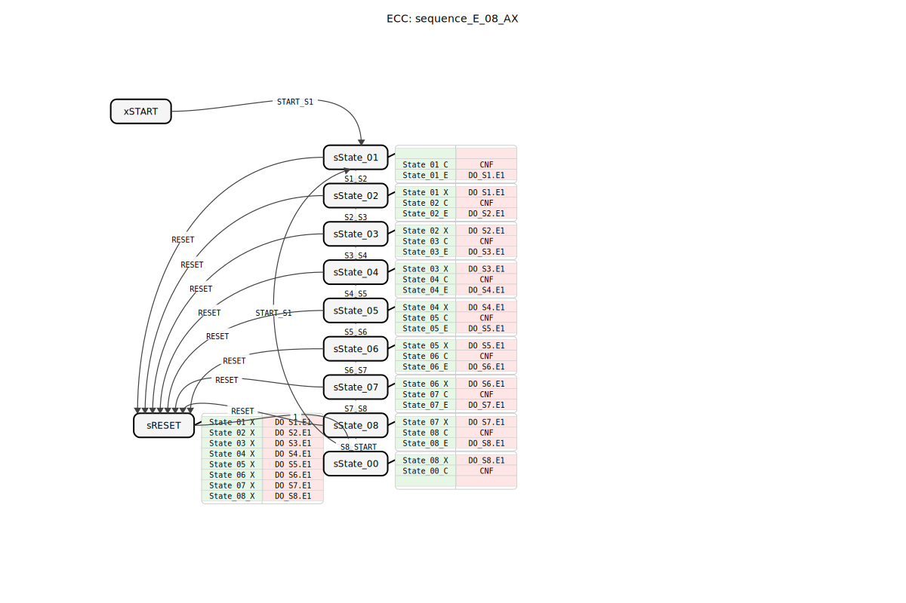
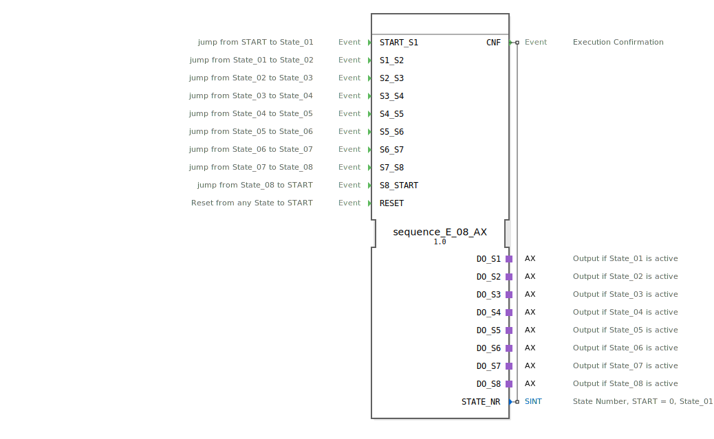

# sequence_E_08_AX

```{index} single: sequence_E_08_AX
```




* * * * * * * * * *
## Einleitung
`sequence_E_08_AX` ist eine Variante des `sequence_E_08`, die zusätzlich Adapter (`AX`) für die Ausgänge verwendet. Er steuert eine rein ereignisgesteuerte Sequenz mit 8 Ausgabezuständen.



## Schnittstellenstruktur

### **Ereignis-Eingänge**
*   **START_S1**: Startet die Sequenz bei State_01.
*   **S1_S2** ... **S7_S8**: Manuelle Übergänge zwischen den Zuständen.
*   **S8_START**: Manueller Übergang State_08 -> START.
*   **RESET**: Setzt die Sequenz zurück.

### **Ereignis-Ausgänge**
*   **CNF**: Bestätigung der Ausführung.

### **Daten-Eingänge**
*   Keine.

### **Daten-Ausgänge**
*   **STATE_NR** (SINT): Aktuelle Zustandsnummer.

### **Adapter**
*   **DO_S1** ... **DO_S8** (adapter::types::unidirectional::AX): Ausgangsadapter für State_01 bis State_08.

## Funktionsweise
Entspricht `sequence_E_08`, verwendet jedoch Adapter für die Ausgänge.

## Technische Besonderheiten
*   Verwendung von `adapter::types::unidirectional::AX`.

## Zustandsübersicht
Siehe `sequence_E_08`.

## Anwendungsszenarien
Für ereignisgesteuerte 8-stufige Sequenzen mit Adapteranbindung.

## ⚖️ Vergleich mit ähnlichen Bausteinen
*   **sequence_E_08**: Standardvariante ohne Adapter.

## Fazit
Adapter-Variante des 8-Schritt-Ereignis-Sequenzers.