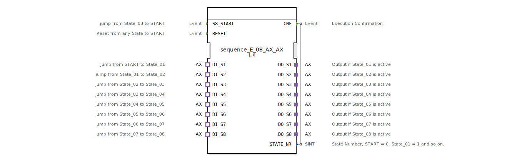

# sequence_E_08_AX_AX

* * * * * * * * * *

## Einleitung

Der Funktionsblock **sequence_E_08_AX_AX** realisiert eine sequenzielle Ablaufsteuerung mit acht Ausgangsstufen. Er ermöglicht das schrittweise Durchschalten von Zuständen, wobei jeder Zustand durch ein Ereignis über einen AX-Adapter-Eingang verlassen wird. Ein AX-Adapter stellt dabei eine unidirektionale Schnittstelle mit einem Datenwert (`D1`) zur Verfügung, der beim Eintritt in einen Zustand vom Eingangsadapter auf den zugehörigen Ausgangsadapter übertragen wird. Der Block ist für den Einsatz in Automatisierungssystemen konzipiert, die eine klare, ereignisgesteuerte Schrittkette erfordern.

## Schnittstellenstruktur

### **Ereignis-Eingänge**

| Name | Typ | Kommentar |
|------|-----|-----------|
| `S8_START` | Event | Springt von `State_08` zurück in den Startzustand `START` |
| `RESET` | Event | Setzt aus jedem beliebigen Zustand zurück in den Startzustand `START` |

### **Ereignis-Ausgänge**

| Name | Typ | Kommentar |
|------|-----|-----------|
| `CNF` | Event | Bestätigung der Ausführung (gekoppelt mit `STATE_NR`) |

### **Daten-Eingänge**

Keine (die Zustandsübergänge werden ausschließlich über Ereignisse gesteuert).

### **Daten-Ausgänge**

| Name | Typ | Kommentar |
|------|-----|-----------|
| `STATE_NR` | SINT | Aktuelle Zustandsnummer: `START` = 0, `State_01` = 1, …, `State_08` = 8 |

### **Adapter**

**Plugs (Ausgänge – unidirektionaler AX-Adapter)**

| Name | Type | Kommentar |
|------|------|-----------|
| `DO_S1` | adapter::types::unidirectional::AX | Ausgang aktiv, wenn `State_01` aktiv ist |
| `DO_S2` | adapter::types::unidirectional::AX | Ausgang aktiv, wenn `State_02` aktiv ist |
| `DO_S3` | adapter::types::unidirectional::AX | Ausgang aktiv, wenn `State_03` aktiv ist |
| `DO_S4` | adapter::types::unidirectional::AX | Ausgang aktiv, wenn `State_04` aktiv ist |
| `DO_S5` | adapter::types::unidirectional::AX | Ausgang aktiv, wenn `State_05` aktiv ist |
| `DO_S6` | adapter::types::unidirectional::AX | Ausgang aktiv, wenn `State_06` aktiv ist |
| `DO_S7` | adapter::types::unidirectional::AX | Ausgang aktiv, wenn `State_07` aktiv ist |
| `DO_S8` | adapter::types::unidirectional::AX | Ausgang aktiv, wenn `State_08` aktiv ist |

**Sockets (Eingänge – unidirektionaler AX-Adapter)**

| Name | Type | Kommentar |
|------|------|-----------|
| `DI_S1` | adapter::types::unidirectional::AX | Springt von `START` nach `State_01` |
| `DI_S2` | adapter::types::unidirectional::AX | Springt von `State_01` nach `State_02` |
| `DI_S3` | adapter::types::unidirectional::AX | Springt von `State_02` nach `State_03` |
| `DI_S4` | adapter::types::unidirectional::AX | Springt von `State_03` nach `State_04` |
| `DI_S5` | adapter::types::unidirectional::AX | Springt von `State_04` nach `State_05` |
| `DI_S6` | adapter::types::unidirectional::AX | Springt von `State_05` nach `State_06` |
| `DI_S7` | adapter::types::unidirectional::AX | Springt von `State_06` nach `State_07` |
| `DI_S8` | adapter::types::unidirectional::AX | Springt von `State_07` nach `State_08` |

## Funktionsweise

Der Baustein arbeitet nach dem Prinzip einer ereignisgesteuerten Schrittkette. Nach dem Start befindet er sich im Zustand `xSTART`. Sobald am Socket `DI_S1` ein Ereignis eintrifft, wechselt er in den Zustand `sState_01`. Beim Eintritt in einen Zustand wird der aktuelle Datenwert des zugehörigen Eingangsadapters (`DI_Sx.D1`) auf den entsprechenden Ausgangsadapter (`DO_Sx.D1`) übertragen und gleichzeitig das Ereignis `CNF` mit der aktuellen Zustandsnummer (`STATE_NR`) ausgelöst. Verlässt der Baustein einen Zustand (z.B. durch ein Ereignis am nächsten `DI_Sx`), wird der zugehörige Ausgangsadapter auf `FALSE` gesetzt (Exit-Algorithmus). Der Übergang erfolgt schrittweise: `State_01` → `State_02` → … → `State_08`. Nach `State_08` wird durch das Ereignis `S8_START` wieder in den Ruhezustand `sState_00` zurückgesprungen. Von dort kann mit `DI_S1` eine neue Sequenz gestartet werden. Das Ereignis `RESET` unterbricht jederzeit die Sequenz, setzt alle Ausgangsadapter auf `FALSE` und kehrt in den Ruhezustand `sState_00` zurück.

## Technische Besonderheiten

- **Einsatz von AX-Adaptern**: Alle Ein- und Ausgänge sind als unidirektionale AX-Adapter realisiert, die neben dem Ereigniskanal auch einen Datenwert (`D1`) übertragen. Dadurch kann beim Zustandswechsel nicht nur das Ereignis, sondern auch ein zugehöriger Wert (z.B. ein Sollwert für einen Aktor) weitergegeben werden.
- **Entry-/Exit-Logik**: Durch die strikte Trennung von Eintritts- (`State_xx_E`) und Austrittsaktionen (`State_xx_X`) werden deterministische Zustandswechsel gewährleistet. Der Ausgang eines Zustands wird immer beim Verlassen deaktiviert, um Überschleifen zu vermeiden.
- **Konfigurierbare Startbedingung**: Der Eingang `DI_S1` dient sowohl beim ersten Start als auch nach einem Sequenzdurchlauf als Startbedingung. Der separate Ereigniseingang `S8_START` ermöglicht einen manuellen oder extern getriggerten Rücksprung aus dem letzten Zustand.
- **Zustandsnummerierung**: Der Ausgang `STATE_NR` gibt jederzeit die laufende Zustandsnummer aus, wobei `0` dem Ruhezustand entspricht.

## Zustandsübersicht

| Zustand (ECC) | Bedeutung | Aktionen |
|---------------|-----------|----------|
| `xSTART` | Initialer Ruhezustand nach Aktivierung | Keine Ausgabe, erwartet `DI_S1` |
| `sState_01` | Erster Schritt der Sequenz | Setzt `DO_S1.D1` auf `DI_S1.D1`; Ausgabe `STATE_NR=1` |
| `sState_02` | Zweiter Schritt | Setzt `DO_S2.D1` auf `DI_S2.D1`; `STATE_NR=2` |
| `sState_03` | Dritter Schritt | Setzt `DO_S3.D1` auf `DI_S3.D1`; `STATE_NR=3` |
| `sState_04` | Vierter Schritt | Setzt `DO_S4.D1` auf `DI_S4.D1`; `STATE_NR=4` |
| `sState_05` | Fünfter Schritt | Setzt `DO_S5.D1` auf `DI_S5.D1`; `STATE_NR=5` |
| `sState_06` | Sechster Schritt | Setzt `DO_S6.D1` auf `DI_S6.D1`; `STATE_NR=6` |
| `sState_07` | Siebter Schritt | Setzt `DO_S7.D1` auf `DI_S7.D1`; `STATE_NR=7` |
| `sState_08` | Achter Schritt | Setzt `DO_S8.D1` auf `DI_S8.D1`; `STATE_NR=8` |
| `sState_00` | Ruhezustand nach Sequenzdurchlauf oder Reset | Keine Ausgabe; `STATE_NR=0` |
| `sRESET` | Zwischenzustand bei Reset | Setzt **alle** `DO_Sx.D1` auf `FALSE`; danach Übergang zu `sState_00` |

## Anwendungsszenarien

- **Mehrstufige Förderbandsteuerung**: Jeder Schritt aktiviert einen anderen Förderabschnitt oder eine andere Weiche. Der Datenwert `D1` kann die Geschwindigkeit oder die Fahrtrichtung enthalten.
- **Programmablauf in Bearbeitungsmaschinen**: Z.B. sequentielles Anfahren von Werkzeugen oder Stationen, wobei jeder Schritt einen konfigurierbaren Parameter (z.B. Druck, Temperatur) über den AX-Adapter erhält.
- **Lichtsteuerung mit Szenen**: Acht Schritte können unterschiedliche Beleuchtungsszenen aktivieren, wobei der Datenwert einer Szene (z.B. Helligkeitswerte) vom Eingangsadapter an den Ausgang übergeben wird.
- **Test- und Prüfabläufe**: Automatisierte Testsequenzen mit acht aufeinanderfolgenden Prüfschritten, bei denen die Messwerte des vorherigen Schritts als Sollwert für den nächsten dienen.

## Vergleich mit ähnlichen Bausteinen

- **sequence_E_08 (ohne AX)**: Ein einfacher sequenzieller Baustein, der nur Boolesche Signale steuert. Der hier beschriebene Baustein erweitert dies um AX-Adapter, wodurch zusätzlich Datenwerte transportiert werden können.
- **sequence_E_08_AX (mit weniger Adaptern)**: Versionen mit weniger als acht Stufen bieten eine kleinere Schrittanzahl, was je nach Anwendung entweder ausreichend oder zu einschränkend sein kann.
- **SFC-Bausteine (Step-Function-Chart)**: Hochsprachliche Bausteine wie `SFC` erlauben parallele Verzweigungen, die dieser einfache Sequenzer nicht abbildet. Dafür ist er deutlich ressourcenschonender und deterministischer in der Ausführung.

Der vorliegende Baustein stellt einen optimierten Kompromiss zwischen Flexibilität (durch AX-Adapter) und Übersichtlichkeit dar – ideal für Standard-Schrittketten mit Datenweitergabe.

## Fazit

Der Funktionsblock `sequence_E_08_AX_AX` ist ein modularer, ereignisgesteuerter Sequenzer mit acht Stufen, der durch den Einsatz von AX-Adaptern eine kompakte Übergabe von Datenwerten zwischen den Schritten erlaubt. Die klare Entry-/Exit-Logik, das separate Reset-Verhalten und die Zustandsnummerierung machen ihn zu einem zuverlässigen Werkzeug für einfache bis mittelschwere Ablaufsteuerungen in der Automatisierungstechnik. Er ist besonders dann vorteilhaft, wenn jeder Schritt nicht nur ein Signal, sondern auch einen parametrierbaren Wert an den Aktor weitergeben muss.