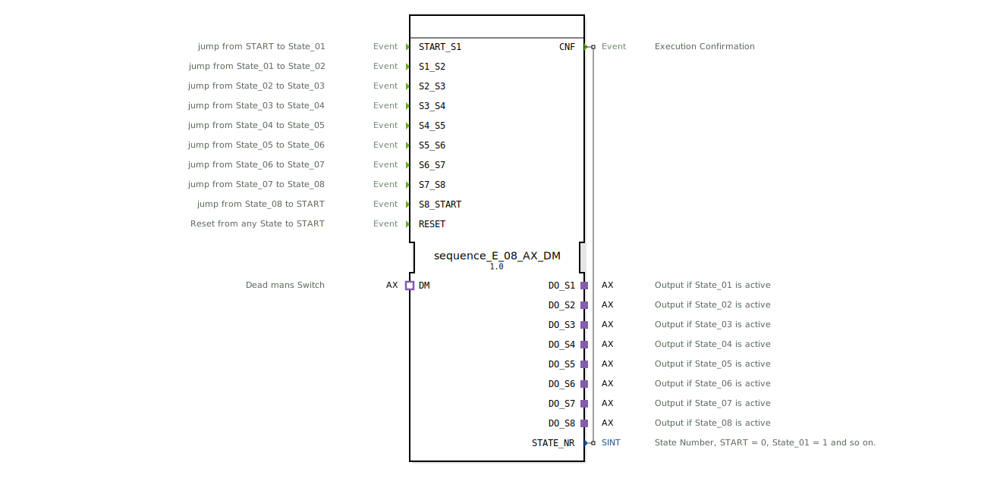

# sequence_E_08_AX_DM

* * * * * * * * * *
## Einleitung
Der Funktionsblock `sequence_E_08_AX_DM` realisiert eine ereignisgesteuerte Ablaufsteuerung mit acht sequenziell zu schaltenden Ausgängen. Er basiert auf einem endlichen Automaten mit neun Zuständen und ermöglicht den Wechsel zwischen den Zuständen durch explizite Ereignisse. Ein integrierter Totmannschalter (Deadman, DM) erlaubt die Überwachung und das kontrollierte Zurücksetzen der Ausgänge. Der FB ist speziell für den Einsatz in sicherheitskritischen oder überwachten Steuerungsabläufen in der Agrartechnik konzipiert.

## Schnittstellenstruktur

### **Ereignis-Eingänge**

| Ereignis | Beschreibung |
|----------|--------------|
| `START_S1` | Wechsel vom Startzustand zu Zustand 1 (State_01) |
| `S1_S2` | Wechsel von Zustand 1 zu Zustand 2 (State_02) |
| `S2_S3` | Wechsel von Zustand 2 zu Zustand 3 (State_03) |
| `S3_S4` | Wechsel von Zustand 3 zu Zustand 4 (State_04) |
| `S4_S5` | Wechsel von Zustand 4 zu Zustand 5 (State_05) |
| `S5_S6` | Wechsel von Zustand 5 zu Zustand 6 (State_06) |
| `S6_S7` | Wechsel von Zustand 6 zu Zustand 7 (State_07) |
| `S7_S8` | Wechsel von Zustand 7 zu Zustand 8 (State_08) |
| `S8_START` | Wechsel von Zustand 8 zum Startzustand (State_00) |
| `RESET` | Rücksetzen aus jedem Zustand in den Startzustand (State_00) |

### **Ereignis-Ausgänge**

| Ereignis | Mit Variable | Beschreibung |
|----------|--------------|--------------|
| `CNF` | `STATE_NR` | Bestätigung der Zustandsänderung; liefert gleichzeitig die aktuelle Zustandsnummer |

### **Daten-Eingänge**
Keine Daten-Eingänge vorhanden.

### **Daten-Ausgänge**

| Variable | Typ | Beschreibung |
|----------|-----|--------------|
| `STATE_NR` | SINT | Aktuelle Zustandsnummer (0 = State_00, 1 = State_01, …, 8 = State_08) |

### **Adapter**

| Richtung | Name | Typ | Beschreibung |
|----------|------|-----|--------------|
| Plug | `DO_S1` | unidirectional::AX | Ausgang für Zustand 1 (State_01 aktiv) |
| Plug | `DO_S2` | unidirectional::AX | Ausgang für Zustand 2 (State_02 aktiv) |
| Plug | `DO_S3` | unidirectional::AX | Ausgang für Zustand 3 (State_03 aktiv) |
| Plug | `DO_S4` | unidirectional::AX | Ausgang für Zustand 4 (State_04 aktiv) |
| Plug | `DO_S5` | unidirectional::AX | Ausgang für Zustand 5 (State_05 aktiv) |
| Plug | `DO_S6` | unidirectional::AX | Ausgang für Zustand 6 (State_06 aktiv) |
| Plug | `DO_S7` | unidirectional::AX | Ausgang für Zustand 7 (State_07 aktiv) |
| Plug | `DO_S8` | unidirectional::AX | Ausgang für Zustand 8 (State_08 aktiv) |
| Socket | `DM` | unidirectional::AX | Totmannschalter (Deadman); liefert das Ereignis `DM.E1` und den Datenwert `DM.D1` |

## Funktionsweise
Der Funktionsblock arbeitet als endlicher Automat mit folgenden Zuständen: `xSTART` (Initial), `sState_01` bis `sState_08` (aktive Sequenzzustände), `sState_00` (Start-/Wartezustand nach Sequenzende) und `sRESET` (Zwischenzustand für Rücksetzung).

- **Start und Ablauf**: Nach dem Start befindet sich der Automat im Zustand `xSTART`. Durch das Ereignis `START_S1` wird in den Zustand `sState_01` gewechselt. Von dort aus führen die Ereignisse `S1_S2`, `S2_S3`, … bis `S7_S8` sequenziell durch die acht Zustände. Der letzte Zustand `sState_08` wird durch `S8_START` in den Zustand `sState_00` überführt, der als Ruhepunkt nach der Sequenz dient und wiederholt über `START_S1` gestartet werden kann.
- **Ausgänge**: Jeder Zustand aktiviert den zugehörigen Plug-Adapter (`DO_Sx`). Beim Eintritt in einen Zustand wird der Datenwert des Deadman-Adapters (`DM.D1`) an den Ausgangsadapter weitergegeben (`DO_Sx.D1 := DM.D1`). Beim Verlassen eines Zustands (Exit) wird der Ausgang deaktiviert (`DO_Sx.D1 := FALSE`).
- **Totmannschalter (Deadman)**: Das Ereignis `DM.E1` löst eine Selbsttransition im aktuellen Zustand aus (z. B. `sState_01 → sState_01`). Dies führt zur erneuten Ausführung der Exit- und Entry-Aktionen, sodass der aktuelle Wert von `DM.D1` aktualisiert auf den Ausgangsadapter übertragen wird. Solange der Deadman aktiv ist (d. h. `DM.E1` wiederholt eintrifft), bleibt der Ausgangswert auf dem aktuellen `DM.D1`-Stand. Falls der Deadman nicht mehr getriggert wird, verbleibt der Zustand, bis ein normales Sequenzereignis oder `RESET` eintritt.
- **Rücksetzen**: Das Ereignis `RESET` führt aus jedem Zustand (außer `xSTART` und `sRESET`) in den Zwischenzustand `sRESET`. Dort werden alle acht Ausgänge durch Aufruf der Exit-Algorithmen ausgeschaltet. Anschließend wird automatisch (Transition mit `1`) in den Zustand `sState_00` gewechselt. Von dort kann die Sequenz erneut mit `START_S1` gestartet werden.
- **Bestätigung**: Bei jedem Zustandswechsel (außer innerhalb von `sRESET`) wird das Ereignis `CNF` mit der aktuellen Zustandsnummer `STATE_NR` ausgegeben. Die Zustandsnummer wird über die Konstanten `sequence::State_00` bis `sequence::State_08` gesetzt.

## Technische Besonderheiten
- **Adapterbasierte Ausgänge**: Alle acht Ausgänge sowie der Totmannschalter sind als unidirektionale AX-Adapter implementiert. Dies ermöglicht eine flexible Anbindung an externe Hardware (z. B. analoge oder digitale Aktoren) über den Adapterrahmen.
- **Wiederverwendbare Sequenzkonstanten**: Die Zustandsnummern werden aus einer separaten Bibliothek (`logiBUS::utils::sequence::const::sequence`) bezogen, was eine konsistente Nummerierung über verschiedene Sequenzbausteine hinweg erlaubt.
- **Deadman-Integration**: Der Totmannschalter wirkt nicht als Sperre, sondern als dynamischer Wertegeber für die Ausgänge. Jeder Zustand übernimmt bei Eintritt den aktuellen Wert von `DM.D1` und kann durch wiederholtes `DM.E1`-Ereignis aktualisiert werden.
- **Explizites Rücksetzen**: Das `RESET`-Ereignis deaktiviert sofort alle Ausgänge und kehrt in einen definierten Startzustand zurück – eine wichtige Sicherheitsfunktion.

## Zustandsübersicht

| Zustand | Bezeichnung | Ausgang aktiv | Transitionen |
|---------|-------------|---------------|--------------|
| `xSTART` | Initialzustand | keiner | → `sState_01` bei `START_S1`; Selbsttransition bei `DM.E1` |
| `sState_01` | Sequenzschritt 1 | `DO_S1` | → `sState_02` bei `S1_S2`; Selbsttrans. bei `DM.E1`; → `sRESET` bei `RESET` |
| `sState_02` | Sequenzschritt 2 | `DO_S2` | → `sState_03` bei `S2_S3`; Selbsttrans. bei `DM.E1`; → `sRESET` bei `RESET` |
| `sState_03` | Sequenzschritt 3 | `DO_S3` | → `sState_04` bei `S3_S4`; Selbsttrans. bei `DM.E1`; → `sRESET` bei `RESET` |
| `sState_04` | Sequenzschritt 4 | `DO_S4` | → `sState_05` bei `S4_S5`; Selbsttrans. bei `DM.E1`; → `sRESET` bei `RESET` |
| `sState_05` | Sequenzschritt 5 | `DO_S5` | → `sState_06` bei `S5_S6`; Selbsttrans. bei `DM.E1`; → `sRESET` bei `RESET` |
| `sState_06` | Sequenzschritt 6 | `DO_S6` | → `sState_07` bei `S6_S7`; Selbsttrans. bei `DM.E1`; → `sRESET` bei `RESET` |
| `sState_07` | Sequenzschritt 7 | `DO_S7` | → `sState_08` bei `S7_S8`; Selbsttrans. bei `DM.E1`; → `sRESET` bei `RESET` |
| `sState_08` | Sequenzschritt 8 | `DO_S8` | → `sState_00` bei `S8_START`; Selbsttrans. bei `DM.E1`; → `sRESET` bei `RESET` |
| `sState_00` | Ruhezustand (nach Sequenz) | keiner | → `sState_01` bei `START_S1`; Selbsttrans. bei `DM.E1` |
| `sRESET` | Rückstellzustand | alle deaktiviert | Automatisch → `sState_00` |

## Anwendungsszenarien
- **Landwirtschaftliche Steuerungen**: Schrittweises Ansteuern von acht Ventilen, Antrieben oder Beleuchtungseinheiten, z. B. für Bewässerungssequenzen oder Erntemaschinen.
- **Sicherheitsüberwachte Prozesse**: Einsatz in Anlagen, die einen Totmannschalter erfordern – der Bediener muss durch wiederholtes Betätigen des Deadman die Ausgänge aktiv halten.
- **Test- und Prüfstände**: Sequenzielle Aktivierung von Prüfschritten mit manueller Freigabe durch den Bediener (über die Ereignisse).
- **Modulare Ablaufsteuerung**: Kombination mehrerer `sequence_E_08_AX_DM`-Bausteine für umfangreichere Sequenzen mit mehr als acht Schritten.

## Vergleich mit ähnlichen Bausteinen
- **`sequence_E_08_AX` (ohne Deadman)**: Besitzt keinen Totmannschalter – die Ausgänge werden beim Eintritt dauerhaft aktiviert (z. B. mit `TRUE`) und nur beim Verlassen deaktiviert. Geeignet für unkritische Steuerungen.
- **`sequence_E_04_AX_DM`**: Vierstufige Variante mit entsprechend weniger Ausgängen und Ereignissen. Bietet identische Deadman-Funktionalität.
- **`sequence_T_08_AX_DM`**: Zeitgesteuerte Variante – die Zustandsübergänge erfolgen über Timer anstatt über externe Ereignisse. Vergleichbare Deadman-Integration.

## Fazit
Der Funktionsblock `sequence_E_08_AX_DM` ist eine leistungsfähige und sichere Komponente für ereignisgesteuerte Abläufe mit bis zu acht Schritten. Die Integration eines Totmannschalters erhöht die Betriebssicherheit, indem sie erzwungene Bedienerinteraktion verlangt. Die adapterbasierte Ausgangsschnittstelle erlaubt eine einfache Anbindung an unterschiedliche Aktorik. Dank der klar strukturierten Zustandsmaschine und der expliziten Rücksetzmöglichkeit eignet sich dieser Baustein besonders für sicherheitsrelevante Steuerungsaufgaben in der Agrartechnik und darüber hinaus.