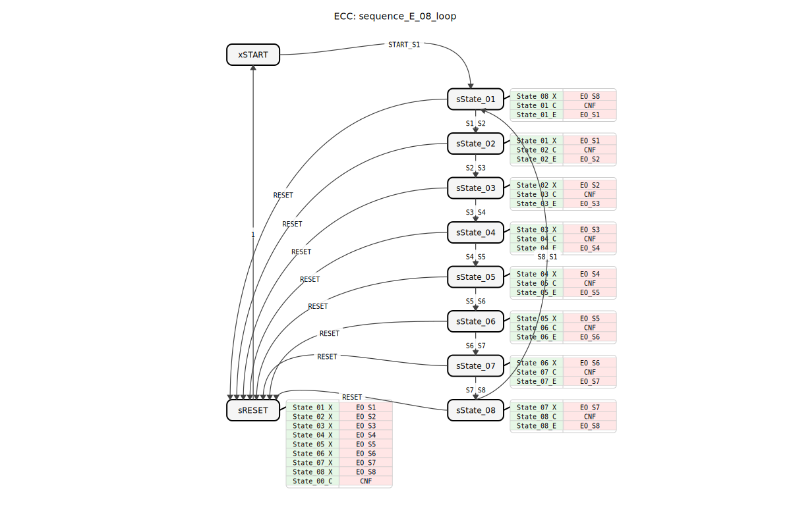
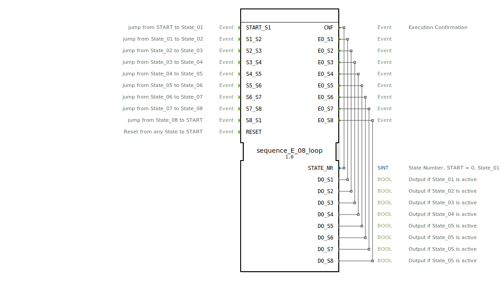

# sequence_E_08_loop

```{index} single: sequence_E_08_loop
```




* * * * * * * * * *
## Einleitung
Der Funktionsblock `sequence_E_08_loop` ist ein Sequenzer mit acht Ausgangszuständen, der in einer Schleife arbeitet. Er dient zur Steuerung sequentieller Abläufe, bei denen jeder Schritt durch ein externes Ereignis ausgelöst wird. Der Baustein ist als Basic Function Block (BasicFB) nach IEC 61499 implementiert und eignet sich für Anwendungen, die eine klare, ereignisgesteuerte Zustandsmaschine erfordern.



## Schnittstellenstruktur
### **Ereignis-Eingänge**
*   `START_S1`: Wechselt vom Startzustand (`START`) in den Zustand `State_01`.
*   `S1_S2`: Wechselt von `State_01` zu `State_02`.
*   `S2_S3`: Wechselt von `State_02` zu `State_03`.
*   `S3_S4`: Wechselt von `State_03` zu `State_04`.
*   `S4_S5`: Wechselt von `State_04` zu `State_05`.
*   `S5_S6`: Wechselt von `State_05` zu `State_06`.
*   `S6_S7`: Wechselt von `State_06` zu `State_07`.
*   `S7_S8`: Wechselt von `State_07` zu `State_08`.
*   `S8_S1`: Wechselt von `State_08` zurück zum Zustand `State_01` (Schleife).
*   `RESET`: Setzt von jedem beliebigen Zustand zurück in den Startzustand (`START`).

### **Ereignis-Ausgänge**
*   `CNF` (Execution Confirmation): Wird bei jedem Zustandswechsel ausgelöst und liefert die aktuelle Zustandsnummer (`STATE_NR`).
*   `EO_S1` ... `EO_S8`: Werden beim Eintritt in den jeweiligen Zustand (`State_01` bis `State_08`) ausgelöst und liefern den zugehörigen booleschen Datenausgang (`DO_S1` ... `DO_S8`).

### **Daten-Eingänge**
*   Keine vorhanden.

### **Daten-Ausgänge**
*   `STATE_NR` (SINT): Die Nummer des aktiven Zustands. `START` = 0, `State_01` = 1, `State_02` = 2, usw.
*   `DO_S1` ... `DO_S8` (BOOL): Logische Ausgänge, die `TRUE` sind, wenn der entsprechende Zustand aktiv ist.

### **Adapter**
*   Keine Adapterschnittstellen vorhanden.

## Funktionsweise
Der FB arbeitet als ereignisgesteuerte Zustandsmaschine (ECC). Der initiale Zustand ist `xSTART`. Ein eingehendes Ereignis an einem der benannten Ereigniseingänge (z.B. `START_S1`) bewirkt einen Übergang in den nächsten Zustand (z.B. `sState_01`).

Bei jedem Zustandswechsel werden drei Aktionen ausgeführt:
1.  **Exit-Aktion (X) des vorherigen Zustands**: Setzt den zugehörigen Datenausgang (`DO_Sx`) auf `FALSE`.
2.  **Confirmation-Aktion (C) des neuen Zustands**: Setzt die Zustandsnummer `STATE_NR` und löst das `CNF`-Ereignis aus.
3.  **Entry-Aktion (E) des neuen Zustands**: Setzt den zugehörigen Datenausgang (`DO_Sx`) auf `TRUE` und löst das entsprechende Ereignis `EO_Sx` aus.

Die Sequenz durchläuft die Zustände 1 bis 8 linear. Von `State_08` aus führt das Ereignis `S8_S1` zurück zu `State_01`, wodurch eine Endlosschleife entsteht. Das `RESET`-Ereignis führt über einen dedizierten Reset-Zustand (`sRESET`) immer zurück in den initialen Zustand `xSTART` und setzt dabei alle aktiven Ausgänge zurück.

## Technische Besonderheiten
*   **Reiner Event-Trigger**: Zustandsübergänge erfolgen ausschließlich durch externe Ereignisse, nicht durch Bedingungen oder Zeitgeber.
*   **Explizite Reset-Logik**: Der Reset-Vorgang nutzt einen eigenen Zustand (`sRESET`), in dem alle möglichen Exit-Aktionen aufgerufen werden, um sicherzustellen, dass alle Ausgänge deaktiviert werden, bevor der Startzustand erreicht wird.
*   **Zustandsbestätigung**: Das `CNF`-Ereignis und der `STATE_NR`-Ausgang bieten eine klare Rückmeldung über den aktuellen Systemstatus.
*   **Konsistente Namensgebung**: Die Namen der Ereignisse, Zustände und Algorithmen folgen einem durchgängigen Schema (z.B. `S1_S2`, `sState_01`, `State_01_C`), was die Lesbarkeit und Wartung erleichtert.

## Zustandsübersicht
Die ECC (Execution Control Chart) umfasst folgende Zustände:
*   `xSTART`: Initialer, inaktiver Wartezustand (Zustandsnummer 0).
*   `sState_01` bis `sState_08`: Die acht aktiven Sequenzzustände (Zustandsnummern 1-8). Jeder aktiviert seinen spezifischen Ausgang.
*   `sRESET`: Dedizierter Reset-Zustand. Beim Eintreten werden alle potenziell aktiven Ausgänge (`DO_S1` bis `DO_S8`) deaktiviert, die Zustandsnummer auf 0 gesetzt und ein Übergang zu `xSTART` ausgeführt.

## Anwendungsszenarien
*   Steuerung von zyklischen Fertigungs- oder Montageprozessen mit manueller oder sensorischer Freigabe für den nächsten Schritt.
*   Steuerung von Testsequenzen, bei denen jeder Testschritt manuell gestartet wird.
*   Überwachung und Steuerung von Batch-Prozessen, bei denen ein Operator die nächste Phase einleitet.
*   Als zentraler Steuerbaustein in Maschinen, die einen klar definierten, schrittweisen Arbeitsablauf haben.

## ⚖️ Vergleich mit ähnlichen Bausteinen
Im Vergleich zu Sequenzern mit zeitgesteuerten Übergängen (z.B. `sequence_T_08_loop`) bietet dieser FB maximale Flexibilität, da die Verweildauer in jedem Zustand extern vorgegeben wird. Er ist einfacher aufgebaut als Bausteine mit integrierter Fehlerbehandlung oder komplexen Verzweigungen, stellt aber eine robuste Grundlage für ereignisgesteuerte Abläufe dar. Alternative Implementierungen mit `E_SR`- oder `E_CTUD`-Blöcken wären deutlich komplexer und weniger übersichtlich.


## 🛠️ Zugehörige Übungen

* [Uebung_040](../../../../../../training1/Ventilsteuerung/4diacIDE-workspace/test_B/Uebungen_doc/Uebung_040.md)
* [Uebung_040_2](../../../../../../training1/Ventilsteuerung/4diacIDE-workspace/test_B/Uebungen_doc/Uebung_040_2.md)
* [Uebung_041](../../../../../../training1/Ventilsteuerung/4diacIDE-workspace/test_B/Uebungen_doc/Uebung_041.md)

## Fazit
Der `sequence_E_08_loop` ist ein spezialisierter, zuverlässiger und einfach zu konfigurierender Funktionsblock für ereignisgesteuerte Sequenzabläufe. Seine klare Struktur, die konsistente Schnittstelle und die integrierte Reset-Funktionalität machen ihn besonders geeignet für Anwendungen, bei denen ein schrittweiser Prozess durch externe Signale (z.B. Taster, Sensoren, übergeordnete Steuerungen) vorangetrieben werden muss. Die Ausgabe der Zustandsnummer und die konfirmierenden Ereignisse ermöglichen eine einfache Anbindung an Visualisierungs- und Überwachungssysteme.