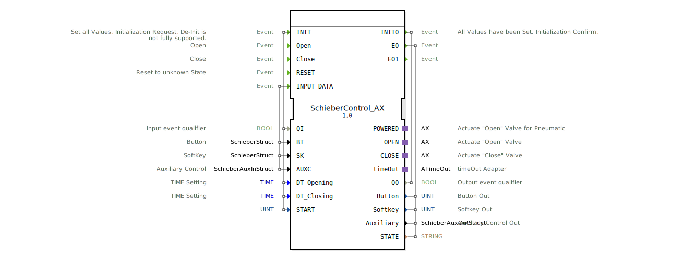
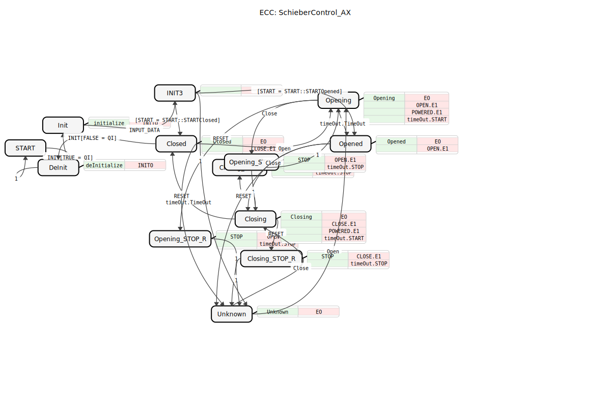

# SchieberControl_AX

* * * * * * * * * *

## Einleitung

Der Funktionsbaustein **SchieberControl_AX** dient zur Steuerung eines Schiebers (Ventil, Klappe oder ähnliche Aktorik) innerhalb eines 61499-basierten Steuerungssystems. Er implementiert eine Zustandsmaschine, die nicht nur die logischen Zustände (Offen, Geschlossen, Öffnend, Schließend) verwaltet, sondern auch die Zeitsteuerung für die Bewegungen übernimmt und entsprechende Visualisierungsdaten (Buttons, Softkeys) für ein HMI bereitstellt.

Diese Version des Bausteins („AX Adapter Version“) nutzt spezielle Adapter (`adapter::types::unidirectional::AX`) zur Ansteuerung der physikalischen Ventile.

## Schnittstellenstruktur

### **Ereignis-Eingänge**

| Ereignis | Typ | Kommentar |
| :--- | :--- | :--- |
| **INIT** | EInit | Initialisierungsanfrage. Setzt alle Werte und Parameter. |
| **Open** | Event | Befehl zum Öffnen des Schiebers. |
| **Close** | Event | Befehl zum Schließen des Schiebers. |
| **RESET** | Event | Setzt den Baustein in einen unbekannten Zustand („Unknown“) zurück. |
| **INPUT_DATA** | Event | Aktualisiert die Konfigurationsdaten für UI-Elemente (Button, Softkey, Aux). |

### **Ereignis-Ausgänge**

| Ereignis | Typ | Kommentar |
| :--- | :--- | :--- |
| **INITO** | EInit | Bestätigung der Initialisierung. |
| **EO** | EInit | Ereignis bei Zustandsänderung oder Aktualisierung der Ausgänge (Button, Softkey, Status). |
| **EO1** | Event | Internes Ereignis (oft genutzt nach dem initialen Starten). |

### **Daten-Eingänge**

| Variable | Datentyp | Kommentar |
| :--- | :--- | :--- |
| **QI** | BOOL | Input Event Qualifier (True = Normalbetrieb, False = De-Init). |
| **BT** | SchieberStruct | Konfigurationsstruktur für Button-Zustände (je nach Schieberstatus). |
| **SK** | SchieberStruct | Konfigurationsstruktur für Softkey-Zustände. |
| **AUXC** | SchieberAuxInStruct | Konfigurationsstruktur für Hilfssteuerungen (Bilder/Farben). |
| **DT_Opening** | TIME | Zeitdauer für den Öffnungsvorgang. |
| **DT_Closing** | TIME | Zeitdauer für den Schließvorgang. |
| **START** | UINT | Startkonfiguration (Definiert, in welchem Zustand der Baustein startet). Standard: `STARTUnknown`. |

### **Daten-Ausgänge**

| Variable | Datentyp | Kommentar |
| :--- | :--- | :--- |
| **QO** | BOOL | Output Event Qualifier. |
| **Button** | UINT | Aktueller Button-Status (basierend auf dem internen Zustand). |
| **Softkey** | UINT | Aktueller Softkey-Status. |
| **Auxiliary** | SchieberAuxOutStruct | Aktuelle Hilfsdaten (z.B. Bild-ID, Farbe) für die Visualisierung. |
| **STATE** | STRING | Textuelle Repräsentation des aktuellen Zustands (z.B. "Opened", "Closing"). |

### **Adapter**

| Name | Typ | Kommentar |
| :--- | :--- | :--- |
| **POWERED** | AX | Adapter zur Ansteuerung des „Öffnen“-Ventils (Pneumatik/Hauptversorgung). Aktiv während des Öffnens und im offenen Zustand. |
| **OPEN** | AX | Adapter zur Ansteuerung des „Öffnen“-Signals. |
| **CLOSE** | AX | Adapter zur Ansteuerung des „Schließen“-Signals. |
| **timeOut** | ATimeOut | Adapter für Timer-Funktionalität (überwacht die Öffnungs-/Schließzeiten). |

## Funktionsweise

Der Baustein arbeitet als Zustandsautomat (ECC), der Übergänge basierend auf den Ereignissen `Open` und `Close` sowie dem Timer-Adapter `timeOut` steuert.

1.  **Initialisierung:**
    Beim Start (`INIT`) wird geprüft, in welchem Zustand der Schieber beginnen soll (definiert durch `START`). Möglich sind z.B. direkt „Closed“, „Opened“ oder „Unknown“.
2.  **Bewegungsablauf:**
    *   Erfolgt der Befehl `Open`, wechselt der Baustein in den Zustand **Opening**. Dabei werden die Adapter `POWERED` und `OPEN` aktiviert und der Timer mit `DT_Opening` gestartet.
    *   Nach Ablauf der Zeit (`timeOut.TimeOut`) wechselt der Zustand automatisch zu **Opened**.
    *   Erfolgt der Befehl `Close`, wechselt der Baustein zu **Closing**. Der Adapter `CLOSE` wird aktiviert (während `POWERED` und `OPEN` deaktiviert werden) und der Timer mit `DT_Closing` gestartet.
    *   Nach Ablauf der Zeit wechselt der Zustand zu **Closed**.
3.  **Unterbrechung:**
    Wird während des Öffnens der Befehl `Close` (oder umgekehrt) gegeben, wird der Vorgang gestoppt (`STOP`-Zustände), die Ausgänge zurückgesetzt und der entgegengesetzte Vorgang eingeleitet.
4.  **Visualisierung:**
    In jedem Zustand (Closed, Opening, Opened, Closing, Unknown) werden die Ausgänge `Button`, `Softkey` und `Auxiliary` mit den Werten aus den Eingangsstrukturen (`BT`, `SK`, `AUXC`) befüllt, die dem jeweiligen Zustand entsprechen. Dies ermöglicht eine dynamische Anpassung der Benutzeroberfläche.

## Technische Besonderheiten

*   **AX-Adapter Integration:** Die direkte Nutzung von `adapter::types::unidirectional::AX` deutet auf eine standardisierte Schnittstelle zur Hardware-Abstraktion hin, was den Baustein wiederverwendbar für verschiedene Ventiltypen macht, solange der Adapter passt.
*   **Struktur-Mapping:** Der Baustein fungiert als "Mapper". Er nimmt komplexe Konfigurationsstrukturen (`SchieberStruct`) entgegen und gibt zur Laufzeit nur die für den aktuellen Zustand relevanten Einzelwerte aus. Das reduziert die Logik im HMI.
*   **Stop-Logik:** Es sind explizite `STOP`-Zustände implementiert, die sicherstellen, dass bei einem Richtungswechsel die Ausgänge kurzzeitig definiert abgeschaltet werden (`timeOut.STOP`, Ventile aus), bevor die neue Richtung eingeschlagen wird.

## Zustandsübersicht

Die wichtigsten Zustände im ECC (Execution Control Chart) sind:

*   **START / Init / DeInit:** Verwaltungszustände für den Lebenszyklus des Bausteins.
*   **Unknown:** Fehler- oder Initialzustand, wenn die Position nicht bekannt ist.
*   **Closed:** Der Schieber ist vollständig geschlossen. (`CLOSE`=False, `OPEN`=False).
*   **Opening:** Der Schieber öffnet sich gerade. (`POWERED`=True, `OPEN`=True, Timer läuft).
*   **Opened:** Der Schieber ist vollständig offen. (`POWERED`=True, `OPEN`=False).
*   **Closing:** Der Schieber schließt sich gerade. (`CLOSE`=True, `POWERED`=False, Timer läuft).
*   **..._STOP:** Zwischenzustände zum sauberen Abbrechen von Bewegungen.

## Anwendungsszenarien

*   **Landwirtschaftliche Maschinen:** Steuerung von Gülle-Schiebern, Dosierklappen oder hydraulischen Auslegern.
*   **Prozessautomatisierung:** Einfache Ventilsteuerungen, bei denen keine Endlagensensoren vorhanden sind, sondern über Zeit (`DT_Opening`/`DT_Closing`) gefahren wird.
*   **HMI-Integration:** Systeme, bei denen sich das Symbol oder die Tastenfarbe auf dem Display ändern muss, je nachdem, ob das Ventil gerade fährt, offen oder geschlossen ist.

## Vergleich mit ähnlichen Bausteinen

Im Gegensatz zu einem einfachen `SR`-Flipflop zur Ventilsteuerung bietet der **SchieberControl_AX**:
1.  **Zeitüberwachung:** Integrierte Timer simulieren die Laufzeit.
2.  **HMI-Mapping:** Eingebaute Logik zur Umschaltung von UI-Informationen.
3.  **Hardware-Abstraktion:** Nutzung von Adaptern statt direkter boolescher Ausgänge für die Ventile.
4.  **Zwischenzustände:** Explizite Darstellung von „Öffnet“ und „Schließt“, nicht nur „Auf“ und „Zu“.

## Fazit

Der `SchieberControl_AX` ist ein spezialisierter, robuster Funktionsbaustein für die zeitgesteuerte Aktorik. Er kapselt die Komplexität von Zustandsübergängen, Timer-Handling und UI-Statusverwaltung in einer einzigen Komponente und erleichtert so die Entwicklung von Steuerungssoftware für Maschinen mit hydraulischen oder pneumatischen Schiebern erheblich.