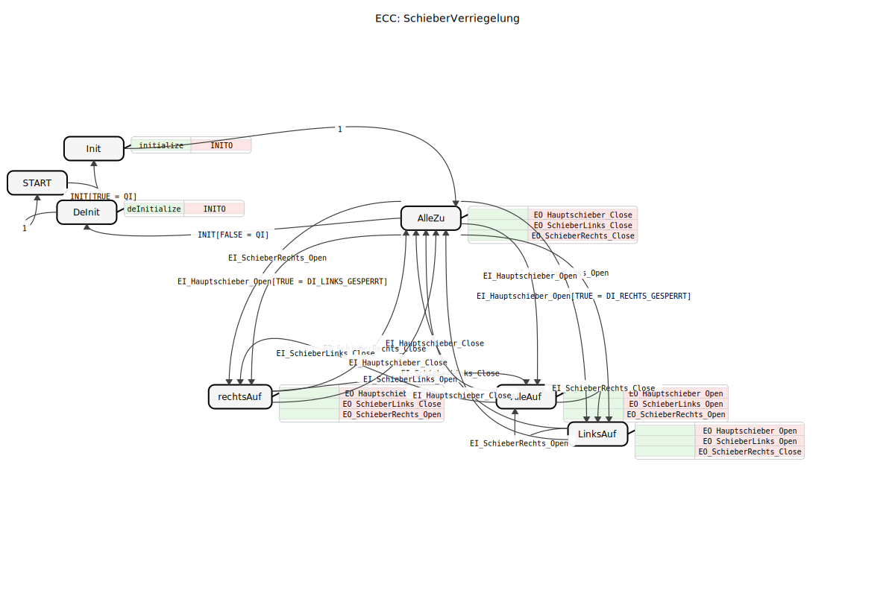
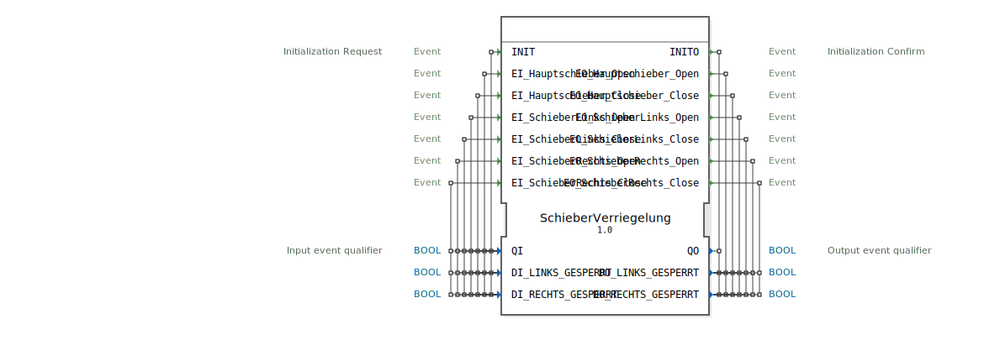

# SchieberVerriegelung

```{index} single: SchieberVerriegelung
```




* * * * * * * * * *
## Einleitung
Der Funktionsblock `SchieberVerriegelung` dient der koordinierten Steuerung und Verriegelung von drei Schiebern: einem Hauptschieber sowie einem linken und einem rechten Seitenschieber. Sein primärer Zweck ist es, basierend auf externen Anforderungen (Ereignisse) und Sperrzuständen, gültige und kollisionsfreie Schieber-Kombinationen zu gewährleisten. Der Baustein ist besonders für Anwendungen geeignet, bei denen die Bewegung eines Schiebers die Bewegung eines anderen verhindern oder erzwingen muss.



## Schnittstellenstruktur

### **Ereignis-Eingänge**
*   **`INIT`**: Initialisierungsanforderung. Löst den Übergang in den initialisierten Zustand aus. Wird mit den Daten `QI`, `DI_LINKS_GESPERRT` und `DI_RECHTS_GESPERRT` verknüpft.
*   **`EI_Hauptschieber_Open`**: Fordert das Öffnen des Hauptschiebers an.
*   **`EI_Hauptschieber_Close`**: Fordert das Schließen des Hauptschiebers an.
*   **`EI_SchieberLinks_Open`**: Fordert das Öffnen des linken Seitenschiebers an.
*   **`EI_SchieberLinks_Close`**: Fordert das Schließen des linken Seitenschiebers an.
*   **`EI_SchieberRechts_Open`**: Fordert das Öffnen des rechten Seitenschiebers an.
*   **`EI_SchieberRechts_Close`**: Fordert das Schließen des rechten Seitenschiebers an.

### **Ereignis-Ausgänge**
*   **`INITO`**: Initialisierungsbestätigung. Wird nach Abschluss der Initialisierung (`INIT`) oder Deinitialisierung ausgelöst. Ist mit den Daten `QO`, `DO_LINKS_GESPERRT` und `DO_RECHTS_GESPERRT` verknüpft.
*   **`EO_Hauptschieber_Open`**: Signalisiert den Befehl zum Öffnen des Hauptschiebers.
*   **`EO_Hauptschieber_Close`**: Signalisiert den Befehl zum Schließen des Hauptschiebers.
*   **`EO_SchieberLinks_Open`**: Signalisiert den Befehl zum Öffnen des linken Seitenschiebers.
*   **`EO_SchieberLinks_Close`**: Signalisiert den Befehl zum Schließen des linken Seitenschiebers.
*   **`EO_SchieberRechts_Open`**: Signalisiert den Befehl zum Öffnen des rechten Seitenschiebers.
*   **`EO_SchieberRechts_Close`**: Signalisiert den Befehl zum Schließen des rechten Seitenschiebers.

### **Daten-Eingänge**
*   **`QI` (BOOL)**: Qualifiziert das INIT-Ereignis. `TRUE` startet die Initialisierung, `FALSE` die Deinitialisierung.
*   **`DI_LINKS_GESPERRT` (BOOL)**: Signalisiert den Sperrzustand des linken Seitenschiebers (`TRUE` = gesperrt).
*   **`DI_RECHTS_GESPERRT` (BOOL)**: Signalisiert den Sperrzustand des rechten Seitenschiebers (`TRUE` = gesperrt).

### **Daten-Ausgänge**
*   **`QO` (BOOL)**: Statusausgabe, die den Erfolg der Initialisierung/Deinitialisierung widerspiegelt.
*   **`DO_LINKS_GESPERRT` (BOOL)**: Gibt den intern verarbeiteten oder weitergeleiteten Sperrzustand für den linken Schieber aus.
*   **`DO_RECHTS_GESPERRT` (BOOL)**: Gibt den intern verarbeiteten oder weitergeleiteten Sperrzustand für den rechten Schieber aus.

### **Adapter**
Dieser Funktionsblock verwendet keine Adapter-Schnittstellen.

## Funktionsweise
Der `SchieberVerriegelung`-FB ist als BasicFB implementiert und folgt einer definierten Zustandsmaschine (ECC). Nach der Initialisierung startet der Baustein im Zustand `AlleZu` (alle Schieber geschlossen). Von hier aus können je nach eintreffendem Ereignis und den aktuellen Sperrzuständen (`DI_LINKS_GESPERRT`, `DI_RECHTS_GESPERRT`) Übergänge in andere Zustände erfolgen.

Die zentrale Logik liegt in der Interpretation des `EI_Hauptschieber_Open`-Ereignisses im Zustand `AlleZu`:
1.  Wenn **kein** Seitenschieber gesperrt ist (`DI_LINKS_GESPERRT = FALSE` und `DI_RECHTS_GESPERRT = FALSE`), geht der FB in den Zustand `AlleAuf` über (alle Schieber öffnen).
2.  Wenn **nur der rechte** Schieber gesperrt ist (`DI_RECHTS_GESPERRT = TRUE`), geht der FB in den Zustand `LinksAuf` über (Haupt- und linker Schieber öffnen, rechter bleibt geschlossen).
3.  Wenn **nur der linke** Schieber gesperrt ist (`DI_LINKS_GESPERRT = TRUE`), geht der FB in den Zustand `rechtsAuf` über (Haupt- und rechter Schieber öffnen, linker bleibt geschlossen).

Die Zustände `LinksAuf` und `rechtsAuf` repräsentieren die verriegelten Betriebszustände. Von ihnen aus kann durch gezieltes Öffnen/Schließen der Seitenschieber in den Zustand `AlleAuf` gewechselt oder durch Schließen des Hauptschiebers zurück zu `AlleZu` gegangen werden.

Der Algorithmus `normalOperation` kopiert bei aktiviertem Betrieb (`QI=TRUE`) die Sperrzustände von den Eingängen (`DI_*_GESPERRT`) auf die Ausgänge (`DO_*_GESPERRT`).

## Technische Besonderheiten
*   **Zustandsgesteuerte Ausgabe**: Jeder operative Zustand (`AlleZu`, `AlleAuf`, `LinksAuf`, `rechtsAuf`) löst sofort eine feste Kombination von Ausgabeereignissen (`EO_*`) aus, die die gewünschte Schieberposition definieren.
*   **Bedingte Transitionen**: Die Transition von `AlleZu` zu `LinksAuf`/`rechtsAuf` ist an den `EI_Hauptschieber_Open`-Event **und** den entsprechenden Sperrzustand (`DI_*_GESPERRT`) geknüpft. Dies stellt eine hardwarenahe Verriegelungslogik dar.
*   **Explizite Deinitialisierung**: Ein `INIT`-Event mit `QI=FALSE` führt von jedem Zustand aus in den `DeInit`-Zustand und setzt den Ausgang `QO` auf `FALSE`.

## Zustandsübersicht
1.  **START**: Inaktiver Ausgangszustand vor der Initialisierung.
2.  **Init**: Wird bei `INIT` mit `QI=TRUE` angesprungen. Führt den `initialize`-Algorithmus aus und bestätigt mit `INITO`.
3.  **AlleZu** (Standard-Betriebszustand): Alle drei Schieber sind geschlossen. Sendet `Close`-Befehle für alle Schieber.
4.  **AlleAuf**: Alle drei Schieber sind geöffnet. Sendet `Open`-Befehle für alle Schieber.
5.  **LinksAuf**: Hauptschieber und linker Seitenschieber sind geöffnet, der rechte ist geschlossen (verriegelt). Sendet entsprechende `Open`/`Close`-Befehle.
6.  **rechtsAuf**: Hauptschieber und rechter Seitenschieber sind geöffnet, der linke ist geschlossen (verriegelt). Sendet entsprechende `Open`/`Close`-Befehle.
7.  **DeInit**: Deinitialisierungszustand. Setzt `QO` auf `FALSE` und geht dann zurück zu `START`.

## Anwendungsszenarien
Typische Anwendungen finden sich in Verteil- und Förderanlagen, beispielsweise in der Landtechnik oder Materiallogistik:
*   **Korn- oder Schüttgutförderer**: Der Hauptschieber leitet den Strom. Die Seitenschieber können je nach Bedarf geöffnet werden, um z.B. in verschiedene Silos zu verteilen. Die Verriegelung verhindert, dass beide Seiten gleichzeitig geöffnet sind, wenn dies mechanisch oder prozessbedingt unzulässig ist.
*   **Weichensteuerung**: Analog zu einer mechanischen Weiche, bei der die Stellung eines Weichenschuhs die andere Position blockiert.

## ⚖️ Vergleich mit ähnlichen Bausteinen
Im Vergleich zu einfachen Schieber-Steuerungsbausteinen (z.B. einzelnen `E_SR`-FlipFlops pro Schieber) bietet der `SchieberVerriegelung`-FB:
*   **Integrierte Kollisionsvermeidung**: Die Verriegelungslogik ist fest im Zustandsautomaten hinterlegt und muss nicht extern verdrahtet werden.
*   **Zustandsbasierte Koordination**: Die Ausgangsbefehle sind immer konsistente Sets (`Open`/`Close`-Kombinationen für alle drei Schieber).
*   **Explizite Sperreingänge**: Die Berücksichtigung externer Sperrsignale (`DI_*_GESPERRT`) ist integraler Bestandteil der Steuerlogik.

Ein Nachteil ist die geringere Flexibilität. Die Logik ist spezifisch für genau drei Schieber mit dieser speziellen Verriegelungsbeziehung. Für andere Anzahlen oder Abhängigkeiten muss ein neuer Baustein erstellt werden.

## Fazit
Der `SchieberVerriegelung`-Funktionsblock ist ein spezialisierter Steuerbaustein für die koordinierte Ansteuerung von drei mechanisch oder prozesslich gekoppelten Schiebern. Seine Stärke liegt in der robusten, zustandsbasierten Implementierung der Verriegelungslogik, die sichere und konsistente Schieberstellungen garantiert. Er eignet sich ideal für fest definierte Anlagenabschnitte mit klaren Abhängigkeiten zwischen den Aktoren und entlastet den übergeordneten Steuerungsentwurf von der Verdrahtung dieser Sicherheitslogik.