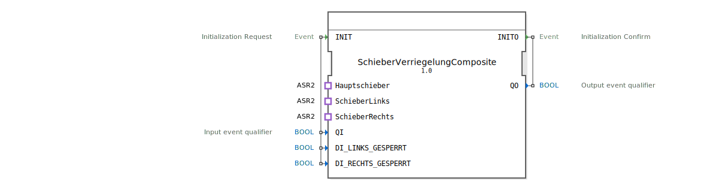

# SchieberVerriegelungComposite

```{index} single: SchieberVerriegelungComposite
```


* * * * * * * * * *
## Einleitung
Der Funktionsblock `SchieberVerriegelungComposite` ist ein Composite-FB, der als Wrapper für andere Funktionsblöcke dient. Sein Hauptzweck ist die Verwaltung und Koordination der Verriegelungslogik für mehrere Schieber (Hauptschieber, Schieber links, Schieber rechts). Er kapselt die interne Logik und bietet eine vereinheitlichte Schnittstelle für die Initialisierung und den Datenaustausch mit den angeschlossenen Aktoren und Sensoren.



## Schnittstellenstruktur

### **Ereignis-Eingänge**
*   **`INIT`**: Initialisierungsanforderung. Löst den Initialisierungsvorgang des internen `SchieberVerriegelung`-FB und damit des gesamten Composite-Blocks aus. Wird mit den Daten `QI`, `DI_LINKS_GESPERRT` und `DI_RECHTS_GESPERRT` verknüpft.

### **Ereignis-Ausgänge**
*   **`INITO`**: Initialisierungsbestätigung. Wird vom internen `SchieberVerriegelung`-FB ausgelöst und signalisiert den erfolgreichen Abschluss der Initialisierung. Ist mit dem Datenausgang `QO` verknüpft.

### **Daten-Eingänge**
*   **`QI` (BOOL)**: Qualifizierer für das INIT-Ereignis. Steuert die Initialisierung.
*   **`DI_LINKS_GESPERRT` (BOOL)**: Status-Eingang, der anzeigt, ob der linke Schieber verriegelt (gesperrt) ist.
*   **`DI_RECHTS_GESPERRT` (BOOL)**: Status-Eingang, der anzeigt, ob der rechte Schieber verriegelt (gesperrt) ist.

### **Daten-Ausgänge**
*   **`QO` (BOOL)**: Qualifizierer für das INITO-Ereignis. Gibt den Status der Initialisierung zurück.

### **Adapter**
Der Composite-FB stellt drei bidirektionale Adapter-Schnittstellen zur Verfügung, um mit den physikalischen oder logischen Schieber-Aktoren zu kommunizieren. Jeder Adapter folgt dem Typ `adapter::types::bidirectional::ASR2`, der typischerweise SET- und RESET-Kommandos sowie entsprechende Rückmeldungen unterstützt.
1.  **`Hauptschieber`**: Adapter für die Ansteuerung und Statusrückmeldung des Hauptschiebers.
2.  **`SchieberLinks`**: Adapter für die Ansteuerung und Statusrückmeldung des linken Schiebers.
3.  **`SchieberRechts`**: Adapter für die Ansteuerung und Statusrückmeldung des rechten Schiebers.

## Funktionsweise
Der `SchieberVerriegelungComposite` fungiert primär als Vermittler. Er leitet alle externen Ereignisse und Daten an den internen, gekapselten `SchieberVerriegelung`-Funktionsblock weiter. Ebenso werden die Ausgangsereignisse und -daten dieses internen FB an die Composite-Schnittstellen durchgereicht.

Die zentrale Logik zur Steuerung der Schieber und zur Verriegelung liegt vollständig im internen `SchieberVerriegelung`-FB. Der Composite-Block übersetzt die generischen Adapter-Ereignisse (`EI_SET`/`EI_RESET`, `EO_SET`/`EO_RESET`) in die spezifischen, benannten Ereignisse des internen FB (z.B. `EI_Hauptschieber_Open`, `EO_SchieberLinks_Close`) und umgekehrt. Dies ermöglicht eine saubere Trennung zwischen der anwendungsspezifischen Steuerlogik und der generischen Adapter-Kommunikation.

## Technische Besonderheiten
*   **Kapselung**: Die komplexe Verriegelungslogik ist in einem separaten FB (`SchieberVerriegelung`) implementiert, was Wiederverwendbarkeit und Testbarkeit fördert.
*   **Adapter-basierte Kommunikation**: Die Anbindung an die Aktoren erfolgt ausschließlich über standardisierte Adapter-Schnittstellen (`ASR2`). Dies abstrahiert die konkrete Aktorik und erhöht die Flexibilität.
*   **Pass-Through-Design**: Bis auf die Übersetzung der Adapter-Ereignisnamen besitzt dieser Composite-FB keine eigene Logik. Er dient der strukturierten Organisation des FBNetworks.

## Zustandsübersicht
Als Composite-FB besitzt `SchieberVerriegelungComposite` selbst keinen expliziten Zustandsautomaten. Der Systemzustand wird vollständig durch den internen `SchieberVerriegelung`-FB verwaltet. Der Composite-Block kann sich in einem der beiden folgenden Makrozustände befinden:
*   **Nicht initialisiert**: Vor dem Eintreffen eines gültigen `INIT`-Ereignisses.
*   **Initialisiert und betriebsbereit**: Nachdem der interne FB die Initialisierung via `INITO` quittiert hat. In diesem Zustand werden alle Adapter-Ereignisse durchgeleitet.

## Anwendungsszenarien
Dieser Funktionsblock ist für Steuerungsanwendungen konzipiert, in denen mehrere mechanisch oder logisch verknüpfte Schieber oder Verschlüsse koordiniert werden müssen, z.B.:
*   Verriegelungssysteme in Förderanlagen oder Silos.
*   Sicherheitssteuerungen für Tore oder Klappen, die nur unter bestimmten Bedingungen geöffnet werden dürfen.
*   Prozesssteuerungen, in denen die Reihenfolge von Schaltvorgängen eingehalten werden muss (z.B. Hauptschieber nur öffnen, wenn Seitenverschlüsse geschlossen sind).

## Vergleich mit ähnlichen Bausteinen
Im Gegensatz zu einem einfachen, monolithischen Funktionsblock, der Logik und Schnittstellen vermischt, bietet dieser Composite-Block eine klare Trennung der Belange (Separation of Concerns). Ein direkter Vergleich wäre ein `SchieberVerriegelung`-FB, der die Adapter-Schnittstellen direkt integriert hätte. Der Composite-Ansatz ist modularer und erlaubt es, die Kernlogik (`SchieberVerriegelung`) unverändert in verschiedenen Netzwerkumgebungen wiederzuverwenden, indem nur der umschließende Composite-Block angepasst wird.

## Fazit
Der `SchieberVerriegelungComposite` ist ein gut strukturierter Wrapper-Baustein, der die Integration einer komplexen Schieber-Verriegelungslogik in ein größeres 4diac-Steuerungssystem vereinfacht. Durch die Verwendung standardisierter Adapter und die Kapselung der Kernfunktionalität fördert er Wiederverwendbarkeit, Wartbarkeit und klare Schnittstellendefinitionen. Er ist ideal für Anwendungen, bei denen eine zuverlässige und übersichtliche Koordination mehrerer Aktoren erforderlich ist.