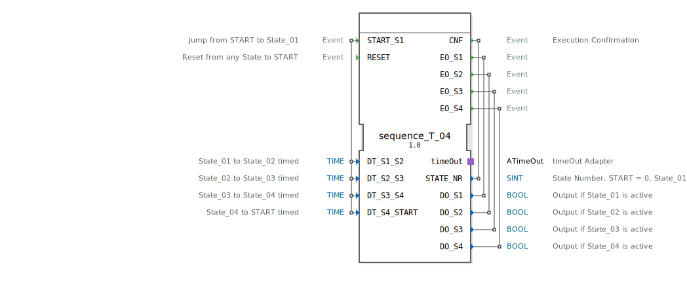

# sequence_T_04

```{index} single: sequence_T_04
```


* * * * * * * * * *
## Einleitung
Der Funktionsblock `sequence_T_04` ist ein zeitgesteuerter Sequenzer mit vier definierten Zuständen (State_01 bis State_04) und einem Startzustand (START). Er ermöglicht die zyklische oder einmalige Abarbeitung einer festen Reihenfolge, wobei die Verweildauer in jedem Zustand über konfigurierbare Zeitwerte gesteuert wird. Der Übergang zwischen den Zuständen erfolgt automatisch nach Ablauf der eingestellten Zeit. Der Baustein eignet sich ideal für zeitlich getaktete Ablaufsteuerungen, wie sie z.B. in Förderanlagen, Verpackungsmaschinen oder Waschprozessen vorkommen.



## Schnittstellenstruktur

### **Ereignis-Eingänge**
*   **`START_S1`**: Startet die Sequenz. Ein Ereignis an diesem Eingang bewirkt den Übergang vom Zustand START oder sState_00 in den ersten aktiven Zustand State_01. Es werden die Zeitdaten `DT_S1_S2`, `DT_S2_S3`, `DT_S3_S4` und `DT_S4_START` mitgelesen.
*   **`RESET`**: Setzt die Sequenz von jedem beliebigen Zustand sofort in den Ruhezustand (sState_00) zurück. Alle Ausgänge (`DO_S1` bis `DO_S4`) werden dabei deaktiviert.

### **Ereignis-Ausgänge**
*   **`CNF`**: Bestätigungsereignis (Execution Confirmation). Wird bei jedem Zustandswechsel ausgelöst und liefert die aktuelle Zustandsnummer `STATE_NR`.
*   **`EO_S1`**: Wird bei Eintritt in den Zustand State_01 ausgelöst und liefert den zugehörigen Datenausgang `DO_S1`.
*   **`EO_S2`**: Wird bei Eintritt in den Zustand State_02 ausgelöst und liefert den zugehörigen Datenausgang `DO_S2`.
*   **`EO_S3`**: Wird bei Eintritt in den Zustand State_03 ausgelöst und liefert den zugehörigen Datenausgang `DO_S3`.
*   **`EO_S4`**: Wird bei Eintritt in den Zustand State_04 ausgelöst und liefert den zugehörigen Datenausgang `DO_S4`.

### **Daten-Eingänge**
*   **`DT_S1_S2`** (TIME): Verweildauer im Zustand State_01, bevor der automatische Übergang zu State_02 erfolgt. Initialwert: `NO_TIME`.
*   **`DT_S2_S3`** (TIME): Verweildauer im Zustand State_02, bevor der automatische Übergang zu State_03 erfolgt. Initialwert: `NO_TIME`.
*   **`DT_S3_S4`** (TIME): Verweildauer im Zustand State_03, bevor der automatische Übergang zu State_04 erfolgt. Initialwert: `NO_TIME`.
*   **`DT_S4_START`** (TIME): Verweildauer im Zustand State_04, bevor der automatische Übergang zum Ruhezustand sState_00 erfolgt. Initialwert: `NO_TIME`.

### **Daten-Ausgänge**
*   **`STATE_NR`** (SINT): Gibt die Nummer des aktuell aktiven Zustands aus. START = 0, State_01 = 1, State_02 = 2, State_03 = 3, State_04 = 4.
*   **`DO_S1`** (BOOL): Logischer Ausgang, der TRUE ist, solange sich der FB im Zustand State_01 befindet.
*   **`DO_S2`** (BOOL): Logischer Ausgang, der TRUE ist, solange sich der FB im Zustand State_02 befindet.
*   **`DO_S3`** (BOOL): Logischer Ausgang, der TRUE ist, solange sich der FB im Zustand State_03 befindet.
*   **`DO_S4`** (BOOL): Logischer Ausgang, der TRUE ist, solange sich der FB im Zustand State_04 befindet.

### **Adapter**
*   **`timeOut`** (Plug, Typ: `iec61499::events::ATimeOut`): Ein standardisierter TimeOut-Adapter, der für die zeitgesteuerten Zustandsübergänge verwendet wird. Der FB startet (`timeOut.START`) den Timer beim Eintritt in einen aktiven Zustand und reagiert auf dessen `TimeOut`-Ereignis.

## Funktionsweise
Der FB arbeitet als Basic Function Block (BFB) mit einer definierten Execution Control Chart (ECC). Die Sequenz durchläuft die Zustände in der festen Reihenfolge: START -> State_01 -> State_02 -> State_03 -> State_04 -> sState_00.

1.  **Start**: Ein `START_S1`-Ereignis (aus den Zuständen `xSTART` oder `sState_00`) aktiviert State_01.
2.  **Zustandsaktivierung**: Beim Eintritt in einen Zustand (State_01-04) werden folgende Aktionen ausgeführt:
    *   Der entsprechende Datenausgang (`DO_Sx`) wird auf TRUE gesetzt (Entry-Algorithmus `State_x_E`).
    *   Das zugehörige Ereignis (`EO_Sx`) wird ausgelöst.
    *   Die Zustandsnummer `STATE_NR` wird aktualisiert (Confirmation-Algorithmus `State_x_C`).
    *   Die für den nächsten Übergang konfigurierte Zeit (`DT_...`) wird an den `timeOut`-Adapter übergeben und der Timer gestartet.
    *   Das allgemeine Bestätigungsereignis `CNF` wird ausgelöst.
3.  **Zeitgesteuerter Übergang**: Nach Ablauf der im Timer eingestellten Zeit löst der Adapter das `TimeOut`-Ereignis aus. Dies ist die Bedingung für den Übergang zum nächsten Zustand in der Sequenz.
4.  **Zustandsverlassen**: Beim Verlassen eines Zustands wird der zugehörige Datenausgang (`DO_Sx`) durch den Exit-Algorithmus (`State_x_X`) auf FALSE zurückgesetzt.
5.  **Zyklusende und Reset**: Nach State_04 wechselt der FB in den Zustand `sState_00` (Ruhezustand). Von hier aus kann die Sequenz durch ein erneutes `START_S1`-Ereignis neu gestartet werden. Ein `RESET`-Ereignis von jedem Zustand aus führt sofort in den `sRESET`-Zustand, deaktiviert alle Ausgänge und geht dann in `sState_00` über.

## Technische Besonderheiten
*   **Initialwerte**: Die Zeitdaten-Eingänge sind standardmäßig mit der Konstante `NO_TIME` vorbelegt. Ein Wert von `NO_TIME` führt dazu, dass der FB nach dem Eintritt in den Zustand unendlich lange wartet, bis ein `RESET` erfolgt.
*   **Zustand sState_00**: Dieser Zustand ist der stabile Ruhezustand nach Abschluss eines Zyklus. Im Gegensatz zum initialen `xSTART` ist er Teil der ECC und kann Algorithmen ausführen (hier die Zustandsnummer 0 setzen).
*   **Adapter-Nutzung**: Die Zeitsteuerung ist komplett in den standardisierten `ATimeOut`-Adapter ausgelagert, was Wiederverwendbarkeit und Klarheit erhöht.

## Zustandsübersicht
| Zustandsname | Beschreibung | Aktive Ausgänge | Übergangsbedingung zum nächsten Zustand |
| :--- | :--- | :--- | :--- |
| **xSTART** | Initialer Idle-Zustand. | Keine | `START_S1` |
| **sState_01** | Erster aktiver Schritt. | `DO_S1=1`, `STATE_NR=1` | `timeOut.TimeOut` (nach DT_S1_S2) |
| **sState_02** | Zweiter aktiver Schritt. | `DO_S2=1`, `STATE_NR=2` | `timeOut.TimeOut` (nach DT_S2_S3) |
| **sState_03** | Dritter aktiver Schritt. | `DO_S3=1`, `STATE_NR=3` | `timeOut.TimeOut` (nach DT_S3_S4) |
| **sState_04** | Vierter aktiver Schritt. | `DO_S4=1`, `STATE_NR=4` | `timeOut.TimeOut` (nach DT_S4_START) |
| **sState_00** | Ruhezustand nach Sequenzende. | `STATE_NR=0` | `START_S1` (für neuen Zyklus) |
| **sRESET** | Zwischenzustand für Reset-Vorgang. | Keine | Immer (`Condition=1`) |

**Globale Übergangsbedingung**: Von den Zuständen sState_01 bis sState_04 führt ein `RESET`-Ereignis immer in den sRESET-Zustand.

## Anwendungsszenarien
*   **Steuerung von Zyklusmaschinen**: Automatische Abfolge von Bearbeitungsschritten wie Bohren, Fräsen, Entgraten mit einstellbaren Bearbeitungszeiten.
*   **Verpackungsanlagen**: Steuerung des zeitlichen Ablaufs: Produkt zuführen -> Verpackung schließen -> Etikett aufbringen -> Palettieren.
*   **Reinigungsprozesse**: Steuerung einer Sprühkabine: Vorspülen (State_01) -> Hauptreinigung (State_02) -> Nachspülen (State_03) -> Trocknen (State_04).
*   **Teststände**: Automatisierte Prüfsequenz, bei der jeder Testschritt eine feste Dauer hat.

## ⚖️ Vergleich mit ähnlichen Bausteinen
*   **Einfache Timer (TON)**: Einzelne Timerbausteine müssten für eine Sequenz verkettet und die Logik für die Zustandsübergänge und Ausgänge separat programmiert werden. `sequence_T_04` kapselt diese komplette Logik.
*   **Zähler-basierte Sequenzer**: Sequenzer, die mit Ereignissen (nicht Zeit) weiterschalten, bieten eine andere Art der Steuerung. `sequence_T_04` ist speziell für zeitkritische Abläufe ohne externe Trigger gedacht.
*   **SPS-spezifische Ablaufsprachen (S7-GRAFCET)**: Dieser FB implementiert ein ähnliches Prinzip wie eine Grafcet-Step-Kette, jedoch innerhalb des portablen IEC 61499-Standards.

## Fazit
Der `sequence_T_04` ist ein robustes und einfach zu konfigurierendes Werkzeug für zeitgesteuerte Ablaufsteuerungen mit bis zu vier Schritten. Durch die klare Trennung von Zustandslogik (ECC) und Zeitsteuerung (Adapter) sowie die vollständige Kapselung des Verhaltens ist er wartungsfreundlich und reduziert den Programmieraufwand im übergeordneten Application-Netzwerk erheblich. Die Möglichkeit eines sofortigen Resets von jedem Zustand aus gewährleistet zudem eine hohe Betriebssicherheit.