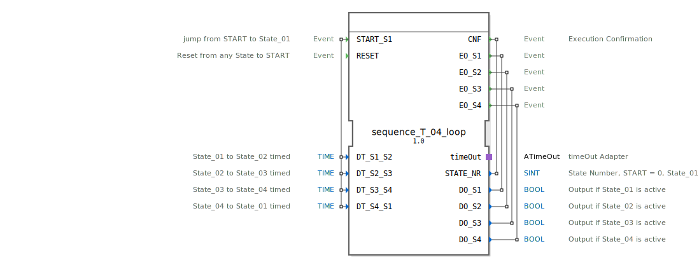

# sequence_T_04_loop

```{index} single: sequence_T_04_loop
```


* * * * * * * * * *
## Einleitung
Der Funktionsblock `sequence_T_04_loop` ist ein zeitgesteuerter Sequenzer mit vier Ausgängen, der in einer Schleife arbeitet. Er durchläuft nacheinander vier Zustände (State_01 bis State_04). Der Übergang von einem Zustand zum nächsten erfolgt automatisch nach Ablauf einer einstellbaren Zeitverzögerung. Der Baustein kann von jedem Zustand aus zurückgesetzt werden und startet dann die Sequenz erneut.



## Schnittstellenstruktur
### **Ereignis-Eingänge**
*   **`START_S1`**: Startet die Sequenz. Der Übergang erfolgt vom initialen `START`-Zustand in `State_01`. Das Ereignis ist mit den vier Zeitdaten-Eingängen verknüpft.
*   **`RESET`**: Setzt die Sequenz von jedem beliebigen aktiven Zustand zurück in den initialen `START`-Zustand.

### **Ereignis-Ausgänge**
*   **`CNF`**: Ausführungsbestätigung (Confirmation). Wird bei jedem Zustandswechsel ausgelöst und liefert die aktuelle Zustandsnummer.
*   **`EO_S1`**: Wird beim Eintritt in `State_01` ausgelöst und liefert den zugehörigen Datenausgang `DO_S1`.
*   **`EO_S2`**: Wird beim Eintritt in `State_02` ausgelöst und liefert den zugehörigen Datenausgang `DO_S2`.
*   **`EO_S3`**: Wird beim Eintritt in `State_03` ausgelöst und liefert den zugehörigen Datenausgang `DO_S3`.
*   **`EO_S4`**: Wird beim Eintritt in `State_04` ausgelöst und liefert den zugehörigen Datenausgang `DO_S4`.

### **Daten-Eingänge**
*   **`DT_S1_S2`** (`TIME`): Zeitverzögerung für den Übergang von `State_01` zu `State_02`. Initialwert: `NO_TIME`.
*   **`DT_S2_S3`** (`TIME`): Zeitverzögerung für den Übergang von `State_02` zu `State_03`. Initialwert: `NO_TIME`.
*   **`DT_S3_S4`** (`TIME`): Zeitverzögerung für den Übergang von `State_03` zu `State_04`. Initialwert: `NO_TIME`.
*   **`DT_S4_S1`** (`TIME`): Zeitverzögerung für den Übergang von `State_04` zurück zu `State_01` (Schleife). Initialwert: `NO_TIME`.

### **Daten-Ausgänge**
*   **`STATE_NR`** (`SINT`): Aktuelle Zustandsnummer. `0` = START, `1` = State_01, `2` = State_02, `3` = State_03, `4` = State_04.
*   **`DO_S1`** (`BOOL`): Ist `TRUE`, wenn `State_01` aktiv ist.
*   **`DO_S2`** (`BOOL`): Ist `TRUE`, wenn `State_02` aktiv ist.
*   **`DO_S3`** (`BOOL`): Ist `TRUE`, wenn `State_03` aktiv ist.
*   **`DO_S4`** (`BOOL`): Ist `TRUE`, wenn `State_04` aktiv ist.

### **Adapter**
*   **`timeOut`** (Plug, Typ: `iec61499::events::ATimeOut`): Ein Zeitgeber-Adapter, der für die zeitgesteuerten Zustandsübergänge verwendet wird. Der FB startet den Timer beim Eintritt in einen Zustand und reagiert auf dessen `TimeOut`-Ereignis.

## Funktionsweise
Der FB ist als BasicFB mit einer ECC (Execution Control Chart) implementiert. Die Sequenz beginnt im initialen Zustand `xSTART`. Ein `START_S1`-Ereignis führt in den ersten aktiven Zustand `sState_01`.

**In jedem aktiven Zustand (`sState_01` bis `sState_04`) werden nacheinander folgende Aktionen ausgeführt:**
1.  **Exit-Step des vorherigen Zustands**: Der zugehörige Datenausgang (`DO_Sx`) wird auf `FALSE` gesetzt (außer beim ersten Eintritt von `xSTART`).
2.  **Confirmation-Step**: Die Zustandsnummer `STATE_NR` wird aktualisiert und die Verzögerungszeit für den *nächsten* Übergang wird an den `timeOut`-Adapter übergeben (`timeOut.DT`).
3.  **Entry-Step des neuen Zustands**: Der zugehörige Datenausgang (`DO_Sx`) wird auf `TRUE` gesetzt und das entsprechende Ereignis (`EO_Sx`) wird ausgelöst.
4.  **Timer-Start**: Der `timeOut`-Adapter wird gestartet (`timeOut.START`).

Der Übergang zum nächsten Zustand erfolgt ausschließlich durch das `TimeOut`-Ereignis des Adapters. Nach `State_04` springt die Sequenz gemäß Schleifenlogik zurück zu `State_01`.

Ein `RESET`-Ereignis von jedem Zustand aus führt in den `sRESET`-Zustand. Dort werden alle Ausgänge (`DO_S1` bis `DO_S4`) deaktiviert, der Timer gestoppt, die Zustandsnummer auf `0` (START) gesetzt und eine Bestätigung (`CNF`) ausgegeben. Anschließend kehrt der FB automatisch in den `xSTART`-Zustand zurück.

## Technische Besonderheiten
*   **Zeitsteuerung**: Die Übergänge sind rein zeitgesteuert. Es gibt keine ereignisgesteuerten Übergänge zwischen den Hauptzuständen.
*   **Initialwerte**: Die Zeitdaten-Eingänge sind standardmäßig mit `NO_TIME` vorbelegt. Dies muss für einen funktionierenden Ablauf angepasst werden.
*   **Konstanten**: Der FB verwendet Konstanten aus der Bibliothek `logiBUS::utils::sequence::const::sequence` (z.B. für Zustandsnummern) und `logiBUS::utils::sequence::const::sequence::NO_TIME`.

## Zustandsübersicht
1.  **`xSTART`**: Initialer, inaktiver Zustand. Wartet auf `START_S1`.
2.  **`sState_01`**: Erster aktiver Zustand. `DO_S1 = TRUE`. Timer für Übergang zu `State_02` läuft.
3.  **`sState_02`**: Zweiter aktiver Zustand. `DO_S2 = TRUE`. Timer für Übergang zu `State_03` läuft.
4.  **`sState_03`**: Dritter aktiver Zustand. `DO_S3 = TRUE`. Timer für Übergang zu `State_04` läuft.
5.  **`sState_04`**: Vierter aktiver Zustand. `DO_S4 = TRUE`. Timer für Übergang (zurück) zu `State_01` läuft.
6.  **`sRESET`**: Reset-Zustand. Deaktiviert alle Ausgänge, stoppt den Timer und bestätigt den Reset.

## Anwendungsszenarien
*   Steuerung zyklischer Prozesse mit festen Zeitschritten, z.B. in Verpackungsmaschinen, Waschanlagen oder automatisierten Montagelinien.
*   Ansteuerung von Aktoren in einer festen, zeitlich getakteten Reihenfolge.
*   Als zentraler Taktgeber für übergeordnete Steuerungsabläufe.

## ⚖️ Vergleich mit ähnlichen Bausteinen
*   **Einfache Timer (TON)**: Einzelne Timer bieten keine integrierte Sequenzlogik. `sequence_T_04_loop` kapselt die komplette Zustandsmaschine mit vier Schritten.
*   **Ereignisgesteuerte Sequenzer**: Im Gegensatz zu ereignisgesteuerten Sequenzern (z.B. `sequence_E_04_loop`) erfolgen die Übergänge hier ausschließlich zeitbasiert, nicht durch externe Ereignisse.
*   **SPS-Zyklus**: Die zeitgesteuerte Ablaufkontrolle ist präziser und unabhängig vom SPS-Zyklus, da sie auf dem `ATimeOut`-Adapter basiert.


## 🛠️ Zugehörige Übungen

* [Uebung_035a](../../../../../../training1/Ventilsteuerung/4diacIDE-workspace/test_B/Uebungen_doc/Uebung_035a.md)

## Fazit
Der `sequence_T_04_loop` ist ein robuster und einfach zu konfigurierender Funktionsblock für zeitgesteuerte Ablaufsteuerungen mit vier Schritten. Durch die klare Trennung von Zustandslogik und Zeitparametern sowie die integrierte Reset-Funktionalität eignet er sich gut für standardisierte zyklische Prozesse in der Automatisierungstechnik. Die Verwendung eines Standard-Adapters für die Zeitmessung gewährleistet Portabilität und Zuverlässigkeit.