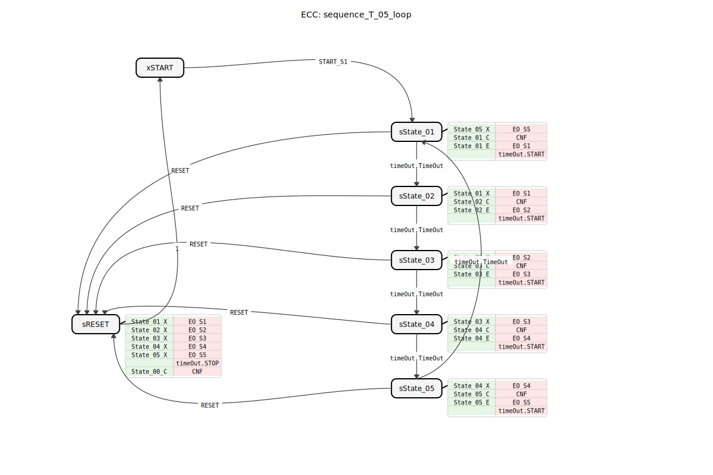
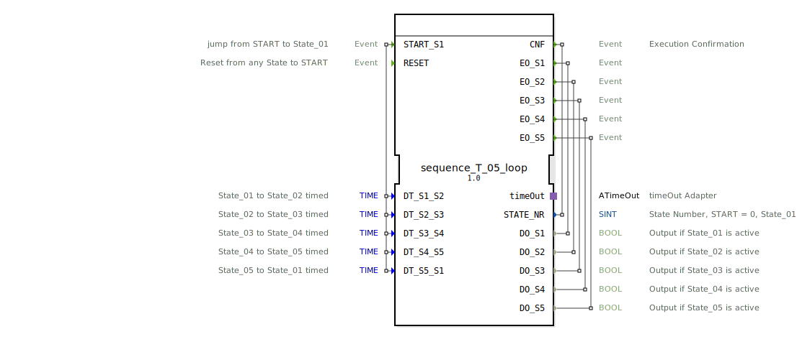

# sequence_T_05_loop

```{index} single: sequence_T_05_loop
```




* * * * * * * * * *
## Einleitung
Der Funktionsblock `sequence_T_05_loop` ist ein zeitgesteuerter Sequenzer, der einen zyklischen Ablauf von fünf Zuständen (State_01 bis State_05) realisiert. Der Übergang von einem Zustand zum nächsten erfolgt nach einer einstellbaren Zeitverzögerung. Der Baustein ist für Anwendungen konzipiert, in denen Aktionen oder Prozessschritte nacheinander und für eine definierte Dauer aktiviert werden müssen, beispielsweise in automatisierten Handhabungs- oder Fertigungsprozessen.



## Schnittstellenstruktur

### **Ereignis-Eingänge**
*   **`START_S1`**: Startet die Sequenz und führt einen Übergang vom Initialzustand (`START`) in den ersten aktiven Zustand (`State_01`). Das Ereignis wird mit den fünf Zeitdaten-Eingängen verknüpft.
*   **`RESET`**: Bricht die aktuelle Sequenz ab und führt in den Reset-Zustand (`sRESET`), von wo aus automatisch in den Initialzustand (`xSTART`) zurückgekehrt wird. Setzt alle Ausgänge zurück.

### **Ereignis-Ausgänge**
*   **`CNF`**: Bestätigungsereignis (Confirmation). Wird bei jedem Zustandswechsel ausgelöst und liefert die aktuelle Zustandsnummer (`STATE_NR`).
*   **`EO_S1`** bis **`EO_S5`**: Zustandsereignisse. Werden beim Eintritt in den jeweiligen Zustand (State_01 bis State_05) ausgelöst und liefern den zugehörigen booleschen Datenausgang (`DO_S1` bis `DO_S5`).

### **Daten-Eingänge**
*   **`DT_S1_S2`** (Typ: `TIME`, Initialwert: `NO_TIME`): Zeitdauer für den Übergang von State_01 zu State_02.
*   **`DT_S2_S3`** (Typ: `TIME`, Initialwert: `NO_TIME`): Zeitdauer für den Übergang von State_02 zu State_03.
*   **`DT_S3_S4`** (Typ: `TIME`, Initialwert: `NO_TIME`): Zeitdauer für den Übergang von State_03 zu State_04.
*   **`DT_S4_S5`** (Typ: `TIME`, Initialwert: `NO_TIME`): Zeitdauer für den Übergang von State_04 zu State_05.
*   **`DT_S5_S1`** (Typ: `TIME`, Initialwert: `NO_TIME`): Zeitdauer für den Übergang von State_05 zurück zu State_01, wodurch die Schleife geschlossen wird.

### **Daten-Ausgänge**
*   **`STATE_NR`** (Typ: `SINT`): Gibt die Nummer des aktuell aktiven Zustands aus. `0` = START, `1` = State_01, ..., `5` = State_05.
*   **`DO_S1`** bis **`DO_S5`** (Typ: `BOOL`): Logische Ausgänge, die `TRUE` sind, solange sich der FB im zugehörigen Zustand (State_01 bis State_05) befindet.

### **Adapter**
*   **`timeOut`** (Typ: `iec61499::events::ATimeOut`, Plug): Ein Zeitgeber-Adapter, der für die zeitgesteuerten Zustandsübergänge verwendet wird. Der FB startet den Timer beim Eintritt in einen Zustand und wechselt beim Eingang des `TimeOut`-Ereignisses zum nächsten Zustand.

## Funktionsweise
Der FB ist als Basic Function Block (BFB) mit einer Execution Control Chart (ECC) implementiert. Nach dem Start (`START_S1`) durchläuft er die Zustände `State_01` bis `State_05` in einer festen Reihenfolge. In jedem aktiven Zustand werden folgende Aktionen ausgeführt:
1.  **Exit-Aktion des vorherigen Zustands**: Setzt den zugehörigen booleschen Ausgang (`DO_Sx`) auf `FALSE`.
2.  **Confirmation-Aktion**: Setzt die aktuelle `STATE_NR` und konfiguriert die Verweildauer für den *aktuellen* Zustand im `timeOut`-Adapter (z.B. wird in `State_01` der Wert von `DT_S1_S2` geladen).
3.  **Entry-Aktion des neuen Zustands**: Setzt den zugehörigen booleschen Ausgang (`DO_Sx`) auf `TRUE`.
4.  **Timer-Start**: Startet den `timeOut`-Adapter mit der in Schritt 2 geladenen Zeit.

Der Übergang zum nächsten Zustand erfolgt ausschließlich, wenn der `timeOut`-Adapter das `TimeOut`-Ereignis liefert. Nach `State_05` springt der FB gemäß `DT_S5_S1` zurück zu `State_01`, wodurch eine Endlosschleife entsteht. Ein `RESET`-Ereignis von jedem Zustand aus deaktiviert alle Ausgänge, stoppt den Timer und bringt den FB in den Initialzustand `xSTART` zurück.

## Technische Besonderheiten
*   **Initialwerte**: Die Zeitdaten-Eingänge sind standardmäßig mit der Konstante `NO_TIME` initialisiert. Ein Wert von `NO_TIME` oder `T#0s` führt zu einem sofortigen Zustandsübergang.
*   **Zustandsbestätigung**: Das `CNF`-Ereignis wird in jedem Zustand (inklusive Reset) ausgelöst, was eine zuverlässige Überwachung der FB-Aktivität von außen ermöglicht.
*   **Adapter-Nutzung**: Die Zeitsteuerung ist komplett in den standardisierten `ATimeOut`-Adapter ausgelagert, was Wiederverwendbarkeit und klare Schnittstellen fördert.
*   **Konstanten**: Der FB importiert Konstanten aus `logiBUS::utils::sequence::const::sequence`, z.B. für die Zustandsnummern (`State_00`, `State_01`, ...).

## Zustandsübersicht
Die ECC umfasst sieben Zustände:
*   **`xSTART`**: Inaktiver Initialzustand. Wartet auf `START_S1`.
*   **`sState_01`** bis **`sState_05`**: Aktive Arbeitszustände. Jeder aktiviert seinen spezifischen Ausgang (`DO_Sx`) und startet den Timer für seinen eigenen Verbleib.
*   **`sRESET`**: Reset-Zustand. Deaktiviert alle Ausgänge, stoppt den Timer und sendet eine Bestätigung (`CNF`) mit `STATE_NR=0`. Geht automatisch mit Condition `1` (immer wahr) zurück zu `xSTART`.

## Anwendungsszenarien
*   **Steuerung von Zyklusabläufen**: Automatisierte Abfolgen in Verpackungsmaschinen, wo verschiedene Aktoren (Greifer, Stempel, Förderer) nacheinander für bestimmte Zeiten aktiviert werden müssen.
*   **Prozesssteuerung**: Schrittweise Durchführung von chemischen oder thermischen Prozessen, bei denen jeder Schritt eine definierte Haltezeit hat.
*   **Anzeige- oder Blinksequenzen**: Steuerung von visuellen oder akustischen Signalen in einer festgelegten, zeitlich getakteten Reihenfolge.

## ⚖️ Vergleich mit ähnlichen Bausteinen
Im Gegensatz zu einem einfachen TON-Timer (Verzögerungseinschaltverzögerung) realisiert dieser FB eine vollständige Zustandsmaschine mit mehreren Schritten. Im Vergleich zu generischen Sequencer-FBs, die oft mit Schrittabfragen (z.B. über Steigungsflanken) arbeiten, ist dieser Baustein rein zeitgesteuert. Er ähnelt einer Kette von TON-Bausteinen, ist aber in einem einzigen, zustandsbasierten FB gekapselt, was die Anordnung und Parametrierung vereinfacht.


## 🛠️ Zugehörige Übungen

* [Uebung_035a2](../../../../../../training1/Ventilsteuerung/4diacIDE-workspace/test_B/Uebungen_doc/Uebung_035a2.md)
* [Uebung_035a3](../../../../../../training1/Ventilsteuerung/4diacIDE-workspace/test_B/Uebungen_doc/Uebung_035a3.md)

## Fazit
Der `sequence_T_05_loop` ist ein spezialisierter, robuster und einfach zu konfigurierender Sequenzer für zyklische, zeitgesteuerte Abläufe mit fünf Schritten. Seine klare Struktur, die Nutzung standardisierter Adapter und die umfassende Bestätigung aller Zustandswechsel machen ihn zu einer zuverlässigen Komponente für zeitkritische Automatisierungsaufgaben. Die Schleifenfunktion und der zentrale Reset sind für Dauerbetriebsanwendungen besonders geeignet.