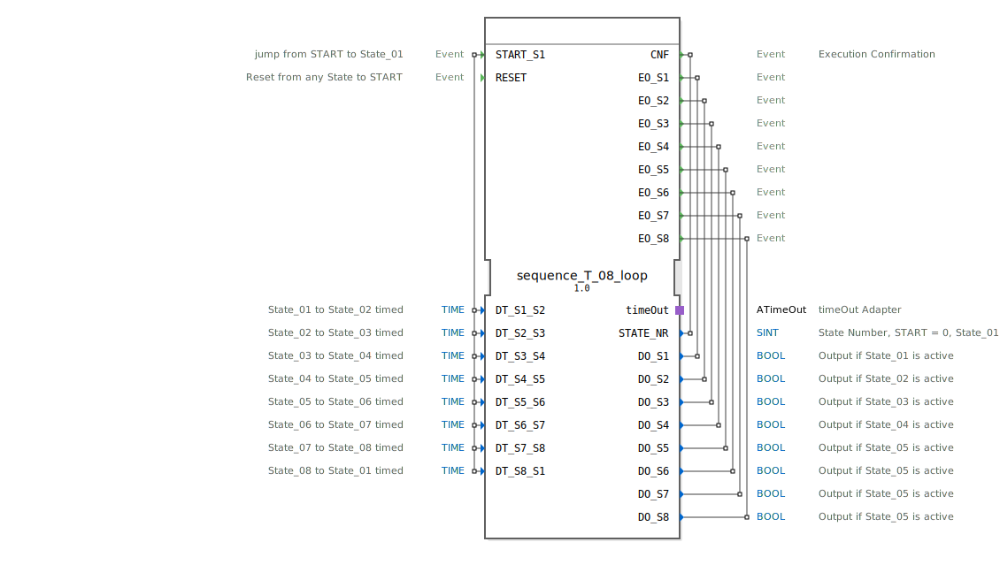

# sequence_T_08_loop

```{index} single: sequence_T_08_loop
```


* * * * * * * * * *
## Einleitung
Der Funktionsblock `sequence_T_08_loop` ist ein zeitgesteuerter Sequenzer mit acht Ausgangszuständen. Er realisiert eine zyklische Abfolge von Zuständen, wobei der Übergang zwischen den einzelnen Zuständen durch einstellbare Zeitverzögerungen gesteuert wird. Der Baustein ist für Anwendungen konzipiert, in denen Prozessschritte oder Maschinenzustände nacheinander für eine definierte Dauer aktiviert werden müssen, beispielsweise in Förderanlagen, Verpackungsmaschinen oder automatisierten Montageprozessen.



## Schnittstellenstruktur
### **Ereignis-Eingänge**
*   **`START_S1`**: Startet die Sequenz durch einen Sprung vom initialen `START`-Zustand in den ersten aktiven Zustand `State_01`. Löst die Ausführung der zugehörigen Algorithmen aus.
*   **`RESET`**: Setzt die Sequenz unabhängig vom aktuellen Zustand sofort in den initialen `START`-Zustand zurück. Alle aktiven Ausgänge werden deaktiviert.

### **Ereignis-Ausgänge**
*   **`CNF`** (Execution Confirmation): Wird bei jedem Zustandswechsel ausgelöst und bestätigt die Ausführung. Überträgt die aktuelle Zustandsnummer `STATE_NR`.
*   **`EO_S1` bis `EO_S8`**: Ereignisausgänge, die beim Eintritt in den jeweiligen Zustand `State_01` bis `State_08` ausgelöst werden. Sie übertragen den zugehörigen booleschen Datenwert (`DO_S1` bis `DO_S8`), der auf `TRUE` gesetzt wird.

### **Daten-Eingänge**
Acht Zeitdaten-Eingänge vom Typ `TIME`, die die Verweildauer in jedem Zustand definieren. Der Standardwert ist `NO_TIME` (keine Zeit, sofortiger Übergang).
*   `DT_S1_S2`: Verweildauer in `State_01` vor Übergang zu `State_02`.
*   `DT_S2_S3`: Verweildauer in `State_02` vor Übergang zu `State_03`.
*   `DT_S3_S4`: Verweildauer in `State_03` vor Übergang zu `State_04`.
*   `DT_S4_S5`: Verweildauer in `State_04` vor Übergang zu `State_05`.
*   `DT_S5_S6`: Verweildauer in `State_05` vor Übergang zu `State_06`.
*   `DT_S6_S7`: Verweildauer in `State_06` vor Übergang zu `State_07`.
*   `DT_S7_S8`: Verweildauer in `State_07` vor Übergang zu `State_08`.
*   `DT_S8_S1`: Verweildauer in `State_08` vor dem zyklischen Übergang zurück zu `State_01`.

### **Daten-Ausgänge**
*   **`STATE_NR`** (SINT): Gibt die Nummer des aktuell aktiven Zustands aus. `START` = 0, `State_01` = 1, ..., `State_08` = 8.
*   **`DO_S1` bis `DO_S8`** (BOOL): Die physischen Ausgangssignale der Sequenz. Jeder Ausgang wird auf `TRUE` gesetzt, wenn der entsprechende Zustand aktiv ist, ansonsten ist er `FALSE`.

### **Adapter**
*   **`timeOut`** (Plug, Typ: `iec61499::events::ATimeOut`): Ein Zeitgeber-Adapter, der für die Realisierung der zeitgesteuerten Zustandsübergänge verwendet wird. Der FB startet den Timer beim Eintritt in einen Zustand und wechselt bei Empfang des `TimeOut`-Ereignisses zum nächsten Zustand.

## Funktionsweise
Der FB arbeitet als Basic Function Block mit einem internen Execution Control Chart (ECC). Die Sequenz beginnt im initialen Zustand `xSTART`. Ein `START_S1`-Ereignis führt zum Zustand `sState_01`. Beim Eintritt in einen Zustand (z.B. `sState_01`) werden drei Aktionen ausgeführt:
1.  Der Exit-Algorithmus des vorherigen Zustands (z.B. `State_08_X`) deaktiviert dessen Ausgang.
2.  Der Confirmation-Algorithmus (z.B. `State_01_C`) setzt die `STATE_NR` und lädt die für diesen Zustand konfigurierte Zeit (`DT_S1_S2`) in den `timeOut`-Adapter.
3.  Der Entry-Algorithmus (z.B. `State_01_E`) setzt den zugehörigen Datenausgang (`DO_S1`) auf `TRUE` und löst das entsprechende Ereignis (`EO_S1`) aus.
4.  Der Timer-Adapter wird mit `timeOut.START` gestartet.

Nach Ablauf der eingestellten Zeit löst der Adapter das `timeOut.TimeOut`-Ereignis aus, was im ECC den Übergang zum nächsten Zustand (z.B. von `sState_01` zu `sState_02`) bewirkt. Nach dem letzten Zustand (`sState_08`) erfolgt der Übergang zurück zum ersten Zustand (`sState_01`), wodurch eine Endlosschleife entsteht.

Ein `RESET`-Ereignis von jedem Zustand aus führt zum Zustand `sRESET`. Hier werden alle Ausgänge deaktiviert, der Timer gestoppt und eine Bestätigung mit `STATE_NR=0` gesendet, bevor automatisch in den `xSTART`-Zustand zurückgekehrt wird.

## Technische Besonderheiten
*   **Zyklus ohne Stopp**: Die Sequenz läuft nach dem Start endlos im Kreis, bis ein `RESET`-Signal empfangen wird. Es gibt keinen integrierten Stopp-Befehl.
*   **Sofortige Zustandsübergänge**: Durch Setzen der Zeitwerte auf `NO_TIME` (Standard) kann der FB so konfiguriert werden, dass er sofort zum nächsten Zustand wechselt, sobald der Eintrittsalgorithmus des aktuellen Zustands abgearbeitet ist.
*   **Deterministische Abarbeitung**: Die Algorithmen für Exit, Confirmation und Entry werden in genau dieser Reihenfolge und atomar beim Zustandseintritt ausgeführt.
*   **Konstanten für Zustandsnummern**: Die `STATE_NR` wird über Konstanten aus dem Import `sequence` (z.B. `sequence::State_01`) gesetzt, was die Wartbarkeit und Lesbarkeit verbessert.

## Zustandsübersicht
Der ECC besteht aus 10 Zuständen:
*   **`xSTART`**: Initialer, inaktiver Zustand. Wartet auf `START_S1`.
*   **`sState_01` bis `sState_08`**: Die acht aktiven Sequenzzustände. Jeder verwaltet seinen eigenen Ausgang und die Zeit bis zum nächsten Zustand.
*   **`sRESET`**: Reset-Zustand. Wird bei `RESET`-Ereignis von jedem Zustand aus angesprungen, deaktiviert alle Ausgänge und kehrt dann zu `xSTART` zurück.

Die Übergangsbedingungen sind:
*   `START_S1`: Von `xSTART` nach `sState_01`.
*   `timeOut.TimeOut`: Von jedem Zustand `sState_XX` zum nächsten `sState_YY` (zyklisch von `sState_08` zu `sState_01`).
*   `RESET`: Von jedem aktiven Zustand (`sState_01`-`sState_08`) nach `sRESET`.
*   `1` (immer wahr): Von `sRESET` zurück zu `xSTART`.

## Anwendungsszenarien
*   **Steuerung von Rundtaktmaschinen**: Aktivierung verschiedener Werkzeuge oder Stationen in einer rotierenden Maschine für eine genau definierte Dauer.
*   **Batch-Prozesse in der Verfahrenstechnik**: Schrittweise Steuerung von Ventilen, Pumpen und Heizungen in einem chemischen Prozess mit festen Zykluszeiten.
*   **Automatisierte Prüfsequenzen**: Nacheinander Durchführung verschiedener Messungen oder Tests an einem Bauteil.
*   **Licht- oder Signalanlagen**: Erzeugung von festen Blink- oder Lauflichtmustern.

## ⚖️ Vergleich mit ähnlichen Bausteinen
Im Gegensatz zu einem `E_CYCLE`- oder `E_DELAY`-FB, die einfache periodische oder verzögerte Ereignisse erzeugen, bietet `sequence_T_08_loop` eine strukturierte Zustandsmaschine mit mehreren unabhängigen Ausgängen. Im Vergleich zu einem frei programmierbaren `E_CTU` (Zähler) in Kombination mit `SEL`-Blöcken ist dieser FB vorkonfiguriert und damit einfacher und schneller für Standard-Sequenzen mit bis zu acht Schritten einsetzbar. Für komplexere oder zustandsabhängige Sequenzen müsste auf einen Service Sequence Function Block (SFC) oder eine individuelle Basic FB-Programmierung zurückgegriffen werden.


## 🛠️ Zugehörige Übungen

* [Uebung_038](../../../../../../training1/Ventilsteuerung/4diacIDE-workspace/test_B/Uebungen_doc/Uebung_038.md)

## Fazit
Der `sequence_T_08_loop` ist ein robuster und einfach zu konfigurierender Funktionsblock für zeitgesteuerte Sequenzen mit fester Schrittanzahl. Seine klare Struktur aus Zuständen, konfigurierbaren Verweilzeiten und dedizierten Ausgängen macht ihn besonders geeignet für standardisierte Steuerungsaufgaben in der Automatisierungstechnik, bei denen Zuverlässigkeit und leichte Parametrierung im Vordergrund stehen. Die Integration eines Timer-Adapters entkoppelt die Zeitmessung von der FB-Logik und fördert die Wiederverwendbarkeit.