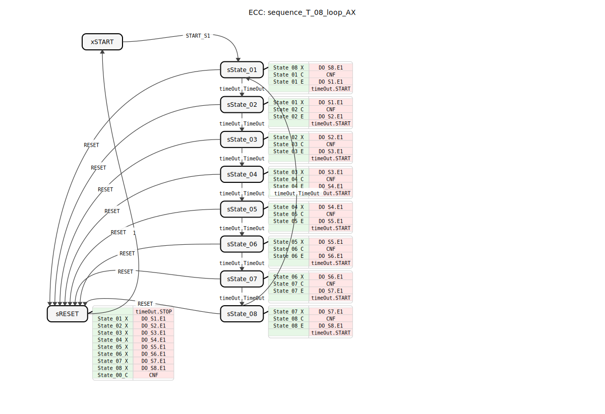
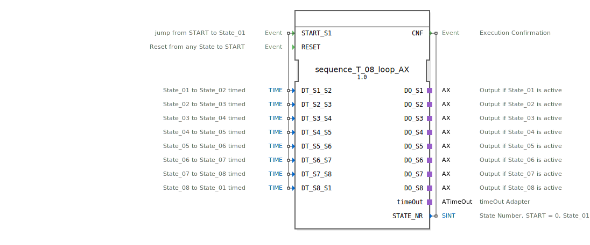

# sequence_T_08_loop_AX

```{index} single: sequence_T_08_loop_AX
```




* * * * * * * * * *
## Einleitung
`sequence_T_08_loop_AX` ist eine Variante des `sequence_T_08_loop`, die zusätzlich Adapter (`AX`) für die Ausgänge verwendet. Er steuert eine rein zeitgesteuerte, zyklische Sequenz mit 8 Ausgabezuständen.



## Schnittstellenstruktur

### **Ereignis-Eingänge**
*   **START_S1**: Startet die Sequenz bei State_01.
*   **RESET**: Setzt die Sequenz zurück.

### **Ereignis-Ausgänge**
*   **CNF**: Bestätigung der Ausführung.

### **Daten-Eingänge**
*   **DT_S1_S2** ... **DT_S8_S1**: Zeiten für die automatischen Übergänge zwischen den Zuständen.

### **Daten-Ausgänge**
*   **STATE_NR** (SINT): Aktuelle Zustandsnummer.

### **Adapter**
*   **DO_S1** ... **DO_S8** (adapter::types::unidirectional::AX): Ausgangsadapter für State_01 bis State_08.
*   **timeOut** (iec61499::events::ATimeOut): Timer-Adapter.

## Funktionsweise
Entspricht `sequence_T_08_loop`, verwendet jedoch Adapter für die Ausgänge.

## Technische Besonderheiten
*   Verwendung von `adapter::types::unidirectional::AX`.

## Zustandsübersicht
Siehe `sequence_T_08_loop`.

## Anwendungsszenarien
Für zeitgesteuerte zyklische 8-stufige Sequenzen mit Adapteranbindung.

## ⚖️ Vergleich mit ähnlichen Bausteinen
*   **sequence_T_08_loop**: Standardvariante ohne Adapter.


## 🛠️ Zugehörige Übungen

* [Uebung_038_AX](../../../../../../training1/Ventilsteuerung/4diacIDE-workspace/test_AX/Uebungen_doc/Uebung_038_AX.md)

## Fazit
Adapter-Variante des 8-Schritt-Loop-Zeit-Sequenzers.