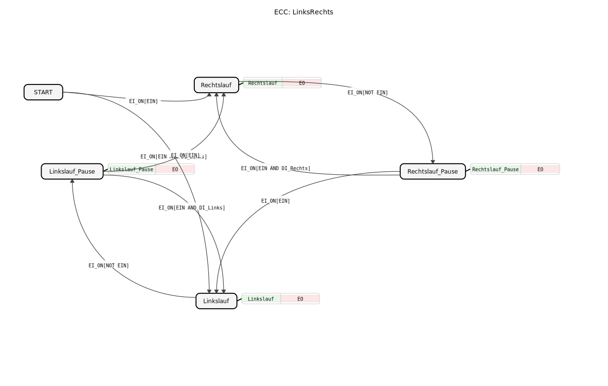
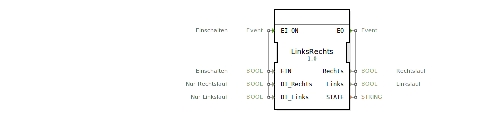

# LinksRechts

```{index} single: LinksRechts
```




* * * * * * * * * *
## Einleitung
Der Funktionsblock `LinksRechts` ist ein grundlegender Baustein zur Steuerung einer bidirektionalen Bewegung, beispielsweise eines Antriebs, der sowohl im Rechts- als auch im Linkslauf betrieben werden kann. Er realisiert eine einfache Priorisierungslogik, bei der der Rechtslauf Vorrang vor dem Linkslauf hat, es sei denn, ein spezieller Linkslauf-Befehl ist aktiv. Der Block ermöglicht zudem das pausieren der Bewegung.



## Schnittstellenstruktur

### **Ereignis-Eingänge**
*   **`EI_ON`**: Das zentrale Steuerereignis. Es löst bei jedem Eintreffen eine Auswertung der aktuellen Eingangsdaten und einen potenziellen Zustandsübergang aus.

### **Ereignis-Ausgänge**
*   **`EO`**: Dieses Ereignis wird bei jedem Zustandswechsel ausgelöst. Es liefert die aktualisierten Ausgangsdaten `Rechts`, `Links` und `STATE`.

### **Daten-Eingänge**
*   **`EIN`** (BOOL): Allgemeiner Freigabe-/Einschaltbefehl. Bei `TRUE` ist der Betrieb erlaubt, bei `FALSE` geht der Block in einen Pause-Zustand.
*   **`DI_Rechts`** (BOOL): Befehl für "Nur Rechtslauf". Setzt den Rechtslauf durch, sofern `EIN` aktiv ist.
*   **`DI_Links`** (BOOL): Befehl für "Nur Linkslauf". Setzt den Linkslauf durch, sofern `EIN` aktiv ist und kein `DI_Rechts`-Befehl vorliegt.

### **Daten-Ausgänge**
*   **`Rechts`** (BOOL): Steuersignal für den Rechtslauf. Ist `TRUE`, wenn der Block im Zustand `Rechtslauf` ist.
*   **`Links`** (BOOL): Steuersignal für den Linkslauf. Ist `TRUE`, wenn der Block im Zustand `Linkslauf` ist.
*   **`STATE`** (STRING): Zeigt den aktuellen internen Zustand des Funktionsblocks als lesbaren Text an (z.B. "Rechtslauf", "Linkslauf_Pause").

### **Adapter**
Dieser Funktionsblock verwendet keine Adapter.

## Funktionsweise
Der `LinksRechts`-Block ist als Basic-FB mit einer Ereignissteuerung (ECC) implementiert. Das Eintreffen des Ereignisses `EI_ON` bewirkt eine Auswertung der mitgeführten Daten `EIN`, `DI_Rechts` und `DI_Links`. Basierend auf der aktuellen Kombination dieser Werte und dem aktuellen Zustand findet ein Übergang in einen neuen Zustand statt.

In jedem Zustand wird ein spezifischer Algorithmus ausgeführt, der die Ausgangssignale `Rechts` und `Links` setzt und den Zustandsnamen in `STATE` schreibt. Anschließend wird das Ausgangsereignis `EO` erzeugt, um nachgelagerte Blöcke über die Änderung zu informieren.

Die Prioritätslogik ist wie folgt definiert: Wenn `EIN` aktiv ist (`TRUE`), wird zuerst `DI_Rechts` geprüft. Ist dieser `TRUE`, wird der Rechtslauf aktiviert. Ist `DI_Rechts` `FALSE`, wird `DI_Links` geprüft. Ist dieser `TRUE`, wird der Linkslauf aktiviert. Ist `EIN` `FALSE`, wechselt der Block unabhängig von den Laufbefehlen in einen Pause-Zustand.

## Technische Besonderheiten
*   **Priorität**: Die Spezifikation betont, dass "Nur Rechtslauf" (`DI_Rechts`) Vorrang vor "Nur Linkslauf" (`DI_Links`) hat. Dies ist in der ECC-Transition von `START` nach `Rechtslauf` umgesetzt, die nur `EIN` benötigt, während der Übergang nach `Linkslauf` zusätzlich `DI_Links` erfordert.
*   **Zustandsausgabe**: Die Ausgabe `STATE` ist vom Typ `STRING` und wird aus einer importierten Aufzählung `STATES` gespeist, was die Diagnose und Visualisierung erleichtert.
*   **Pause-Zustände**: Es existieren zwei separate Pause-Zustände (`Rechtslauf_Pause` und `Linkslauf_Pause`). Diese merken sich die letzte aktive Laufrichtung. Bei erneuter Freigabe (`EIN=TRUE`) wird, sofern kein spezifischer Laufbefehl (`DI_Rechts`/`DI_Links`) anliegt, die zuletzt aktive Richtung fortgesetzt.

## Zustandsübersicht
Die ECC (Execution Control Chart) des Bausteins umfasst fünf Zustände:
1.  **`START`**: Initialzustand. Verlassen wird er mit dem ersten `EI_ON`-Ereignis.
2.  **`Rechtslauf`**: Aktiver Zustand, in dem das Ausgangssignal `Rechts` auf `TRUE` gesetzt wird.
3.  **`Linkslauf`**: Aktiver Zustand, in dem das Ausgangssignal `Links` auf `TRUE` gesetzt wird.
4.  **`Rechtslauf_Pause`**: Pause-Zustand, der vom `Rechtslauf` aus erreicht wird, wenn `EIN` `FALSE` wird. Beide Ausgänge sind `FALSE`.
5.  **`Linkslauf_Pause`**: Pause-Zustand, der vom `Linkslauf` aus erreicht wird, wenn `EIN` `FALSE` wird. Beide Ausgänge sind `FALSE`.

Die Übergänge zwischen den Zuständen werden ausschließlich durch das Ereignis `EI_ON` in Kombination mit den Datenbedingungen ausgelöst.

## Anwendungsszenarien
Typische Anwendungen sind:
*   Steuerung eines Wechselstrommotors mit zwei Drehrichtungen.
*   Kontrolle einer horizontal verfahrbaren Einheit (z.B. Schlitten, Tor).
*   Jede Applikation, bei der eine Vorwärts-/Rückwärtsbewegung mit einer allgemeinen Freigabe und individuellen Richtungsbefehlen gesteuert werden muss.

## ⚖️ Vergleich mit ähnlichen Bausteinen
Im Vergleich zu einem einfachen `SR`- oder `RS`-Flipflop bietet `LinksRechts` eine höhere Abstraktionsebene, da er die Priorisierungslogik und die Pause-Funktionalität bereits kapselt. Gegenüber einem reinen `E_SWITCH`-Block, der nur zwischen zwei Ausgängen umschaltet, verwaltet `LinksRechts` zusätzlich interne Zustände (Pause) und bietet eine definierte Priorisierung der Eingänge.


## 🛠️ Zugehörige Übungen

* [Uebung_006a4](../../../../../../training1/Ventilsteuerung/4diacIDE-workspace/test_B/Uebungen_doc/Uebung_006a4.md)

## Fazit
Der `LinksRechts`-Funktionsblock ist ein nützlicher und robuster Grundbaustein für die Steuerung bidirektionaler Bewegungen. Durch die integrierte Priorisierungslogik (Rechtslauf vor Linkslauf) und die zustandsbasierte Pausefunktion vereinfacht er die Applikationsprogrammierung und erhöht die Übersichtlichkeit von Steuerungsprogrammen. Seine klare Schnittstelle und der ausgegebene Zustand unterstützen die Inbetriebnahme und Fehlersuche.