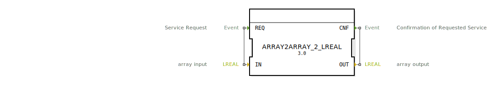

# ARRAY2ARRAY_2_LREAL

```{index} single: ARRAY2ARRAY_2_LREAL
```


* * * * * * * * * *
## Einleitung

Der Funktionsblock (FB) `ARRAY2ARRAY_2_LREAL` ist ein Service-Interface-Funktionsblock, der darauf ausgelegt ist, Werte von einem Eingangs-Array auf ein Ausgangs-Array zu kopieren. Er dient als einfache und ereignisgesteuerte Schnittstelle für die Übertragung von Daten zwischen Arrays innerhalb einer 4diac-Anwendung.



## Schnittstellenstruktur

### **Ereignis-Eingänge**

*   **REQ** (Event): Löst den Kopierprozess aus. Dieses Ereignis signalisiert dem Funktionsblock, die Datenübertragung zu starten.
    *   Verbunden mit Datenvariable: `IN`

### **Ereignis-Ausgänge**

*   **CNF** (Event): Bestätigt den Abschluss des Kopierprozesses. Dieses Ereignis wird nach erfolgreicher Datenübertragung ausgelöst.
    *   Verbunden mit Datenvariable: `OUT`

### **Daten-Eingänge**

*   **IN** (Typ: `LREAL`, Array-Größe: `2`): Das Quell-Array, dessen Werte kopiert werden sollen. Es handelt sich um ein Array von Langen Reellen Zahlen (Double-Precision Floating Point).

### **Daten-Ausgänge**

*   **OUT** (Typ: `LREAL`, Array-Größe: `2`): Das Ziel-Array, in das die kopierten Werte geschrieben werden. Ebenfalls ein Array von Langen Reellen Zahlen.

### **Adapter**
Dieser Funktionsblock verwendet keine Adapter.

## Funktionsweise

Der Funktionsblock `ARRAY2ARRAY_2_LREAL` arbeitet ereignisgesteuert. Sobald das Eingangsereignis `REQ` empfangen wird, liest der Funktionsblock die aktuellen Werte aus dem Daten-Eingangs-Array `IN`. Diese Werte werden dann direkt in das Daten-Ausgangs-Array `OUT` kopiert. Nach Abschluss des Kopiervorgangs wird das Ausgangsereignis `CNF` ausgelöst, um den erfolgreichen Abschluss der Operation zu signalisieren. Der Block verarbeitet somit eine Eins-zu-Eins-Kopie der Array-Elemente.

## Technische Besonderheiten

*   **Service-Interface:** Der Baustein ist als "Service Interface Function Block Type" konzipiert, was auf eine Standard-Schnittstelle für spezifische Dienste hinweist.
*   **Generische Implementierung:** Intern verwendet dieser Funktionsblock wahrscheinlich eine generische Implementierung, wie durch den Attributwert `'GEN_ARRAY2ARRAY'` angedeutet. Dies ermöglicht eine flexible Erstellung ähnlicher Bausteine für verschiedene Array-Größen und Datentypen.
*   **Feste Array-Größe:** Die Array-Größe für `IN` und `OUT` ist fest auf `2` definiert, was den Anwendungsbereich auf spezifische Szenarien mit dieser Array-Dimension begrenzt.
*   **Datentyp `LREAL`:** Der Baustein ist auf den Datentyp `LREAL` (Lange Reelle Zahl) spezialisiert, was ihn ideal für die Verarbeitung von hochpräzisen Gleitkommazahlen macht.

## Zustandsübersicht

Der Funktionsblock befindet sich typischerweise in zwei Hauptzuständen:
1.  **Warten auf Anfrage:** Der Block wartet auf das `REQ`-Ereignis. In diesem Zustand ist er passiv und führt keine Operationen aus.
2.  **Verarbeitung der Anfrage:** Nach Empfang von `REQ` wechselt der Block in diesen Zustand, führt den Kopierprozess von `IN` nach `OUT` aus und emittiert anschließend `CNF`, bevor er in den Zustand "Warten auf Anfrage" zurückkehrt.

## Anwendungsszenarien

*   **Datenrouting:** Weiterleitung von `LREAL`-Datenpaketen der Größe 2 zwischen verschiedenen Teilen eines Steuerungssystems.
*   **Datenpufferung:** Kurzfristiges Speichern oder Übertragen von Messwerten oder Sollwerten.
*   **Schnittstellenanpassung:** Wenn ein Baustein ein `LREAL`-Array der Größe 2 als Ausgabe liefert und ein anderer Baustein dasselbe Array als Eingabe benötigt, kann dieser FB als Brücke dienen.
*   **Konstante Datenweitergabe:** Übertragen von statischen oder selten aktualisierten `LREAL`-Arrays von einem Punkt zu einem anderen.

## Vergleich mit ähnlichen Bausteinen

Dieser Baustein ist sehr spezifisch in seiner Funktion. Im Vergleich zu allgemeineren Datenmanipulationsbausteinen, die oft flexible Datentypen oder Array-Größen über Konfigurationsparameter ermöglichen, ist `ARRAY2ARRAY_2_LREAL` fest auf `LREAL`-Arrays der Größe 2 spezialisiert. Existierten Bausteine für generische Array-Kopien (z.B. `ARRAY_COPY` mit konfigurierbarer Größe und Typ), wäre dieser Baustein eine spezialisierte Instanz davon. Er ist einfacher als solche generischen Bausteine, aber weniger flexibel. Für seine spezifische Aufgabe bietet er jedoch eine klare und effiziente Lösung.

## Metadaten

| Attribut | Wert |
| :--- | :--- |
| Copyright | (c) 2014 Profactor GmbH |
| Lizenz | EPL-2.0 |
| Version | 3.0 (2025-04-14, Patrick Aigner), 1.0 (2014-08-05, Matthias Plasch) |
| 4diac-Paket | eclipse4diac::convert |

## Fazit

Der `ARRAY2ARRAY_2_LREAL` Funktionsblock bietet eine unkomplizierte und ereignisgesteuerte Methode, um `LREAL`-Arrays der Größe 2 zu kopieren. Seine Spezialisierung auf diesen Datentyp und diese Array-Größe macht ihn zu einem nützlichen Werkzeug für definierte Anwendungsfälle, bei denen diese genaue Datenstruktur erforderlich ist. Er trägt zur Modularität und Lesbarkeit von 4diac-Applikationen bei, indem er eine explizite Funktion für diese Art der Datenübertragung bereitstellt.