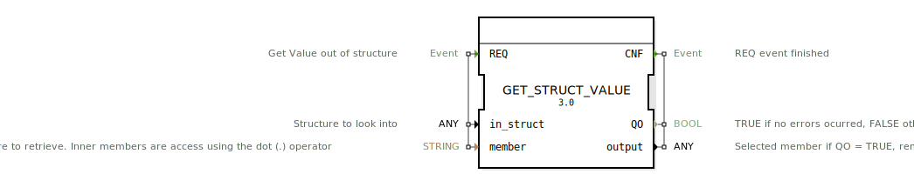

# GET_STRUCT_VALUE

```{index} single: GET_STRUCT_VALUE
```


* * * * * * * * * *
## Einleitung
Der Funktionsblock (FB) `GET_STRUCT_VALUE` ist ein Service-Schnittstellen-Baustein, der dafür entwickelt wurde, spezifische Werte aus einer gegebenen Datenstruktur dynamisch auszulesen. Er bietet eine flexible Möglichkeit, auf Strukturmember zuzugreifen, deren Namen oder Pfade zur Laufzeit bestimmt werden.



## Schnittstellenstruktur

### **Ereignis-Eingänge**
| Name | Typ   | Beschreibung                     | Daten mit |
| :--- | :---- | :------------------------------- | :-------- |
| `REQ`| `Event`| Fordert das Auslesen eines Wertes aus der Struktur an. | `member`, `in_struct` |

### **Ereignis-Ausgänge**
| Name | Typ   | Beschreibung                     | Daten mit |
| :--- | :---- | :------------------------------- | :-------- |
| `CNF`| `Event`| Bestätigt den Abschluss des `REQ`-Ereignisses. | `QO`, `output`    |

### **Daten-Eingänge**
| Name      | Typ      | Beschreibung                                                                                              |
| :-------- | :------- | :-------------------------------------------------------------------------------------------------------- |
| `in_struct`| `ANY`    | Die Datenstruktur, aus der ein Wert ausgelesen werden soll.                                                |
| `member`  | `STRING` | Der Name des Members der Struktur, der abgerufen werden soll. Innere Member werden über den Punkt-Operator (`.`) angesprochen. |

### **Daten-Ausgänge**
| Name   | Typ   | Beschreibung                                          |
| :----- | :---- | :---------------------------------------------------- |
| `QO`   | `BOOL`| `TRUE`, wenn keine Fehler aufgetreten sind, andernfalls `FALSE`. |
| `output`| `ANY` | Der Wert des ausgewählten Members, wenn `QO = TRUE`. Andernfalls bleibt dieser Wert unverändert. |

### **Adapter**
Keine Adapter vorhanden.

## Funktionsweise
Der `GET_STRUCT_VALUE` Funktionsblock wird durch ein `REQ`-Ereignis aktiviert. Bei Aktivierung versucht der Baustein, den Wert eines in `member` angegebenen Strukturmembers aus der am Eingang `in_struct` anliegenden Datenstruktur zu extrahieren. Der Pfad zum Member kann dabei auch verschachtelte Member (z.B. "config.port") über den Punkt-Operator (`.`) spezifizieren. Nach dem Auslesen wird ein `CNF`-Ereignis ausgelöst, welches den Status (`QO`) und den extrahierten Wert (`output`) bereitstellt. Tritt ein Fehler auf (z.B. Member nicht gefunden oder ungültiger Pfad), wird `QO` auf `FALSE` gesetzt.

## Technische Besonderheiten
*   **Dynamischer Member-Zugriff:** Der Baustein ermöglicht den Zugriff auf Strukturmember über einen `STRING`-Eingang, was eine hohe Flexibilität bei der Datenverarbeitung bietet.
*   **Verschachtelte Strukturen:** Über den Punkt-Operator (`.`) in der `member`-Zeichenkette können auch Member in verschachtelten Strukturen effizient adressiert werden.
*   **Typunabhängigkeit:** Die Ein- und Ausgänge `in_struct` und `output` sind vom Typ `ANY`, was bedeutet, dass der Baustein mit beliebigen Datenstrukturen und Member-Datentypen umgehen kann.

## Zustandsübersicht
Der `GET_STRUCT_VALUE` ist ein nicht-zustandsbehafteter Service-Baustein, der eine einfache Anforderungs-Bestätigungs-Logik implementiert (REQ/CNF). Er verarbeitet jede Anforderung individuell und behält keine komplexen internen Zustände bei.

## Anwendungsszenarien
*   **Dynamische Konfiguration:** Auslesen von Konfigurationsparametern aus einer zentralen Struktur, wobei die benötigten Parameter zur Laufzeit ermittelt werden.
*   **Generische Datenverarbeitung:** Entwicklung von generischen Algorithmen oder Logiken, die basierend auf externen Eingaben oder Regeln auf verschiedene Teile einer Datenstruktur zugreifen müssen.
*   **Protokollierung und Diagnose:** Extrahieren spezifischer Statusinformationen oder Messwerte aus einer komplexen Systemzustandsstruktur für Überwachungs- oder Diagnosezwecke.
*   **Schnittstellen zu externen Systemen:** Anpassung an Datenformate externer Systeme, bei denen die Feldnamen dynamisch übergeben werden.

## Vergleich mit ähnlichen Bausteinen
Es gibt in der Standardbibliothek von 4diac keine direkt vergleichbaren Funktionsblöcke, die einen dynamischen Zugriff auf Strukturmember über einen `STRING`-Pfad ermöglichen. Dieser Baustein füllt eine Nische für Anwendungsfälle, die eine flexible und zur Laufzeit konfigurierbare Strukturmanipulation erfordern, welche über den statischen Zugriff herkömmlicher FBs hinausgeht.

## Metadaten

| Attribut | Wert |

| :--- | :--- |

| Copyright | (c) 2018 fortiss GmbH |

| Lizenz | EPL-2.0 |

| Version | 3.0 (2025-04-14, Patrick Aigner), 1.0 (2018-10-16, Jose Cabral) |

| 4diac-Paket | eclipse4diac::convert |


## Zugehörige Übungen

* [Uebung_052](../../../training1/Ventilsteuerung/4diacIDE-workspace/test_B/Uebungen_doc/Uebung_052.md)

## Fazit

Der `GET_STRUCT_VALUE` Funktionsblock ist ein wertvolles Werkzeug für Entwickler, die eine flexible und dynamische Methode zum Auslesen von Werten aus Datenstrukturen in 4diac benötigen. Seine Fähigkeit, auf Member über String-Pfade zuzugreifen, einschließlich verschachtelter Strukturen, macht ihn besonders nützlich in Szenarien, in denen die Struktur der benötigten Daten zur Kompilierzeit nicht vollständig bekannt oder variabel ist.