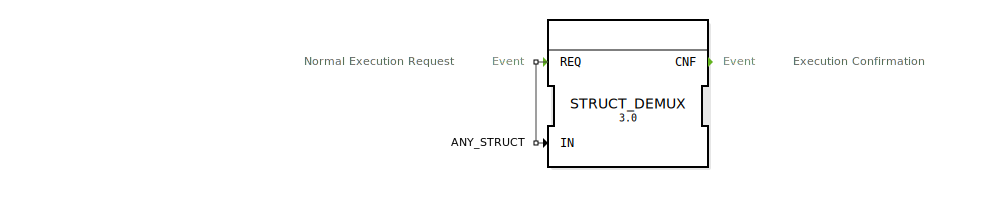

# STRUCT_DEMUX

```{index} single: STRUCT_DEMUX
```


* * * * * * * * * *
## Einleitung
Der Funktionsblock (FB) `STRUCT_DEMUX` ist ein generischer Demultiplexer für strukturierte Datentypen. Seine Hauptaufgabe ist es, eine am Eingang anliegende Datenstruktur in ihre einzelnen Bestandteile (Member) aufzuspalten. Diese einzelnen Member werden dann über separate Daten-Ausgänge zur Verfügung gestellt, die dynamisch erzeugt werden.



## Schnittstellenstruktur
Die Schnittstelle des `STRUCT_DEMUX`-Funktionsblocks ist generisch definiert. Die tatsächlichen Daten-Ausgänge werden erst bei der Instanziierung des Blocks festgelegt.

### **Ereignis-Eingänge**
- **REQ**: Löst die Ausführung des Bausteins aus und bewirkt das Auslesen der Eingangsstruktur.
    - **Mit Datenvariable**: `IN`

### **Ereignis-Ausgänge**
- **CNF**: Bestätigt den Abschluss der Operation, nachdem die Werte der Struktur an die Ausgänge weitergeleitet wurden.
    - **Mit Datenvariablen**: Alle dynamisch erzeugten Daten-Ausgänge.

### **Daten-Eingänge**
- **IN** (Typ: `ANY_STRUCT`): Die Eingangs-Datenstruktur, die aufgeteilt werden soll.

### **Daten-Ausgänge**
Die Daten-Ausgänge dieses Funktionsblocks sind nicht fest vordefiniert. Stattdessen werden sie **dynamisch** basierend auf dem Datentyp erstellt, der mit dem `IN`-Eingang verbunden ist. Für jeden Member der Eingangsstruktur wird ein entsprechender Daten-Ausgang mit demselben Namen und Datentyp am Baustein erzeugt.

**Beispiel:**
Wenn eine Struktur vom Typ `MyStruct` mit den Membern `a` (Typ `INT`) and `b` (Typ `BOOL`) an den `IN`-Eingang angeschlossen wird, erzeugt der `STRUCT_DEMUX`-Baustein automatisch zwei Daten-Ausgänge:
- `a` (Typ `INT`)
- `b` (Typ `BOOL`)

Das Bild oben illustriert genau diesen Fall.

## Funktionsweise
Sobald ein `REQ`-Ereignis am Eingang des `STRUCT_DEMUX`-Funktionsblocks empfangen wird, liest der Baustein die am `IN`-Eingang anliegende Datenstruktur aus. Er extrahiert die Werte jedes einzelnen Members der Struktur und leitet sie an die entsprechenden, dynamisch erzeugten Daten-Ausgänge weiter. Nachdem alle Ausgangswerte aktualisiert wurden, wird das `CNF`-Ereignis ausgelöst, um den Abschluss des Vorgangs zu signalisieren.

## Technische Besonderheiten
- **Generischer Baustein**: Dank des Attributs `GEN_STRUCT_DEMUX` ist der Baustein in der Lage, sich an jeden beliebigen strukturierten Datentyp (`ANY_STRUCT`) anzupassen.
- **Dynamische Schnittstelle**: Die Fähigkeit, seine Ausgänge basierend auf dem Eingangs-Datentyp zu generieren, macht ihn extrem flexibel und wiederverwendbar.
- **Service Interface Function Block Type**: Der Baustein ist als standardisierte Schnittstelle für diesen Dienst konzipiert.

## Zustandsübersicht
Der `STRUCT_DEMUX` ist ein zustandsloser Baustein, der nach einem einfachen Anforderungs-Bestätigungs-Zyklus arbeitet:
1.  **Bereit**: Wartet auf ein `REQ`-Ereignis.
2.  **Ausführend**: Liest die Eingangsstruktur, extrahiert die Member-Werte und setzt die entsprechenden Ausgänge.
3.  **Abgeschlossen**: Löst das `CNF`-Ereignis aus und kehrt in den Bereitschaftszustand zurück.

## Anwendungsszenarien
- **Aufspaltung komplexer Daten**: Zerlegen von komplexen Datenstrukturen (z.B. Sensordaten, Statusinformationen) in einzelne Signale für die weitere Verarbeitung.
- **Verbesserung der Lesbarkeit**: Anstatt auf Strukturmember über `GET_STRUCT_VALUE` zuzugreifen, können die Member direkt als separate Datenleitungen in der Logik verwendet werden.
- **Schnittstellenanpassung**: Anpassen von Daten, die als eine einzelne Struktur von einem Baustein kommen, an mehrere Bausteine, die einzelne Eingänge erwarten.

## Vergleich mit ähnlichen Bausteinen
- **`GET_STRUCT_VALUE`**: Während `GET_STRUCT_VALUE` einen einzelnen Member dynamisch über einen `STRING`-Namen extrahiert, legt `STRUCT_DEMUX` alle Member statisch als separate Ausgänge frei. `STRUCT_DEMUX` ist oft einfacher zu verwenden, wenn alle Member benötigt werden, während `GET_STRUCT_VALUE` flexibler ist, wenn nur bestimmte Member zur Laufzeit adressiert werden müssen.
- **`STRUCT_MUX`**: Der komplementäre Baustein, der einzelne Daten-Eingänge zu einer einzigen Datenstruktur zusammenfügt.

## Metadaten

| Attribut | Wert |

| :--- | :--- |

| Copyright | (c) 2020 Johannes Kepler University Linz |

| Lizenz | EPL-2.0 |

| Version | 3.0 (2025-04-14, Patrick Aigner) |

| 4diac-Paket | eclipse4diac::convert |


## Zugehörige Übungen

* [Uebung_051](../../../training1/Ventilsteuerung/4diacIDE-workspace/test_B/Uebungen_doc/Uebung_051.md)
* [Uebung_120](../../../training1/Ventilsteuerung/4diacIDE-workspace/test_B/Uebungen_doc/Uebung_120.md)
* [Uebung_121](../../../training1/Ventilsteuerung/4diacIDE-workspace/test_B/Uebungen_doc/Uebung_121.md)
* [Uebung_122](../../../training1/Ventilsteuerung/4diacIDE-workspace/test_B/Uebungen_doc/Uebung_122.md)
* [Uebung_122b](../../../training1/Ventilsteuerung/4diacIDE-workspace/test_B/Uebungen_doc/Uebung_122b.md)
* [Uebung_123](../../../training1/Ventilsteuerung/4diacIDE-workspace/test_B/Uebungen_doc/Uebung_123.md)
* [Uebung_124](../../../training1/Ventilsteuerung/4diacIDE-workspace/test_B/Uebungen_doc/Uebung_124.md)
* [Uebung_125](../../../training1/Ventilsteuerung/4diacIDE-workspace/test_B/Uebungen_doc/Uebung_125.md)
* [Uebung_126](../../../training1/Ventilsteuerung/4diacIDE-workspace/test_B/Uebungen_doc/Uebung_126.md)
* [Uebung_127](../../../training1/Ventilsteuerung/4diacIDE-workspace/test_B/Uebungen_doc/Uebung_127.md)
* [Uebung_128](../../../training1/Ventilsteuerung/4diacIDE-workspace/test_B/Uebungen_doc/Uebung_128.md)
* [Uebung_128b](../../../training1/Ventilsteuerung/4diacIDE-workspace/test_B/Uebungen_doc/Uebung_128b.md)
* [Uebung_130](../../../training1/Ventilsteuerung/4diacIDE-workspace/test_B/Uebungen_doc/Uebung_130.md)
* [Uebung_131](../../../training1/Ventilsteuerung/4diacIDE-workspace/test_B/Uebungen_doc/Uebung_131.md)
* [Uebung_132](../../../training1/Ventilsteuerung/4diacIDE-workspace/test_B/Uebungen_doc/Uebung_132.md)
* [Uebung_133](../../../training1/Ventilsteuerung/4diacIDE-workspace/test_B/Uebungen_doc/Uebung_133.md)
* [Uebung_134](../../../training1/Ventilsteuerung/4diacIDE-workspace/test_B/Uebungen_doc/Uebung_134.md)

## Fazit

`STRUCT_DEMUX` ist ein fundamentaler und äußerst nützlicher Baustein für die Arbeit mit Datenstrukturen in 4diac. Seine Fähigkeit, jede beliebige Struktur automatisch in ihre Bestandteile zu zerlegen, vereinfacht die Anwendungslogik erheblich und fördert eine klare, lesbare Verdrahtung. Er ist das Standardwerkzeug, um auf die Inhalte von Strukturen zuzugreifen.