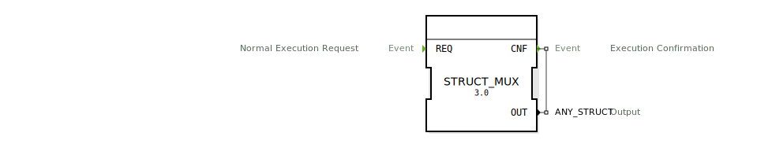

# STRUCT_MUX

```{index} single: STRUCT_MUX
```


* * * * * * * * * *
## Einleitung
Der Funktionsblock (FB) `STRUCT_MUX` ist ein generischer Multiplexer für strukturierte Datentypen. Er fungiert als Gegenstück zum `STRUCT_DEMUX` und hat die Aufgabe, einzelne Datenwerte von mehreren Eingängen zu einer einzigen Datenstruktur am Ausgang zusammenzufügen.



## Schnittstellenstruktur
Die Schnittstelle des `STRUCT_MUX`-Funktionsblocks ist generisch definiert. Die tatsächlichen Daten-Eingänge werden erst bei der Instanziierung des Blocks festgelegt.

### **Ereignis-Eingänge**
- **REQ**: Löst die Ausführung des Bausteins aus. Dies bewirkt das Einlesen der Werte an den Eingängen und das Zusammenbauen der Ausgangsstruktur.
    - **Mit Datenvariablen**: Alle dynamisch erzeugten Daten-Eingänge.

### **Ereignis-Ausgänge**
- **CNF**: Bestätigt den Abschluss der Operation, nachdem die Ausgangsstruktur erfolgreich erstellt wurde.
    - **Mit Datenvariable**: `OUT`

### **Daten-Eingänge**
Die Daten-Eingänge dieses Funktionsblocks sind nicht fest vordefiniert. Stattdessen werden sie **dynamisch** basierend auf dem Datentyp erstellt, der für den `OUT`-Ausgang festgelegt wird. Für jeden Member der Ausgangsstruktur wird ein entsprechender Daten-Eingang mit demselben Namen und Datentyp am Baustein erzeugt.

**Beispiel:**
Wenn der `OUT`-Ausgang auf den Datentyp `MyStruct` mit den Membern `a` (Typ `INT`) and `b` (Typ `BOOL`) gesetzt wird, erzeugt der `STRUCT_MUX`-Baustein automatisch zwei Daten-Eingänge:
- `a` (Typ `INT`)
- `b` (Typ `BOOL`)

Das Bild oben illustriert genau diesen Fall.

### **Daten-Ausgänge**
- **OUT** (Typ: `ANY_STRUCT`): Die Ausgangs-Datenstruktur, die aus den Werten der Eingänge zusammengebaut wird.

## Funktionsweise
Sobald ein `REQ`-Ereignis am Eingang des `STRUCT_MUX`-Funktionsblocks empfangen wird, liest der Baustein die Werte von all seinen dynamisch erzeugten Daten-Eingängen ein. Diese Werte werden dann zu einer einzigen Datenstruktur zusammengefügt. Die resultierende Struktur wird am `OUT`-Ausgang bereitgestellt. Unmittelbar danach wird das `CNF`-Ereignis ausgelöst, um den Abschluss des Vorgangs zu signalisieren.

## Technische Besonderheiten
- **Generischer Baustein**: Dank des Attributs `GEN_STRUCT_MUX` ist der Baustein in der Lage, sich an jeden beliebigen strukturierten Datentyp (`ANY_STRUCT`) anzupassen.
- **Dynamische Schnittstelle**: Die Fähigkeit, seine Eingänge basierend auf dem Ausgangs-Datentyp zu generieren, macht ihn extrem flexibel und wiederverwendbar.
- **Service Interface Function Block Type**: Der Baustein ist als standardisierte Schnittstelle für diesen Dienst konzipiert.

## Zustandsübersicht
Der `STRUCT_MUX` ist ein zustandsloser Baustein, der nach einem einfachen Anforderungs-Bestätigungs-Zyklus arbeitet:
1.  **Bereit**: Wartet auf ein `REQ`-Ereignis.
2.  **Ausführend**: Liest die Eingangswerte ein und baut die Ausgangsstruktur zusammen.
3.  **Abgeschlossen**: Stellt die Struktur am `OUT`-Ausgang bereit, löst das `CNF`-Ereignis aus und kehrt in den Bereitschaftszustand zurück.

## Anwendungsszenarien
- **Zusammenfügen von Daten**: Bündeln einzelner Signale (z.B. Konfigurationsparameter, Steuerwerte) in einer einzigen Struktur für die weitere Verarbeitung oder Kommunikation.
- **Verbesserung der Übersichtlichkeit**: Zusammenfassen vieler einzelner Datenleitungen zu einer einzigen strukturierten Leitung, um die Komplexität der grafischen Darstellung zu reduzieren.
- **Schnittstellenanpassung**: Anpassen einzelner Datenwerte an einen Baustein, der eine einzelne Datenstruktur als Eingang erwartet.

## Vergleich mit ähnlichen Bausteinen
- **`STRUCT_DEMUX`**: Der komplementäre Baustein, der eine einzelne Datenstruktur in ihre einzelnen Member aufspaltet.
- **`SET_STRUCT_VALUE`**: Während `SET_STRUCT_VALUE` einen einzelnen Wert innerhalb einer bestehenden Struktur dynamisch ändert, erzeugt `STRUCT_MUX` eine komplett neue Struktur aus einzelnen Werten.

## Metadaten

| Attribut | Wert |

| :--- | :--- |

| Copyright | (c) 2020 Johannes Kepler University Linz |

| Lizenz | EPL-2.0 |

| Version | 3.0 (2025-04-14, Patrick Aigner) |

| 4diac-Paket | eclipse4diac::convert |


## Zugehörige Übungen

* [Uebung_051](../../../training1/Ventilsteuerung/4diacIDE-workspace/test_B/Uebungen_doc/Uebung_051.md)
* [Uebung_052](../../../training1/Ventilsteuerung/4diacIDE-workspace/test_B/Uebungen_doc/Uebung_052.md)
* [Uebung_121](../../../training1/Ventilsteuerung/4diacIDE-workspace/test_B/Uebungen_doc/Uebung_121.md)
* [Uebung_126b2_sub](../../../training1/Ventilsteuerung/4diacIDE-workspace/test_B/Uebungen_doc/Uebung_126b2_sub.md)
* [Uebung_126b_sub](../../../training1/Ventilsteuerung/4diacIDE-workspace/test_B/Uebungen_doc/Uebung_126b_sub.md)
* [Uebung_12x_sub](../../../training1/Ventilsteuerung/4diacIDE-workspace/test_B/Uebungen_doc/Uebung_12x_sub.md)

## Fazit

`STRUCT_MUX` ist ein fundamentaler und sehr praktischer Baustein für die Arbeit mit Datenstrukturen in 4diac. Seine Fähigkeit, aus einzelnen Werten eine beliebige Struktur zu generieren, vereinfacht die Anwendungslogik und fördert eine saubere, strukturierte Datenhaltung. Er ist das Standardwerkzeug, um Daten zu bündeln und strukturierte Informationen zu erzeugen.