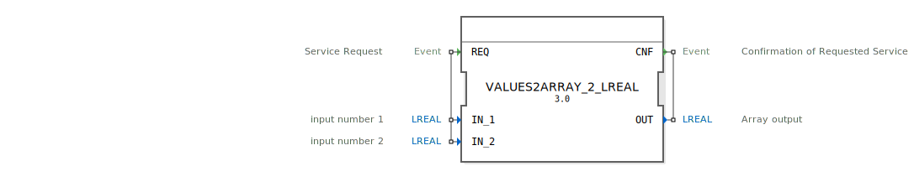

# VALUES2ARRAY_2_LREAL

```{index} single: VALUES2ARRAY_2_LREAL
```

<!-- Hier wäre Platz für ein Bild des Funktionsblocks, falls vorhanden. -->

* * * * * * * * * *
## Einleitung
Der Funktionsblock `VALUES2ARRAY_2_LREAL` dient dazu, zwei einzelne Gleitkommazahlen vom Typ LREAL in ein Array desselben Typs zu konvertieren. Er ist als Service-Interface-Funktionsblock konzipiert, der eine einfache Schnittstelle für diese Umwandlungsaufgabe bietet.



## Schnittstellenstruktur

### **Ereignis-Eingänge**
*   **REQ** (Typ: `Event`)
    *   Kommentar: Service Request
    *   Verbundene Daten: `IN_1`, `IN_2`
    *   Beschreibung: Dieses Ereignis löst die Konvertierung der beiden Eingangswerte `IN_1` und `IN_2` in das Array `OUT` aus.

### **Ereignis-Ausgänge**
*   **CNF** (Typ: `Event`)
    *   Kommentar: Confirmation of Requested Service
    *   Verbundene Daten: `OUT`
    *   Beschreibung: Dieses Ereignis wird ausgelöst, nachdem die Konvertierung erfolgreich abgeschlossen wurde und das Ausgangsarray `OUT` aktualisiert ist.

### **Daten-Eingänge**
*   **IN_1** (Typ: `LREAL`)
    *   Kommentar: input number 1
    *   Beschreibung: Die erste Gleitkommazahl, die in das Array aufgenommen werden soll.
*   **IN_2** (Typ: `LREAL`)
    *   Kommentar: input number 2
    *   Beschreibung: Die zweite Gleitkommazahl, die in das Array aufgenommen werden soll.

### **Daten-Ausgänge**
*   **OUT** (Typ: `LREAL`, Größe: `2`)
    *   Kommentar: Array output
    *   Beschreibung: Ein Array vom Typ LREAL, das die Werte von `IN_1` und `IN_2` enthält. `IN_1` belegt den ersten, `IN_2` den zweiten Index des Arrays.

### **Adapter**
Dieser Funktionsblock verfügt über keine Adapter-Schnittstellen.

## Funktionsweise
Wenn ein `REQ`-Ereignis am Eingang des Funktionsblocks empfangen wird, liest der `VALUES2ARRAY_2_LREAL` die aktuellen Werte der Daten-Eingänge `IN_1` und `IN_2` ein. Diese beiden Werte werden anschließend in das Ausgangsarray `OUT` übertragen, wobei `IN_1` dem Element `OUT[0]` und `IN_2` dem Element `OUT[1]` zugewiesen wird. Nach erfolgreicher Durchführung dieser Operation wird ein `CNF`-Ereignis ausgegeben, um den Abschluss der Anforderung zu signalisieren.

## Technische Besonderheiten
*   Der Funktionsblock ist auf die Konvertierung von genau zwei LREAL-Werten spezialisiert.
*   Das Ausgangsarray `OUT` ist fest auf die Größe 2 definiert.
*   Die Verarbeitung ist ereignisgesteuert, was eine explizite Anforderung des Konvertierungsprozesses ermöglicht.

## Zustandsübersicht
Der `VALUES2ARRAY_2_LREAL` ist ein zustandsloser Funktionsblock. Jede `REQ`-Anforderung wird unabhängig voneinander verarbeitet, ohne dass interne Zustände über Anfragen hinweg beibehalten werden. Die Funktion hängt ausschließlich von den Eingangswerten zum Zeitpunkt des `REQ`-Ereignisses ab.

## Anwendungsszenarien
*   **Datenbündelung**: Wenn zwei separate LREAL-Werte als ein zusammenhängendes Datenpaket (Array) an andere Funktionsblöcke übergeben werden müssen, die Arrays als Eingabe erwarten.
*   **Kompatibilität mit Array-Schnittstellen**: Anpassung von skalaren Daten an Schnittstellen, die explizit Arrays erfordern.
*   **Vorverarbeitung für mathematische Operationen**: Vorbereitung von Datenpaaren für Operationen, die auf Array-Basis arbeiten, wie z.B. Vektoraddition oder Skalierung.

## ⚖️ Vergleich mit ähnlichen Bausteinen
Dieser Funktionsblock ist spezifisch für die Konvertierung von zwei LREAL-Werten in ein LREAL-Array. Allgemeine "Werte-zu-Array"-Bausteine könnten flexibler in Bezug auf die Anzahl und den Datentyp der Eingänge sein, aber dieser Baustein bietet eine einfache, spezialisierte Lösung für den angegebenen Anwendungsfall. Für eine größere Anzahl von Werten oder unterschiedliche Datentypen wären entsprechende, speziell angepasste Bausteine erforderlich.

## Metadaten

| Attribut | Wert |

| :--- | :--- |

| Copyright | (c) 2014 Profactor GmbH |

| Lizenz | EPL-2.0 |

| Version | 3.0 (2025-04-14, Patrick Aigner), 1.0 (2014-07-09, Matthias Plasch) |

| 4diac-Paket | eclipse4diac::convert |

## Fazit

Der `VALUES2ARRAY_2_LREAL` ist ein nützlicher und effizienter Funktionsblock für die spezifische Aufgabe, zwei LREAL-Werte in ein fest dimensioniertes LREAL-Array umzuwandeln. Seine Einfachheit und ereignisgesteuerte Arbeitsweise machen ihn zu einem klaren Bestandteil in Szenarien, wo eine solche Datenbündelung erforderlich ist, und tragen zur Modularität und Lesbarkeit der Applikation bei.