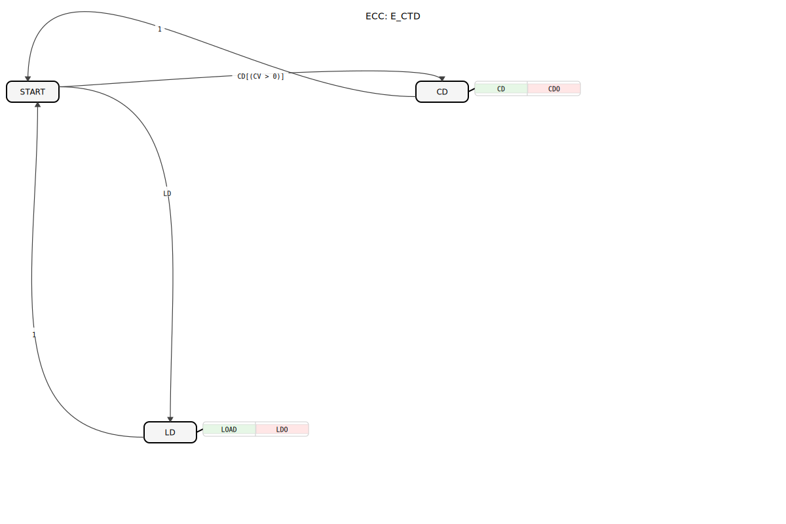
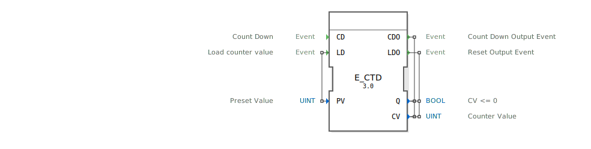

# E\_CTD

## 🎧 Podcast

* [E_CTD: Ereignisgesteuerter Abwärtszähler nach IEC 61499](https://podcasters.spotify.com/pod/show/iec-61499-grundkurs-de/episodes/E_CTD-Ereignisgesteuerter-Abwrtszhler-nach-IEC-61499-e368lli)

## Einleitung
Der **E_CTD** (Event-Driven Down Counter) ist ein ereignisgesteuerter Abwärtszähler nach dem IEC 61499-Standard. Dieser Funktionsbaustein wird in industriellen Steuerungssystemen eingesetzt, um Zählvorgänge zu realisieren, die durch Ereignisse gesteuert werden.

## Struktur des E_CTD-Bausteins

### Schnittstelle (Interface)

**Eingangsereignisse (Event Inputs):**
- **CD (Count Down):** Löst einen Zählschritt aus, der den Zählerstand dekrementiert.
- **LD (Load):** Lädt den Startwert `PV` in den Zähler.

**Ausgangsereignisse (Event Outputs):**
- **CDO (Count Down Output):** Bestätigt einen Zählschritt. Wird nach jedem `CD`-Ereignis ausgelöst, solange der Zählerstand größer als 0 war.
    - **Verbundene Daten**: `Q`, `CV`
- **LDO (Load Output):** Bestätigt das erfolgreiche Laden eines neuen Zählerwerts.
    - **Verbundene Daten**: `Q`, `CV`

**Eingangsvariablen (Input Variables):**
- **PV (Preset Value):** Der Startwert, der bei einem LD-Ereignis geladen wird (Datentyp: `UINT`).

**Ausgangsvariablen (Output Variables):**
- **Q (Status):** Ausgangs-Flag, das `TRUE` wird, wenn der Zählerstand `CV` den Wert 0 erreicht (Datentyp: `BOOL`).
- **CV (Counter Value):** Der aktuelle Zählerstand (Datentyp: `UINT`).

## Verhalten des E_CTD-Bausteins

1. **Initialisierung/Laden:**
   - Wenn ein **LD**-Ereignis eintritt, wird der Zählerstand `CV` auf den Wert von **PV** gesetzt.
   - Das Ausgangs-Flag `Q` wird basierend auf der Bedingung `CV = 0` aktualisiert.
   - Das **LDO**-Ereignis wird ausgelöst und gibt den neuen Zählerstand `CV` und das Flag `Q` aus.

2. **Abwärtszählen:**
   - Bei jedem **CD**-Ereignis wird der Zählerstand **CV**, sofern er größer als 0 ist, um 1 verringert.
   - Danach wird das Ausgangs-Flag `Q` basierend auf der neuen Bedingung `CV = 0` aktualisiert.
   - Das **CDO**-Ereignis wird ausgelöst und gibt den aktuellen Zählerstand `CV` und das Flag `Q` aus.

3. **Neuladen des Zählers:**
   - Ein erneutes **LD**-Ereignis setzt **CV** jederzeit zurück auf **PV** und löst **LDO** aus.

## Technische Besonderheiten
- **Ereignisgesteuert:** Der Baustein arbeitet ausschließlich auf Basis von Ereignissen und benötigt keinen zyklischen Aufruf.
- **Flexible Initialisierung:** Der Startwert **PV** kann jederzeit durch ein **LD**-Ereignis geändert werden.

## Anwendungsbeispiele
- **Produktionslinien:** Zählen von produzierten Einheiten.
- **Verpackungsmaschinen:** Steuerung von Füllvorgängen.
- **Energiemanagement:** Überwachung von Verbrauchszyklen.

## ⚖️ Vergleich mit ähnlichen Bausteinen

| Feature          | E_CTD             | E_CTU (Up Counter) | E_CTUD (Up/Down Counter) |
|------------------|-------------------|--------------------|--------------------------|
| Zählrichtung     | Abwärts           | Aufwärts           | Beides                   |
| Ereignisgesteuert| Ja                | Ja                 | Ja                       |
| Reset-Funktion   | LD (Neuladen)     | R (Reset)          | R (Reset)                |

## 🛠️ Zugehörige Übungen

* [Uebung_081](../../../Uebungen/test_B/Uebungen_doc/Uebung_081.md)

## Fazit
Der **E_CTD**-Baustein ist ein wesentliches Element in der IEC 61499, das eine zuverlässige und flexible Zählfunktion für industrielle Steuerungen bietet. Seine ereignisgesteuerte Natur macht ihn besonders geeignet für verteilte Systeme, wo zyklische Abfragen nicht praktikabel sind. Durch die klare Schnittstelle und das intuitive Verhalten ist er einfach in bestehende Steuerungskonzepte zu integrieren.