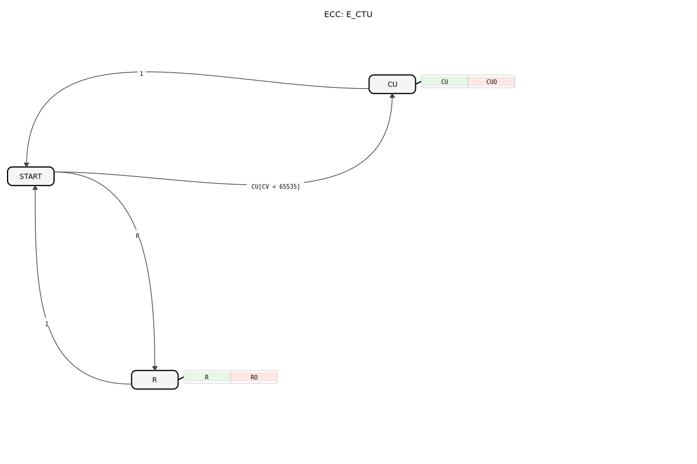
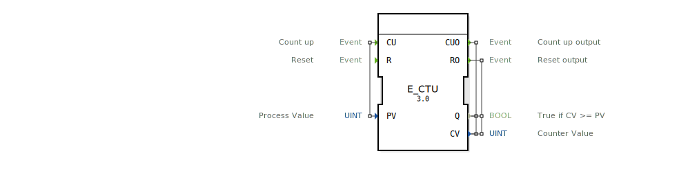

# E_CTU

## 📺 Video

* [The E_CTU upcounter](https://www.youtube.com/watch?v=2v4Ib2wZLGM)

## 🎧 Podcast

* [Der E_CTU in der IEC 61499: Ereignisgesteuertes Zählen und warum der Minimalist im Maschinenbau überzeugt](https://podcasters.spotify.com/pod/show/iec-61499-grundkurs-de/episodes/Der-E_CTU-in-der-IEC-61499-Ereignisgesteuertes-Zhlen-und-warum-der-Minimalist-im-Maschinenbau-berzeugt-e3a9qnq)
* [Der E_CTU-Baustein: Ereignisgesteuertes Hochzählen in der Industrie nach IEC 61499](https://podcasters.spotify.com/pod/show/iec-61499-grundkurs-de/episodes/Der-E_CTU-Baustein-Ereignisgesteuertes-Hochzhlen-in-der-Industrie-nach-IEC-61499-e36846t)
* [E_CTUD: Bidirektionaler Zähler in IEC 61499 Systemen](https://podcasters.spotify.com/pod/show/iec-61499-grundkurs-de/episodes/E_CTUD-Bidirektionaler-Zhler-in-IEC-61499-Systemen-e368lmb)
* [Meisterwissen 61499: Der Ereignisgesteuerte Aufwärtszähler (E_CTU) – Robustes Zählen in Landmaschinen-Steuerungen](https://podcasters.spotify.com/pod/show/iec-61499-grundkurs-de/episodes/Meisterwissen-61499-Der-Ereignisgesteuerte-Aufwrtszhler-E_CTU--Robustes-Zhlen-in-Landmaschinen-Steuerungen-e3a9q5n)

---- 

* * * * * * * * * *
## Einleitung
Der `E_CTU` (Event-Driven Up Counter) ist ein ereignisgesteuerter Aufwärtszähler gemäß dem IEC 61499-Standard. Seine Funktion ist es, bei jedem ankommenden Zählereignis einen internen Zählerstand zu erhöhen und diesen mit einem vorgegebenen Grenzwert zu vergleichen. Der Baustein kann jederzeit zurückgesetzt werden.

## Schnittstellenstruktur

### **Ereignis-Eingänge**
- **CU (Count Up)**: Löst einen Zählschritt aus, der den Zählerstand `CV` um 1 erhöht.
    - **Verbundene Daten**: `PV`
- **R (Reset)**: Setzt den Zählerstand `CV` auf 0 zurück.

### **Ereignis-Ausgänge**
- **CUO (Count Up Output)**: Bestätigt einen Zählschritt. Wird nach jedem `CU`-Ereignis ausgelöst.
    - **Verbundene Daten**: `Q`, `CV`
- **RO (Reset Output)**: Bestätigt das Zurücksetzen des Zählers.
    - **Verbundene Daten**: `Q`, `CV`

### **Daten-Eingänge**
- **PV (Preset Value)**: Der Grenzwert (Datentyp: `UINT`). Dieser Wert wird bei jedem `CU`-Ereignis mit dem Zählerstand verglichen.

### **Daten-Ausgänge**
- **Q (Status)**: Ausgangs-Flag, das `TRUE` wird, wenn der Zählerstand `CV` den Grenzwert `PV` erreicht oder überschreitet (Datentyp: `BOOL`).
- **CV (Counter Value)**: Der aktuelle Zählerstand (Datentyp: `UINT`).

## Funktionsweise
Der `E_CTU`-Baustein hat zwei Hauptfunktionen: Zählen und Zurücksetzen.

1.  **Zählen (CU)**: Wenn ein `CU`-Ereignis eintritt und der interne Zählerstand `CV` den Maximalwert für `UINT` (65535) noch nicht erreicht hat, wird `CV` um 1 erhöht. Anschließend wird `CV` mit dem am `PV`-Eingang anliegenden Grenzwert verglichen. Wenn `CV >= PV` ist, wird der Ausgang `Q` auf `TRUE` gesetzt, andernfalls auf `FALSE`. Nach dem Zählvorgang wird das `CUO`-Ereignis ausgelöst, das den aktuellen Zählerstand `CV` und das Status-Flag `Q` ausgibt.

2.  **Zurücksetzen (R)**: Wenn ein `R`-Ereignis eintritt, wird der Zählerstand `CV` sofort auf 0 und das Status-Flag `Q` auf `FALSE` gesetzt. Anschließend wird das `RO`-Ereignis ausgelöst, das die zurückgesetzten Werte `CV` und `Q` ausgibt.

## Technische Besonderheiten
- **Ereignisgesteuert**: Der Baustein arbeitet ausschließlich auf Basis von Ereignissen (`CU`, `R`).
- **Überlaufschutz**: Der Zähler stoppt, wenn der maximale Wert für `UINT` (65535) erreicht ist, um einen Überlauf zu verhindern.
- **PV bei jedem Zählschritt**: Der Grenzwert `PV` wird mit dem `CU`-Ereignis verknüpft, was bedeutet, dass er potenziell bei jedem Zählschritt geändert werden kann.

## Anwendungsbeispiele
- **Stückzähler**: Zählen von produzierten Teilen auf einem Förderband. Wenn eine Zielmenge (`PV`) erreicht ist, wird `Q` `TRUE`.
- **Ereigniszählung**: Erfassen der Häufigkeit von Ereignissen, wie z.B. das Betätigen eines Schalters.
- **Taktzähler**: Zählen von Taktzyklen in einer Maschine, um Wartungsintervalle zu signalisieren.

## ⚖️ Vergleich mit ähnlichen Bausteinen

| Merkmal          | E_CTU (Up Counter) | E_CTD (Down Counter) | E_CTUD (Up/Down Counter) |
|------------------|--------------------|----------------------|--------------------------|
| Zählrichtung     | Aufwärts           | Abwärts              | Beides                   |
| Ereignisgesteuert| Ja                 | Ja                   | Ja                       |
| Reset-Funktion   | R (Reset auf 0)    | LD (Setzen auf PV)   | R (Reset auf 0)          |

## 🛠️ Zugehörige Übungen

* [Uebung_040](../../../Uebungen/test_B/Uebungen_doc/Uebung_040.md)
* [Uebung_040_2](../../../Uebungen/test_B/Uebungen_doc/Uebung_040_2.md)
* [Uebung_040_AX](../../../Uebungen/test_AX/Uebungen_doc/Uebung_040_AX.md)
* [Uebung_041](../../../Uebungen/test_B/Uebungen_doc/Uebung_041.md)
* [Uebung_080](../../../Uebungen/test_B/Uebungen_doc/Uebung_080.md)
* [Uebung_080b](../../../Uebungen/test_B/Uebungen_doc/Uebung_080b.md)
* [Uebung_080c](../../../Uebungen/test_B/Uebungen_doc/Uebung_080c.md)
* [Uebung_084](../../../Uebungen/test_B/Uebungen_doc/Uebung_084.md)
* [Uebung_12x_sub](../../../Uebungen/test_B/Uebungen_doc/Uebung_12x_sub.md)

## Fazit
Der `E_CTU` ist ein grundlegender und vielseitiger Zählerbaustein für ereignisgesteuerte Systeme nach IEC 61499. Seine einfache Schnittstelle und sein vorhersehbares Verhalten machen ihn zu einem robusten Werkzeug für eine Vielzahl von Zähl- und Überwachungsaufgaben in der industriellen Automatisierung.