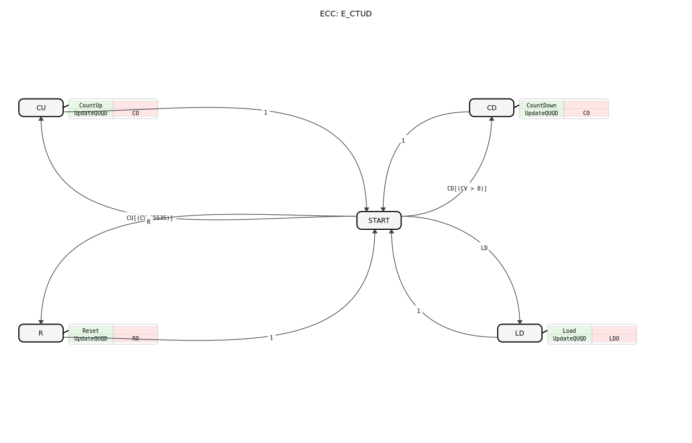
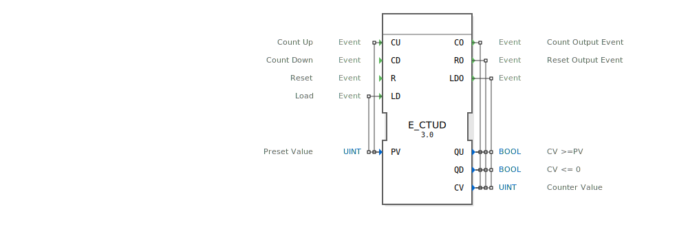

# E_CTUD

## 🎧 Podcast

* [E_CTUD: Bidirektionaler Zähler in IEC 61499 Systemen](https://podcasters.spotify.com/pod/show/iec-61499-grundkurs-de/episodes/E_CTUD-Bidirektionaler-Zhler-in-IEC-61499-Systemen-e368lmb)

---- 

* * * * * * * * * *
## Einleitung
Der `E_CTUD` (Event-Driven Up-Down Counter) ist ein ereignisgesteuerter Vor- und Rückwärtszähler gemäß dem IEC 61499-Standard. Er kann einen Zählerwert basierend auf separaten Ereignissen inkrementieren, dekrementieren, zurücksetzen oder mit einem vordefinierten Wert laden. Dies macht ihn zu einem flexiblen und leistungsstarken Baustein für eine Vielzahl von Zählanwendungen.

## Schnittstellenstruktur

### **Ereignis-Eingänge**
- **CU (Count Up)**: Löst ein Aufwärtszählen aus.
    - **Verbundene Daten**: `PV`
- **CD (Count Down)**: Löst ein Abwärtszählen aus.
- **R (Reset)**: Setzt den Zähler auf 0 zurück.
- **LD (Load)**: Lädt einen neuen Wert in den Zähler.
    - **Verbundene Daten**: `PV`

### **Ereignis-Ausgänge**
- **CO (Count Output)**: Bestätigt eine Zähloperation (`CU` oder `CD`).
    - **Verbundene Daten**: `QU`, `CV`, `QD`
- **RO (Reset Output)**: Bestätigt das Zurücksetzen des Zählers.
    - **Verbundene Daten**: `QU`, `CV`, `QD`
- **LDO (Load Output)**: Bestätigt das Laden eines neuen Zählerwertes.
    - **Verbundene Daten**: `QU`, `CV`, `QD`

### **Daten-Eingänge**
- **PV (Preset Value)**: Der Grenzwert für `QU` bzw. der zu ladende Wert für `LD` (Datentyp: `UINT`).

### **Daten-Ausgänge**
- **QU (Status Up)**: Ausgangs-Flag, das `TRUE` wird, wenn `CV >= PV` (Datentyp: `BOOL`).
- **QD (Status Down)**: Ausgangs-Flag, das `TRUE` wird, wenn `CV = 0` (Datentyp: `BOOL`).
- **CV (Counter Value)**: Der aktuelle Zählerstand (Datentyp: `UINT`).

## Funktionsweise
Der `E_CTUD` reagiert auf vier verschiedene Ereignisse:

1.  **Aufwärtszählen (CU)**: Wenn ein `CU`-Ereignis eintritt und `CV` kleiner als der Maximalwert (65535) ist, wird `CV` um 1 erhöht. Anschließend wird das `CO`-Ereignis ausgelöst.
2.  **Abwärtszählen (CD)**: Wenn ein `CD`-Ereignis eintritt und `CV` größer als 0 ist, wird `CV` um 1 verringert. Anschließend wird das `CO`-Ereignis ausgelöst.
3.  **Zurücksetzen (R)**: Wenn ein `R`-Ereignis eintritt, wird `CV` auf 0 gesetzt. Anschließend wird das `RO`-Ereignis ausgelöst.
4.  **Laden (LD)**: Wenn ein `LD`-Ereignis eintritt, wird `CV` auf den Wert von `PV` gesetzt. Anschließend wird das `LDO`-Ereignis ausgelöst.

Nach jeder dieser Aktionen werden die Status-Flags `QU` und `QD` basierend auf dem neuen Wert von `CV` aktualisiert (`QU = (CV >= PV)` und `QD = (CV == 0)`). Die jeweiligen Ausgangsereignisse (`CO`, `RO`, `LDO`) geben dann den aktuellen Zählerstand `CV` und die beiden Status-Flags aus.

## Technische Besonderheiten
- **Bidirektionale Zählung**: Der Baustein beherrscht das Auf- und Abwärtszählen in einem Block.
- **Umfassende Steuerung**: Bietet neben dem Zählen auch Funktionen zum expliziten Laden und Zurücksetzen.
- **Zwei Statusausgänge**: `QU` signalisiert das Erreichen des oberen Grenzwertes, `QD` das Erreichen des unteren Grenzwertes (0).
- **Über- und Unterlaufschutz**: Zähloperationen werden nur innerhalb der gültigen Grenzen (0 bis 65535) ausgeführt.

## Anwendungsszenarien
- **Positionserfassung**: Zählen von Inkrementalgeber-Schritten in beide Richtungen.
- **Füllstandsregelung**: Erfassen von Zu- und Abflüssen in einem Tank.
- **Lagerplatzverwaltung**: Zählen von ein- und ausgelagerten Paletten.

## ⚖️ Vergleich mit ähnlichen Bausteinen

| Merkmal      | E_CTUD (Up/Down) | E_CTU (Up)      | E_CTD (Down)     |
|--------------|------------------|-----------------|------------------|
| Zählrichtung | Auf & Ab         | Nur Auf         | Nur Ab           |
| Reset (auf 0)| Ja (`R`)         | Ja (`R`)        | Nein             |
| Laden (auf PV)| Ja (`LD`)        | Nein            | Ja (`LD`)        |
| Status Oben  | `QU` (`CV >= PV`)| `Q` (`CV >= PV`)| Nein             |
| Status Unten | `QD` (`CV = 0`)  | Nein            | `Q` (`CV = 0`)   |

## 🛠️ Zugehörige Übungen

* [Uebung_082](../../../training1/Ventilsteuerung/4diacIDE-workspace/test_B/Uebungen_doc/Uebung_082.md)

## Fazit
Der `E_CTUD` ist ein universeller Zählerbaustein, der die Funktionalität eines reinen Aufwärts- und Abwärtszählers kombiniert und erweitert. Durch seine vier Steuerereignisse (`CU`, `CD`, `R`, `LD`) und die beiden Statusausgänge (`QU`, `QD`) bietet er maximale Flexibilität für komplexe Zähl- und Überwachungsaufgaben in der industriellen Automatisierung.