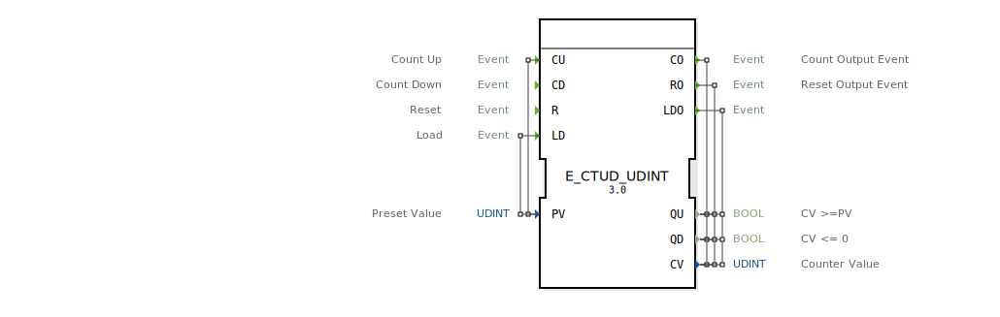

# E_CTUD_UDINT

---- 
```{index} single: E_CTUD_UDINT
```


* * * * * * * * * *
## Einleitung
Der `E_CTUD_UDINT` ist eine Variante des `E_CTUD`-Zählers, die den Datentyp `UDINT` (Unsigned Double Integer, 32-Bit) verwendet. Dieser ereignisgesteuerte Vor- und Rückwärtszähler kann einen sehr großen Zählerbereich abdecken. Er kann einen Zählerwert basierend auf separaten Ereignissen inkrementieren, dekrementieren, zurücksetzen oder mit einem vordefinierten Wert laden.



## Schnittstellenstruktur

### **Ereignis-Eingänge**
- **CU (Count Up)**: Löst ein Aufwärtszählen aus.
    - **Verbundene Daten**: `PV`
- **CD (Count Down)**: Löst ein Abwärtszählen aus.
- **R (Reset)**: Setzt den Zähler auf 0 zurück.
- **LD (Load)**: Lädt einen neuen Wert in den Zähler.
    - **Verbundene Daten**: `PV`

### **Ereignis-Ausgänge**
- **CO (Count Output)**: Bestätigt eine Zähloperation (`CU` oder `CD`).
    - **Verbundene Daten**: `QU`, `CV`, `QD`
- **RO (Reset Output)**: Bestätigt das Zurücksetzen des Zählers.
    - **Verbundene Daten**: `QU`, `CV`, `QD`
- **LDO (Load Output)**: Bestätigt das Laden eines neuen Zählerwertes.
    - **Verbundene Daten**: `QU`, `CV`, `QD`

### **Daten-Eingänge**
- **PV (Preset Value)**: Der Grenzwert für `QU` bzw. der zu ladende Wert für `LD` (Datentyp: `UDINT`).

### **Daten-Ausgänge**
- **QU (Status Up)**: Ausgangs-Flag, das `TRUE` wird, wenn `CV >= PV` (Datentyp: `BOOL`).
- **QD (Status Down)**: Ausgangs-Flag, das `TRUE` wird, wenn `CV = 0` (Datentyp: `BOOL`).
- **CV (Counter Value)**: Der aktuelle Zählerstand (Datentyp: `UDINT`).

## Funktionsweise
Der `E_CTUD_UDINT` reagiert auf vier verschiedene Ereignisse:

1.  **Aufwärtszählen (CU)**: Wenn ein `CU`-Ereignis eintritt und `CV` kleiner als der Maximalwert (4.294.967.295) ist, wird `CV` um 1 erhöht. Anschließend wird das `CO`-Ereignis ausgelöst.
2.  **Abwärtszählen (CD)**: Wenn ein `CD`-Ereignis eintritt und `CV` größer als 0 ist, wird `CV` um 1 verringert. Anschließend wird das `CO`-Ereignis ausgelöst.
3.  **Zurücksetzen (R)**: Wenn ein `R`-Ereignis eintritt, wird `CV` auf 0 gesetzt. Anschließend wird das `RO`-Ereignis ausgelöst.
4.  **Laden (LD)**: Wenn ein `LD`-Ereignis eintritt, wird `CV` auf den Wert von `PV` gesetzt. Anschließend wird das `LDO`-Ereignis ausgelöst.

Nach jeder dieser Aktionen werden die Status-Flags `QU` und `QD` basierend auf dem neuen Wert von `CV` aktualisiert (`QU = (CV >= PV)` und `QD = (CV == 0)`). Die jeweiligen Ausgangsereignisse (`CO`, `RO`, `LDO`) geben dann den aktuellen Zählerstand `CV` und die beiden Status-Flags aus.

## Technische Besonderheiten
- **Großer Zählbereich**: Durch die Verwendung von `UDINT` kann der Zähler Werte von 0 bis 4.294.967.295 annehmen.
- **Bidirektionale Zählung**: Der Baustein beherrscht das Auf- und Abwärtszählen in einem Block.
- **Umfassende Steuerung**: Bietet neben dem Zählen auch Funktionen zum expliziten Laden und Zurücksetzen.
- **Über- und Unterlaufschutz**: Zähloperationen werden nur innerhalb der gültigen `UDINT`-Grenzen (0 bis 4.294.967.295) ausgeführt.

## Anwendungsszenarien
- **Gesamtzähler**: Erfassung von Gesamtstückzahlen oder Betriebsstunden über die gesamte Lebensdauer einer Maschine, wo ein 16-Bit-Zähler nicht ausreicht.
- **Energiemessung**: Zählen von Impulsen eines Energiezählers (z.B. Wh oder kWh) über lange Zeiträume.
- **Hochauflösende Positionserfassung**: Zählen von sehr vielen Inkrementen eines hochauflösenden Encoders.


## Zugehörige Übungen

* [Uebung_009](../../../training1/Ventilsteuerung/4diacIDE-workspace/test_B/Uebungen_doc/Uebung_009.md)
* [Uebung_034b](../../../training1/Ventilsteuerung/4diacIDE-workspace/test_B/Uebungen_doc/Uebung_034b.md)
* [Uebung_083](../../../training1/Ventilsteuerung/4diacIDE-workspace/test_B/Uebungen_doc/Uebung_083.md)

## Fazit
Der `E_CTUD_UDINT` ist die `UDINT`-Variante des universellen `E_CTUD`-Zählers. Er bietet dieselbe Funktionalität, aber mit einem wesentlich größeren Zählbereich (32-Bit). Dies macht ihn zur idealen Wahl für Anwendungen, bei denen der Zählerstand über die Grenze eines 16-Bit-`UINT`-Zählers hinauswachsen kann. Seine robuste, ereignisgesteuerte Natur und die umfassenden Steuerungs- und Statusfunktionen bleiben dabei erhalten.