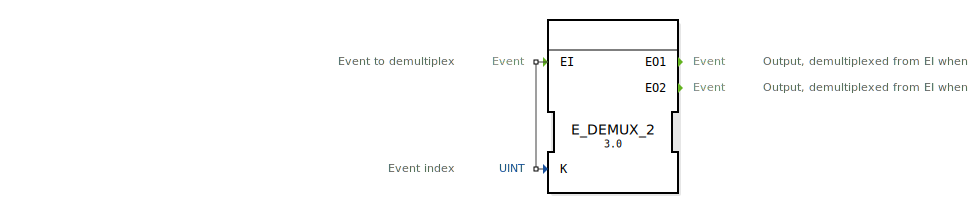

# E_DEMUX_2

```{index} single: E_DEMUX_2
```

<!-- Hier wäre Platz für ein Bild des Funktionsblocks, falls vorhanden. -->

* * * * * * * * * *

## Einleitung
Der `E_DEMUX_2` (Event Demultiplexer) ist ein Funktionsbaustein nach IEC 61499, der ein einzelnes Eingangereignis (`EI`) an einen von zwei Ausgängen weiterleitet. Die Auswahl des Ausgangs wird durch den Wert der Eingangsvariable `K` bestimmt.



## Schnittstellenstruktur

### **Ereignis-Eingänge**
- **EI (Event Input)**: Das Eingangereignis, das verteilt werden soll.
    - **Verbundene Daten**: `K`

### **Ereignis-Ausgänge**
- **EO1**: Wird ausgelöst, wenn `EI` ankommt und der Auswahlindex `K = 0` ist.
- **EO2**: Wird ausgelöst, wenn `EI` ankommt und der Auswahlindex `K = 1` ist.

### **Daten-Eingänge**
- **K**: Der 0-basierte Auswahlindex, der bestimmt, welcher Ausgang ausgelöst wird (Datentyp: `UINT`).

## Funktionsweise
1.  **Ereignisempfang**: Der Baustein wartet auf ein Ereignis am Eingang `EI`.
2.  **Auswahl**: Wenn das `EI`-Ereignis eintrifft, wird der Wert der Datenvariable `K` ausgewertet.
3.  **Weiterleitung**:
    - Ist `K` = 0, wird das Ereignis an `EO1` weitergeleitet.
    - Ist `K` = 1, wird das Ereignis an `EO2` weitergeleitet.
4.  **Ungültiger Index**: Wenn der Wert von `K` außerhalb des gültigen Bereichs [0, 1] liegt, wird kein Ausgangsereignis ausgelöst.

Das Eingangsereignis wird somit immer exklusiv an genau einen Ausgang weitergeleitet, sofern der Index `K` gültig ist.

## Technische Besonderheiten
- **1-zu-2 Verteilung**: Dieser Baustein verteilt ein Ereignis auf zwei mögliche Ausgänge.
- **Index-gesteuert**: Die Logik basiert auf einem numerischen Index (`K`).
- **Verwirrende Namensgebung**: Man beachte, dass die Ausgänge 1-basiert (`EO1`, `EO2`) benannt sind, der Auswahlindex `K` aber 0-basiert ist (`K=0` für `EO1`, `K=1` for `EO2`).
- **Generischer Baustein**: Die Funktionalität wird durch die generische Klasse `GEN_E_DEMUX` zur Verfügung gestellt.

## Anwendungsszenarien
- **Bedingte Verzweigung**: Aufteilen eines Ereignisflusses basierend auf einer einfachen Bedingung, die zu einem Ergebnis von 0 oder 1 führt.
- **Zustandsmaschinen**: Auswahl zwischen zwei möglichen nächsten Zuständen.
- **Aktivierung/Deaktivierung**: Weiterleiten eines Ereignisses an einen "Ein"- oder "Aus"-Pfad.

## Fazit
Der `E_DEMUX_2` ist eine spezialisierte Version des Demultiplexers für Fälle, in denen ein Ereignis auf genau zwei Pfade aufgeteilt werden muss. Er ist nützlich für einfache binäre Entscheidungen im Ereignisfluss. Die inkonsistente Benennung der Ausgänge im Verhältnis zum Indexwert erfordert besondere Aufmerksamkeit bei der Implementierung.