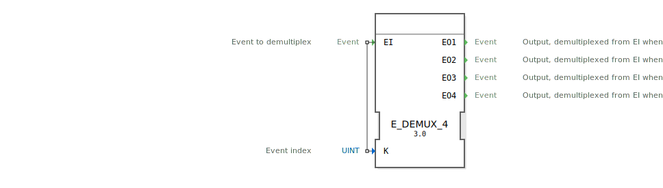

# E_DEMUX_4

```{index} single: E_DEMUX_4
```

<!-- Hier wäre Platz für ein Bild des Funktionsblocks, falls vorhanden. -->

* * * * * * * * * *

## Einleitung
Der `E_DEMUX_4` (Event Demultiplexer) ist ein Funktionsbaustein nach IEC 61499, der ein einzelnes Eingangereignis (`EI`) an einen von vier Ausgängen weiterleitet. Die Auswahl des Ausgangs wird durch den Wert der Eingangsvariable `K` bestimmt.



## Schnittstellenstruktur

### **Ereignis-Eingänge**
- **EI (Event Input)**: Das Eingangereignis, das verteilt werden soll.
    - **Verbundene Daten**: `K`

### **Ereignis-Ausgänge**
- **EO1**: Wird ausgelöst, wenn `EI` ankommt und der Auswahlindex `K = 0` ist.
- **EO2**: Wird ausgelöst, wenn `EI` ankommt und der Auswahlindex `K = 1` ist.
- **EO3**: Wird ausgelöst, wenn `EI` ankommt und der Auswahlindex `K = 2` ist.
- **EO4**: Wird ausgelöst, wenn `EI` ankommt und der Auswahlindex `K = 3` ist.

### **Daten-Eingänge**
- **K**: Der 0-basierte Auswahlindex, der bestimmt, welcher Ausgang ausgelöst wird (Datentyp: `UINT`).

## Funktionsweise
1.  **Ereignisempfang**: Der Baustein wartet auf ein Ereignis am Eingang `EI`.
2.  **Auswahl**: Wenn das `EI`-Ereignis eintrifft, wird der Wert der Datenvariable `K` ausgewertet.
3.  **Weiterleitung**:
    - Ist `K` = 0, wird das Ereignis an `EO1` weitergeleitet.
    - Ist `K` = 1, wird das Ereignis an `EO2` weitergeleitet.
    - Ist `K` = 2, wird das Ereignis an `EO3` weitergeleitet.
    - Ist `K` = 3, wird das Ereignis an `EO4` weitergeleitet.
4.  **Ungültiger Index**: Wenn der Wert von `K` außerhalb des gültigen Bereichs [0, 3] liegt, wird kein Ausgangsereignis ausgelöst.

## Technische Besonderheiten
- **1-zu-4 Verteilung**: Dieser Baustein verteilt ein Ereignis auf vier mögliche Ausgänge.
- **Index-gesteuert**: Die Logik basiert auf einem numerischen Index (`K`).
- **Verwirrende Namensgebung**: Man beachte, dass die Ausgänge 1-basiert (`EO1` bis `EO4`) benannt sind, der Auswahlindex `K` aber 0-basiert ist (`K=0` für `EO1`, `K=1` for `EO2`, usw.).
- **Generischer Baustein**: Die Funktionalität wird durch die generische Klasse `GEN_E_DEMUX` zur Verfügung gestellt.

## Anwendungsszenarien
- **Zustandsmaschinen**: Auswahl des nächsten Zustandsübergangs basierend auf einem berechneten Index.
- **Modus-Umschaltung**: Aktivierung unterschiedlicher Anlagenteile je nach gewähltem Betriebsmodus (`K` = Modus-Nummer).
- **Sequenzer/Schrittketten**: Aktivierung eines von vier möglichen nächsten Schritten.


## Zugehörige Übungen

* [Uebung_040_2](../../../training1/Ventilsteuerung/4diacIDE-workspace/test_B/Uebungen_doc/Uebung_040_2.md)
* [Uebung_087a1](../../../training1/Ventilsteuerung/4diacIDE-workspace/test_B/Uebungen_doc/Uebung_087a1.md)
* [Uebung_087a2](../../../training1/Ventilsteuerung/4diacIDE-workspace/test_B/Uebungen_doc/Uebung_087a2.md)

## Fazit
Der `E_DEMUX_4` ist eine Standard-Implementierung des Demultiplexer-Prinzips für vier Ausgänge. Er ist nützlich für die Aufteilung eines Ereignisflusses in bis zu vier Pfade. Die inkonsistente Benennung der Ausgänge im Verhältnis zum Indexwert erfordert besondere Aufmerksamkeit bei der Implementierung.