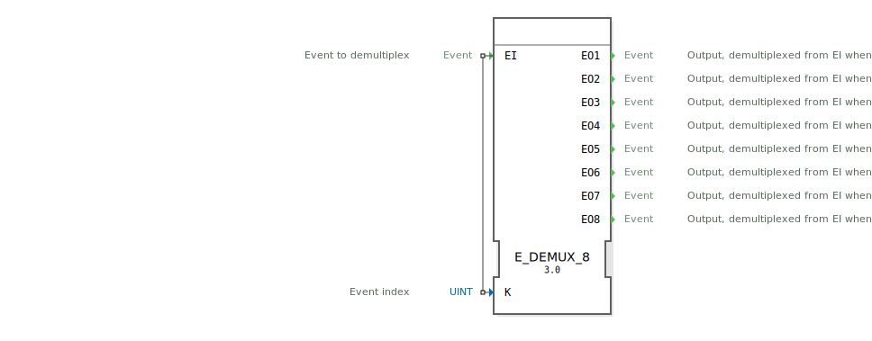

# E_DEMUX_8

```{index} single: E_DEMUX_8
```

<!-- Hier wäre Platz für ein Bild des Funktionsblocks, falls vorhanden. -->

* * * * * * * * * *

## Einleitung
Der `E_DEMUX_8` (Event Demultiplexer) ist ein Funktionsbaustein nach IEC 61499, der ein einzelnes Eingangereignis (`EI`) an einen von acht Ausgängen weiterleitet. Die Auswahl des Ausgangs wird durch den Wert der Eingangsvariable `K` bestimmt.



## Schnittstellenstruktur

### **Ereignis-Eingänge**
- **EI (Event Input)**: Das Eingangereignis, das verteilt werden soll.
    - **Verbundene Daten**: `K`

### **Ereignis-Ausgänge**
- **EO1**: Wird ausgelöst, wenn `EI` ankommt und `K = 0` ist.
- **EO2**: Wird ausgelöst, wenn `EI` ankommt und `K = 1` ist.
- **EO3**: Wird ausgelöst, wenn `EI` ankommt und `K = 2` ist.
- **EO4**: Wird ausgelöst, wenn `EI` ankommt und `K = 3` ist.
- **EO5**: Wird ausgelöst, wenn `EI` ankommt und `K = 4` ist.
- **EO6**: Wird ausgelöst, wenn `EI` ankommt und `K = 5` ist.
- **EO7**: Wird ausgelöst, wenn `EI` ankommt und `K = 6` ist.
- **EO8**: Wird ausgelöst, wenn `EI` ankommt und `K = 7` ist.

### **Daten-Eingänge**
- **K**: Der 0-basierte Auswahlindex, der bestimmt, welcher Ausgang ausgelöst wird (Datentyp: `UINT`).

## Funktionsweise
1.  **Ereignisempfang**: Der Baustein wartet auf ein Ereignis am Eingang `EI`.
2.  **Auswahl**: Wenn das `EI`-Ereignis eintrifft, wird der Wert der Datenvariable `K` ausgewertet.
3.  **Weiterleitung**: Das Ereignis wird an den Ausgang `EO(K+1)` weitergeleitet. Zum Beispiel:
    - Ist `K` = 0, wird das Ereignis an `EO1` weitergeleitet.
    - Ist `K` = 7, wird das Ereignis an `EO8` weitergeleitet.
4.  **Ungültiger Index**: Wenn der Wert von `K` außerhalb des gültigen Bereichs [0, 7] liegt, wird kein Ausgangsereignis ausgelöst.

## Technische Besonderheiten
- **1-zu-8 Verteilung**: Dieser Baustein verteilt ein Ereignis auf acht mögliche Ausgänge.
- **Index-gesteuert**: Die Logik basiert auf einem numerischen Index (`K`).
- **Verwirrende Namensgebung**: Man beachte, dass die Ausgänge 1-basiert (`EO1` bis `EO8`) benannt sind, der Auswahlindex `K` aber 0-basiert ist (`K=0` für `EO1`, `K=7` for `EO8`, usw.).
- **Generischer Baustein**: Die Funktionalität wird durch die generische Klasse `GEN_E_DEMUX` zur Verfügung gestellt.

## Anwendungsszenarien
- **Zustandsmaschinen**: Auswahl des nächsten Zustandsübergangs aus bis zu acht Möglichkeiten.
- **Modus-Umschaltung**: Aktivierung unterschiedlicher Anlagenteile je nach gewähltem Betriebsmodus.
- **Kommunikations-Router**: Weiterleiten von Nachrichten oder Befehlen an einen von acht Kanälen.


## Zugehörige Übungen

* [Uebung_006c](../../../training1/Ventilsteuerung/4diacIDE-workspace/test_B/Uebungen_doc/Uebung_006c.md)
* [Uebung_041](../../../training1/Ventilsteuerung/4diacIDE-workspace/test_B/Uebungen_doc/Uebung_041.md)

## Fazit
Der `E_DEMUX_8` ist eine nützliche Implementierung des Demultiplexer-Prinzips für Anwendungsfälle mit bis zu acht verschiedenen Ereignispfaden. Wie bei den anderen `E_DEMUX`-Bausteinen erfordert die inkonsistente Benennung der Ausgänge im Verhältnis zum Indexwert besondere Aufmerksamkeit bei der Implementierung.