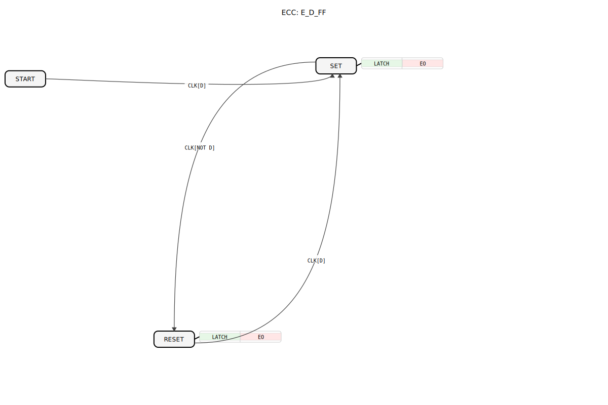

# E_D_FF

---- 
```{index} single: E_D_FF
```




* * * * * * * * * *

## Einleitung
Die IEC 61499 ist ein internationaler Standard für die Modellierung verteilter industrieller Steuerungssysteme. Der **E_D_FF**-Baustein (Data Flip-Flop) ist ein grundlegendes Speicherelement in dieser Norm, das digitale Signale synchron zu einem Taktsignal speichert. Dieser Funktionsbaustein spielt eine zentrale Rolle in Zustandsmaschinen und Speicheranwendungen industrieller Automatisierungslösungen.


## Struktur des E_D_FF-Bausteins

### Schnittstelle (Interface)

**Ereignis-Eingänge:**
- `CLK` (Clock): Taktereignis, das die Übernahme des Daten-Eingangs `D` auslöst.
    - **Verbundene Daten**: `D`

**Ereignis-Ausgänge:**
- `EO` (Event Output): Wird ausgelöst, wenn der `CLK`-Impuls zu einer Änderung des Ausgangs `Q` führt.
    - **Verbundene Daten**: `Q`

**Daten-Eingänge:**
- `D`: Der zu speichernde Datenwert (Datentyp: `BOOL`).

**Daten-Ausgänge:**
- `Q`: Der aktuell gespeicherte Wert (Datentyp: `BOOL`).

## Funktionsweise

1. **Datenspeicherung:**
   - Bei jeder positiven Flanke des `CLK`-Signals wird der Wert von `D` in `Q` übernommen
   - Bei Wertänderung wird das `EO`-Ereignis ausgelöst

2. **Datenhaltung:**
   - Zwischen den Taktflanken bleibt der gespeicherte Wert `Q` stabil
   - Änderungen am Eingang `D` haben ohne Taktflanke keine Auswirkung

## Technische Besonderheiten

✔ **Taktgesteuerte Speicherung** für synchrone Systeme
✔ **Ereignisausgang** für Änderungsdetektion
✔ **Deterministisches Verhalten** in Echtzeitsystemen
✔ **Einfache Integration** in IEC 61499-Applikationen

## Anwendungsszenarien

- **Zustandsspeicherung** in Automatisierungsprozessen
- **Eingabepufferung** für Bedienereingaben
- **Flankenerkennung** in Signalverarbeitungsketten
- **Synchronisation** zwischen asynchronen Systemteilen

## ⚖️ Vergleich mit ähnlichen Bausteinen

| Feature        | E_D_FF | E_SR | E_R_TRIG |
|---------------|--------|------|----------|
| Speichertyp   | D-Flip-Flop | SR-Latch | Flankendetektor |
| Taktung       | Erforderlich | Keine | Keine |
| Datenhaltung  | Ja | Ja | Nein |
| Ereignisausgang | Bei Änderung | Bei Set/Reset | Bei Flanke |


## 🛠️ Zugehörige Übungen

* [Uebung_071a](../../../training1/Ventilsteuerung/4diacIDE-workspace/test_B/Uebungen_doc/Uebung_071a.md)
* [Uebung_071b](../../../training1/Ventilsteuerung/4diacIDE-workspace/test_B/Uebungen_doc/Uebung_071b.md)
* [Uebung_072b](../../../training1/Ventilsteuerung/4diacIDE-workspace/test_B/Uebungen_doc/Uebung_072b.md)
* [Uebung_085](../../../training1/Ventilsteuerung/4diacIDE-workspace/test_B/Uebungen_doc/Uebung_085.md)

## Fazit

Der E_D_FF-Baustein stellt ein essentielles Speicherelement für IEC 61499-basierte Steuerungssysteme dar. Seine Hauptvorteile sind:

- Zuverlässige taktsynchrone Datenspeicherung
- Sofortige Rückmeldung von Zustandsänderungen
- Robuste Integration in verteilte Steuerungsarchitekturen

Durch seine einfache aber wirkungsvolle Funktionalität bildet er die Grundlage für komplexere Speicher- und Zustandssteuerungen in industriellen Automatisierungslösungen. Die strikte Einhaltung der IEC 61499-Standards gewährleistet dabei die problemlose Interoperabilität mit anderen Funktionsbausteinen.