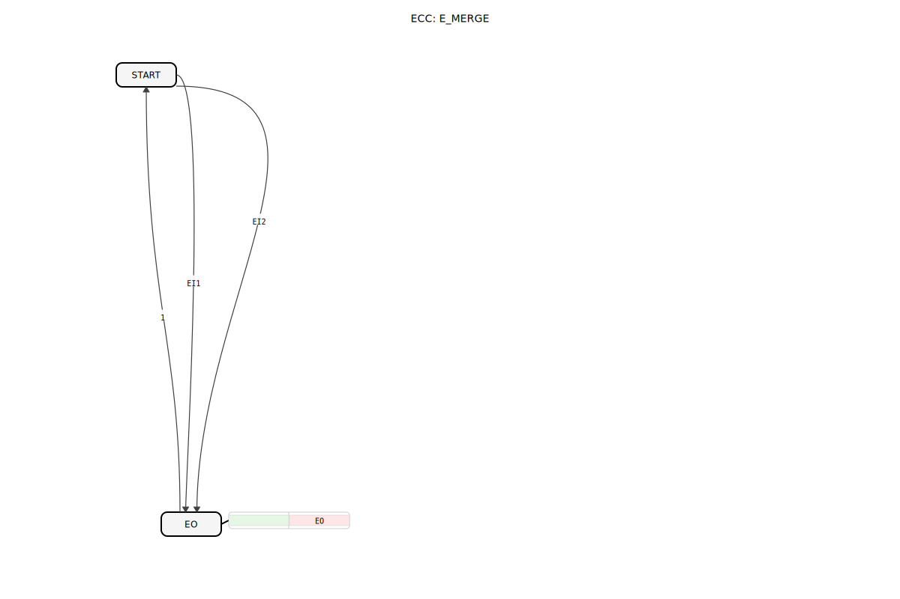

# E_MERGE

```{index} single: E_MERGE
```




* * * * * * * * * *

## Einleitung
Der **E_MERGE** ist ein grundlegender Funktionsbaustein der IEC 61499 Norm, der mehrere Ereignisströme zu einem einzigen Ausgang zusammenführt. Diese logische ODER-Verknüpfung von Ereignissen ist essentiell für die Steuerungslogik in industriellen Automatisierungssystemen.


## Struktur des E_MERGE-Bausteins

### Schnittstelle (Interface)

**Ereignis-Eingänge:**
- `EI1` (Event Input 1): Erster Ereigniseingang
- `EI2` (Event Input 2): Zweiter Ereigniseingang

**Ereignis-Ausgänge:**
- `EO` (Event Output): Zusammengeführter Ereignisausgang

## Funktionsweise

1. **Ereigniszusammenführung:**
   - Jedes Ereignis an `EI1` oder `EI2` löst ein Ausgangsereignis an `EO` aus
   - Die Eingänge werden logisch ODER-verknüpft

2. **Unabhängige Verarbeitung:**
   - Ereignisse an beiden Eingängen werden gleichberechtigt behandelt
   - Keine Priorisierung bestimmter Eingänge

3. **Sofortige Weiterleitung:**
   - Keine Verzögerung zwischen Eingangs- und Ausgangsereignis
   - Kein Speicherverhalten oder Zustandshaltung

## Technische Besonderheiten

✔ **Einfache und schnelle** Ereignisverknüpfung
✔ **Verlustfreie** Ereignisweitergabe
✔ **Echtzeitfähig** für industrielle Anwendungen
✔ **Erweiterbar** auf mehrere Eingänge

## Anwendungsszenarien

- **Bedienkonzepte**: Zusammenführung von Steuersignalen mehrerer Taster
- **Sensordaten**: Kombination von Ereignissen verschiedener Sensoren
- **Fehlermanagement**: Sammelstelle für verschiedene Störmeldungen
- **Prozesssteuerung**: Verknüpfung von Prozessereignissen

## ⚖️ Vergleich mit ähnlichen Bausteinen

| Feature        | E_MERGE | E_DEMUX | E_SWITCH |
|---------------|---------|---------|----------|
| Funktionsprinzip | ODER-Verknüpfung | Verteilung | Bedingte Weiterleitung |
| Richtung      | n:1     | 1:n     | 1:1      |
| Ereignisfluss | Kombination | Aufteilung | Selektion |

## Ähnliche Bausteine
Für Anwendungsfälle, die mehr als zwei Ereigniseingänge benötigen, stellt die Bibliothek weitere Varianten zur Verfügung:
- **E_MERGE**: Dieser Baustein (2 Eingänge)
- **E_MERGE_2**: Funktional identisch zu `E_MERGE` (2 Eingänge)
- **E_MERGE_3**: Eine Variante mit 3 Eingängen (`EI1`, `EI2`, `EI3`)
- **E_MERGE_4**: Eine Variante mit 4 Eingängen

Diese Bausteine erlauben die einfache Zusammenführung von bis zu vier Ereignisquellen auf einen einzigen Ausgang.


## 🛠️ Zugehörige Übungen

* [Uebung_004a2](../../../training1/Ventilsteuerung/4diacIDE-workspace/test_B/Uebungen_doc/Uebung_004a2.md)
* [Uebung_004a2_AX](../../../training1/Ventilsteuerung/4diacIDE-workspace/test_AX/Uebungen_doc/Uebung_004a2_AX.md)

## Fazit

Der E_MERGE-Baustein ist ein fundamentaler Baustein für die Ereignisverarbeitung in IEC 61499-Systemen. Seine Hauptvorteile sind:

- Einfache und effiziente Ereigniskombination
- Sofortige Reaktion auf Eingangsereignisse
- Flexible Einsatzmöglichkeiten in verschiedenen Steuerungsszenarien

Durch seine klare Funktionsweise und Standardkonformität eignet er sich ideal für grundlegende Verknüpfungsaufgaben in industriellen Automatisierungslösungen. Die deterministische Arbeitsweise macht ihn besonders wertvoll für sicherheitskritische Anwendungen.