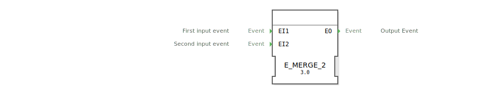

# E_MERGE_2

```{index} single: E_MERGE_2
```

<!-- Hier wäre Platz für ein Bild des Funktionsblocks, falls vorhanden. -->

* * * * * * * * * *

## Einleitung
Der `E_MERGE_2` ist ein grundlegender Funktionsbaustein der IEC 61499 Norm, der zwei Ereignisströme (`EI1`, `EI2`) zu einem einzigen Ausgang (`EO`) zusammenführt. Diese logische ODER-Verknüpfung von Ereignissen ist essentiell für die Steuerungslogik in industriellen Automatisierungssystemen. Dieser Baustein ist funktional identisch mit dem `E_MERGE`-Baustein.



## Schnittstellenstruktur

### **Ereignis-Eingänge:**
- `EI1` (Event Input 1): Erster Ereigniseingang
- `EI2` (Event Input 2): Zweiter Ereigniseingang

### **Ereignis-Ausgänge:**
- `EO` (Event Output): Zusammengeführter Ereignisausgang

## Funktionsweise
Die Funktion ist einfach und direkt:
- Ein Ereignis am Eingang `EI1` löst sofort ein Ereignis am Ausgang `EO` aus.
- Ein Ereignis am Eingang `EI2` löst ebenfalls sofort ein Ereignis am Ausgang `EO` aus.

Die Eingänge werden logisch ODER-verknüpft und ohne Priorisierung oder Verzögerung weitergeleitet.

## Technische Besonderheiten
- **2-zu-1 Verknüpfung**: Führt zwei Ereignisströme zu einem zusammen.
- **Zustandslos**: Der Baustein hat keinen internen Speicher.
- **Generischer Baustein**: Die Funktionalität wird durch die generische Klasse `GEN_E_MERGE` zur Verfügung gestellt, was eine optimierte Ausführung durch die 4diac-Laufzeitumgebung ermöglicht.

## Anwendungsszenarien
- **Bedienkonzepte**: Zusammenführung von Steuersignalen von zwei Tastern auf eine gemeinsame Funktion.
- **Sensorik**: Kombination der Trigger-Ereignisse von zwei verschiedenen Sensoren.
- **Fehlermanagement**: Erstellen einer Sammel-Störmeldung aus zwei potenziellen Fehlerquellen.


## Zugehörige Übungen

* [Uebung_004a2_2](../../../training1/Ventilsteuerung/4diacIDE-workspace/test_B/Uebungen_doc/Uebung_004a2_2.md)

## Fazit
Der `E_MERGE_2` ist ein fundamentaler und häufig verwendeter Baustein für die einfachste Form der Ereignis-Verknüpfung. Seine klare Funktionsweise und die effiziente Implementierung als generischer Baustein machen ihn zu einer zuverlässigen Komponente für grundlegende Steuerungslogik.