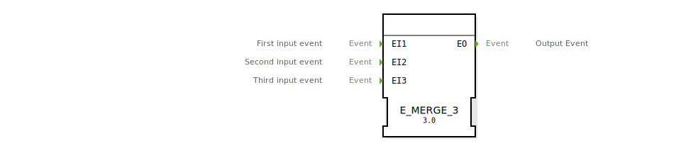

# E_MERGE_3

```{index} single: E_MERGE_3
```

<!-- Hier wäre Platz für ein Bild des Funktionsblocks, falls vorhanden. -->

* * * * * * * * * *

## Einleitung
Der `E_MERGE_3` ist ein grundlegender Funktionsbaustein der IEC 61499 Norm, der drei Ereignisströme (`EI1`, `EI2`, `EI3`) zu einem einzigen Ausgang (`EO`) zusammenführt. Diese logische ODER-Verknüpfung von Ereignissen ist essentiell für die Steuerungslogik in industriellen Automatisierungssystemen.



## Schnittstellenstruktur

### **Ereignis-Eingänge:**
- `EI1` (Event Input 1): Erster Ereigniseingang
- `EI2` (Event Input 2): Zweiter Ereigniseingang
- `EI3` (Event Input 3): Dritter Ereigniseingang

### **Ereignis-Ausgänge:**
- `EO` (Event Output): Zusammengeführter Ereignisausgang

## Funktionsweise
Die Funktion ist einfach und direkt:
- Ein Ereignis am Eingang `EI1`, `EI2` oder `EI3` löst sofort und ohne Priorisierung ein Ereignis am Ausgang `EO` aus.

Die Eingänge werden logisch ODER-verknüpft und ohne Verzögerung weitergeleitet.

## Technische Besonderheiten
- **3-zu-1 Verknüpfung**: Führt drei Ereignisströme zu einem zusammen.
- **Zustandslos**: Der Baustein hat keinen internen Speicher.
- **Generischer Baustein**: Die Funktionalität wird durch die generische Klasse `GEN_E_MERGE` zur Verfügung gestellt, was eine optimierte Ausführung durch die 4diac-Laufzeitumgebung ermöglicht.

## Anwendungsszenarien
- **Bedienkonzepte**: Zusammenführung von Steuersignalen von drei Tastern auf eine gemeinsame Funktion (z.B. "Hand", "Automatik", "Service" starten denselben Prozess).
- **Sensorik**: Kombination der Trigger-Ereignisse von drei verschiedenen Sensoren zu einem Gesamtereignis.
- **Fehlermanagement**: Erstellen einer Sammel-Störmeldung aus drei potenziellen Fehlerquellen.


## 🛠️ Zugehörige Übungen

* [Uebung_004a2_3](../../../training1/Ventilsteuerung/4diacIDE-workspace/test_B/Uebungen_doc/Uebung_004a2_3.md)

## Fazit
Der `E_MERGE_3` ist ein einfacher, aber nützlicher Baustein zur Verknüpfung von bis zu drei Ereignisquellen. Seine klare Funktionsweise und die effiziente Implementierung als generischer Baustein machen ihn zu einer zuverlässigen Komponente für grundlegende Steuerungslogik.