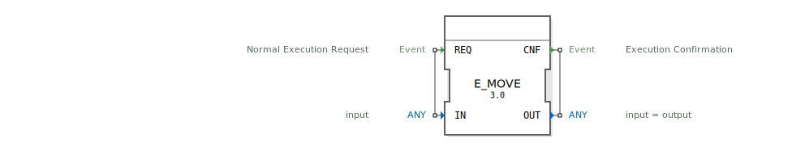

# E_MOVE

```{index} single: E_MOVE
```

<!-- Hier wäre Platz für ein Bild des Funktionsblocks, falls vorhanden. -->

* * * * * * * * * *

## Einleitung
Der `E_MOVE`-Baustein (Event-driven Move) ist ein Datenlatch, der die Weitergabe von Daten und Ereignissen filtert. Er gibt ein Ausgangsereignis nur dann aus, wenn sich der am Eingang anliegende Datenwert vom zuletzt ausgegebenen Wert unterscheidet. Er funktioniert wie ein D-Flipflop für beliebige Datentypen (`ANY`).



## Schnittstellenstruktur

### **Ereignis-Eingänge:**
- **REQ (Request)**: Löst die Überprüfung und potenzielle Weitergabe des Eingangswertes aus.
    - **Verbundene Daten**: `IN`

### **Ereignis-Ausgänge:**
- **CNF (Confirmation)**: Wird ausgelöst, wenn der Eingangswert `IN` sich vom letzten Ausgangswert `OUT` unterscheidet.
    - **Verbundene Daten**: `OUT`

### **Daten-Eingänge:**
- **IN**: Der Eingangswert, der mit dem Ausgangswert verglichen werden soll (Datentyp: `ANY`).

### **Daten-Ausgänge:**
- **OUT**: Der zuletzt geänderte Wert, der dem Eingangswert entspricht (Datentyp: `ANY`).

## Funktionsweise
1.  **Ereignisempfang**: Der Baustein wartet auf ein Ereignis am Eingang `REQ`.
2.  **Wertvergleich**: Wenn das `REQ`-Ereignis eintrifft, wird der aktuelle Wert am `IN`-Eingang mit dem intern gespeicherten Wert (der auch am `OUT`-Ausgang anliegt) verglichen.
3.  **Bedingte Weiterleitung**:
    - **Wenn `IN` ungleich `OUT` ist**: Der neue Wert von `IN` wird am `OUT`-Ausgang ausgegeben und das `CNF`-Ereignis wird ausgelöst.
    - **Wenn `IN` gleich `OUT` ist**: Es geschieht nichts. Das `CNF`-Ereignis wird nicht ausgelöst, und der Datenfluss wird unterbrochen.

Dieser Mechanismus reduziert die Anzahl der Ereignisse im System, indem er nur bei tatsächlichen Datenänderungen reagiert.

## Technische Besonderheiten
- **Filter für Datenänderungen**: Die Kernfunktion ist das Filtern von redundanten Daten und das Unterdrücken unnötiger Ereignisse.
- **Generischer Datentyp**: Der Baustein kann mit jedem Datentyp (`ANY`) außer `REAL` und `LREAL` verwendet werden.
- **Warnung bei `REAL`/`LREAL`**: Die Funktionalität ist für die Datentypen `REAL` und `LREAL` nicht garantiert. Aufgrund von Rundungsfehlern und der Natur von Fließkommavergleichen kann es zu unvorhersehbarem Verhalten kommen, bei dem kleine, irrelevante Änderungen fälschlicherweise als Datenänderung interpretiert werden.

## Anwendungsszenarien
- **Reduzierung der Systemlast**: In komplexen Netzwerken kann die Anzahl der verarbeiteten Ereignisse drastisch reduziert werden, wenn nur noch auf Wertänderungen reagiert wird.
- **Flankenerkennung für nicht-boolesche Werte**: Erkennen, wann sich ein analoger Wert oder ein Status ändert.
- **Schnittstelle zu langsamen Systemen**: Sicherstellen, dass ein Befehl an ein unterlagertes System nur gesendet wird, wenn sich der Sollwert tatsächlich ändert.

## Vergleich mit ähnlichen Bausteinen
- **`E_D_FF`**: Funktional sehr ähnlich, aber `E_D_FF` ist spezifisch auf den Datentyp `BOOL` ausgelegt. `E_MOVE` ist die generische `ANY`-Variante davon.
- **Direkte Verbindung**: Im Gegensatz zu einer direkten Verbindung von Daten und Ereignissen, die bei jeder Ausführung weitergeleitet werden, fügt `E_MOVE` eine "Änderungs-Firewall" ein.

## Fazit
Der `E_MOVE`-Baustein ist ein äußerst nützliches Werkzeug zur Optimierung von IEC 61499-Anwendungen. Indem er die Ereignis-Verarbeitung auf tatsächliche Datenänderungen beschränkt, trägt er maßgeblich zur Reduzierung der Systemlast und zur Erhöhung der Effizienz bei. Seine generische Natur macht ihn sehr flexibel, die Einschränkung bei Fließkommazahlen muss jedoch beachtet werden.