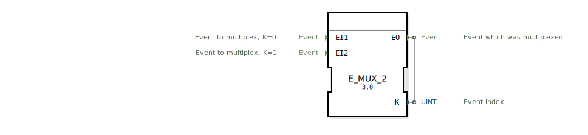

# E_MUX_2

```{index} single: E_MUX_2
```

<!-- Hier wäre Platz für ein Bild des Funktionsblocks, falls vorhanden. -->

* * * * * * * * * *

## Einleitung
Der `E_MUX_2` (Event Multiplexer) ist ein Funktionsbaustein nach IEC 61499, der zwei Ereigniseingänge (`EI1`, `EI2`) auf einen einzigen Ereignisausgang (`EO`) zusammenführt. Zusätzlich zur Zusammenführung gibt der Baustein an einem Datenausgang `K` aus, welcher der Eingänge das Ereignis ausgelöst hat. Er ist das Gegenstück zum `E_DEMUX_2`.



## Schnittstellenstruktur

### **Ereignis-Eingänge:**
- **EI1**: Erster Eingangskanal.
- **EI2**: Zweiter Eingangskanal.

### **Ereignis-Ausgänge:**
- **EO (Event Output)**: Der gemeinsame Ereignisausgang.
    - **Verbundene Daten**: `K`

### **Daten-Ausgänge:**
- **K**: Der Index des auslösenden Eingangskanals (Datentyp: `UINT`).
    - `K = 0` wenn `EI1` ausgelöst wurde.
    - `K = 1` wenn `EI2` ausgelöst wurde.

## Funktionsweise
1.  **Ereignisempfang**: Der Baustein wartet auf ein Ereignis an einem seiner Eingänge (`EI1` oder `EI2`).
2.  **Weiterleitung und Identifizierung**:
    - Wenn ein Ereignis an `EI1` eintrifft, wird der Daten-Ausgang `K` auf `0` gesetzt und sofort das `EO`-Ereignis ausgelöst.
    - Wenn ein Ereignis an `EI2` eintrifft, wird der Daten-Ausgang `K` auf `1` gesetzt und sofort das `EO`-Ereignis ausgelöst.

Auf diese Weise wird der Ereignisfluss zusammengeführt, wobei die Information über die Herkunft des Ereignisses erhalten bleibt.

## Technische Besonderheiten
- **2-zu-1 Multiplexer**: Führt zwei Ereignisströme zu einem zusammen.
- **Herkunfts-Index**: Gibt an, welcher Eingang das Ereignis ausgelöst hat.
- **Zustandslos**: Der Baustein hat keinen internen Speicher.
- **Generischer Baustein**: Die Funktionalität wird durch die generische Klasse `GEN_E_MUX` zur Verfügung gestellt.

## Anwendungsszenarien
- **Zusammenfassen von Befehlen**: Zwei verschiedene Taster (z.B. "Start Vorwärts" und "Start Rückwärts") lösen denselben Prozess aus, aber der Prozess muss wissen, welcher Taster gedrückt wurde.
- **Kombinierte Alarme**: Zwei verschiedene Alarme werden zu einer zentralen Alarmroutine geleitet, die dann anhand von `K` den spezifischen Alarmtext anzeigt.
- **Vereinfachung von Logik**: Statt zwei separate Pfade für ähnliche Logik zu haben, werden die auslösenden Ereignisse zusammengeführt und der Index `K` wird als Parameter für die nachfolgende Logik verwendet.


## 🛠️ Zugehörige Übungen

* [Uebung_172](../../../training1/Ventilsteuerung/4diacIDE-workspace/test_B/Uebungen_doc/Uebung_172.md)

## Fazit
Der `E_MUX_2` ist ein nützlicher Baustein, um Ereignisströme zu bündeln und gleichzeitig die Quelle des Ereignisses zu identifizieren. Er ist das Standard-Gegenstück zum `E_DEMUX_2` und wird häufig verwendet, um die Komplexität von Verdrahtungen zu reduzieren und Logik zu zentralisieren.