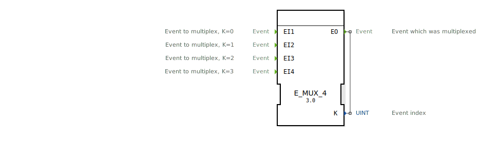

# E_MUX_4

```{index} single: E_MUX_4
```

<!-- Hier wäre Platz für ein Bild des Funktionsblocks, falls vorhanden. -->

* * * * * * * * * *

## Einleitung
Der `E_MUX_4` (Event Multiplexer) ist ein Funktionsbaustein nach IEC 61499, der vier Ereigniseingänge (`EI1` bis `EI4`) auf einen einzigen Ereignisausgang (`EO`) zusammenführt. Zusätzlich zur Zusammenführung gibt der Baustein an einem Datenausgang `K` aus, welcher der Eingänge das Ereignis ausgelöst hat. Er ist das Gegenstück zum `E_DEMUX_4`.



## Schnittstellenstruktur

### **Ereignis-Eingänge:**
- **EI1**: Erster Eingangskanal.
- **EI2**: Zweiter Eingangskanal.
- **EI3**: Dritter Eingangskanal.
- **EI4**: Vierter Eingangskanal.

### **Ereignis-Ausgänge:**
- **EO (Event Output)**: Der gemeinsame Ereignisausgang.
    - **Verbundene Daten**: `K`

### **Daten-Ausgänge:**
- **K**: Der Index des auslösenden Eingangskanals (Datentyp: `UINT`).
    - `K = 0` wenn `EI1` ausgelöst wurde.
    - `K = 1` wenn `EI2` ausgelöst wurde.
    - `K = 2` wenn `EI3` ausgelöst wurde.
    - `K = 3` wenn `EI4` ausgelöst wurde.

## Funktionsweise
1.  **Ereignisempfang**: Der Baustein wartet auf ein Ereignis an einem seiner vier Eingänge.
2.  **Weiterleitung und Identifizierung**: Wenn ein Ereignis an `EIn` eintrifft (wobei `n` für 1 bis 4 steht), wird der Daten-Ausgang `K` auf `n-1` gesetzt und sofort das `EO`-Ereignis ausgelöst.

Auf diese Weise wird der Ereignisfluss zusammengeführt, wobei die Information über die Herkunft des Ereignisses erhalten bleibt.

## Technische Besonderheiten
- **4-zu-1 Multiplexer**: Führt vier Ereignisströme zu einem zusammen.
- **Herkunfts-Index**: Gibt an, welcher Eingang das Ereignis ausgelöst hat.
- **Zustandslos**: Der Baustein hat keinen internen Speicher.
- **Generischer Baustein**: Die Funktionalität wird durch die generische Klasse `GEN_E_MUX` zur Verfügung gestellt.

## Anwendungsszenarien
- **Zusammenfassen von Befehlen**: Vier verschiedene Taster lösen denselben Prozess aus, aber der Prozess muss wissen, welcher der vier Taster gedrückt wurde.
- **Kombinierte Alarme**: Vier verschiedene Alarme werden zu einer zentralen Alarmroutine geleitet, die dann anhand von `K` den spezifischen Alarmtext anzeigt.
- **Modus-Auswahl**: Zusammenführen der Start-Ereignisse von vier verschiedenen Betriebsmodi.


## 🛠️ Zugehörige Übungen

* [Uebung_087a2](../../../training1/Ventilsteuerung/4diacIDE-workspace/test_B/Uebungen_doc/Uebung_087a2.md)

## Fazit
Der `E_MUX_4` ist ein nützlicher Baustein, um Ereignisströme von bis zu vier Quellen zu bündeln und gleichzeitig die Quelle des Ereignisses zu identifizieren. Er ist das Standard-Gegenstück zum `E_DEMUX_4` und wird häufig verwendet, um die Komplexität von Verdrahtungen zu reduzieren und Logik zu zentralisieren.