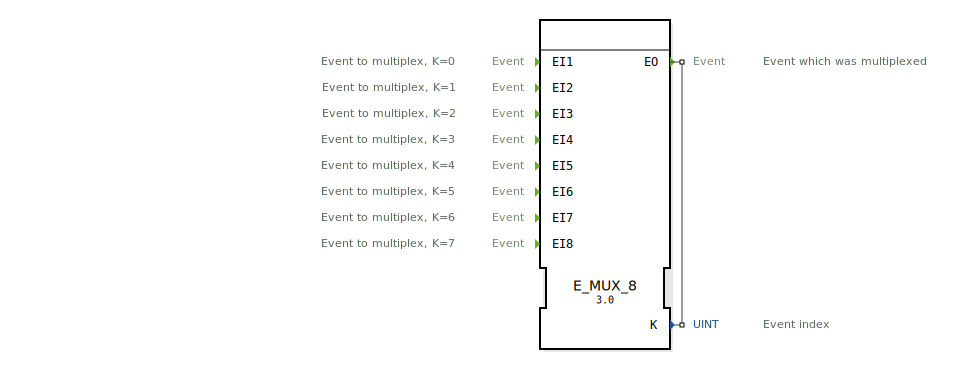

# E_MUX_8

```{index} single: E_MUX_8
```

<!-- Hier wäre Platz für ein Bild des Funktionsblocks, falls vorhanden. -->

* * * * * * * * * *

## Einleitung
Der `E_MUX_8` (Event Multiplexer) ist ein Funktionsbaustein nach IEC 61499, der acht Ereigniseingänge (`EI1` bis `EI8`) auf einen einzigen Ereignisausgang (`EO`) zusammenführt. Zusätzlich zur Zusammenführung gibt der Baustein an einem Datenausgang `K` aus, welcher der Eingänge das Ereignis ausgelöst hat. Er ist das Gegenstück zum `E_DEMUX_8`.



## Schnittstellenstruktur

### **Ereignis-Eingänge:**
- **EI1 ... EI8**: Die acht separaten Eingangskanäle.

### **Ereignis-Ausgänge:**
- **EO (Event Output)**: Der gemeinsame Ereignisausgang.
    - **Verbundene Daten**: `K`

### **Daten-Ausgänge:**
- **K**: Der Index des auslösenden Eingangskanals (Datentyp: `UINT`).
    - `K = 0` wenn `EI1` ausgelöst wurde.
    - `K = 1` wenn `EI2` ausgelöst wurde.
    - ...
    - `K = 7` wenn `EI8` ausgelöst wurde.

## Funktionsweise
1.  **Ereignisempfang**: Der Baustein wartet auf ein Ereignis an einem seiner acht Eingänge.
2.  **Weiterleitung und Identifizierung**: Wenn ein Ereignis an `EIn` eintrifft (wobei `n` für 1 bis 8 steht), wird der Daten-Ausgang `K` auf `n-1` gesetzt und sofort das `EO`-Ereignis ausgelöst.

Auf diese Weise wird der Ereignisfluss zusammengeführt, wobei die Information über die Herkunft des Ereignisses erhalten bleibt.

## Technische Besonderheiten
- **8-zu-1 Multiplexer**: Führt acht Ereignisströme zu einem zusammen.
- **Herkunfts-Index**: Gibt an, welcher Eingang das Ereignis ausgelöst hat.
- **Zustandslos**: Der Baustein hat keinen internen Speicher.
- **Generischer Baustein**: Die Funktionalität wird durch die generische Klasse `GEN_E_MUX` zur Verfügung gestellt.

## Anwendungsszenarien
- **Tastatur-Matrix**: Zusammenfassen der Signale von acht Tasten auf eine zentrale Auswertungslogik.
- **Umfassende Alarmierung**: Bündeln von acht verschiedenen Alarmen zu einer zentralen Routine, die dann anhand von `K` die spezifische Alarmmeldung verarbeitet.
- **Priorisierte Befehlsauswahl**: Acht Befehlsquellen werden zusammengeführt, und eine nachgeschaltete Logik entscheidet basierend auf dem Index `K` über die Priorität.


## Zugehörige Übungen

* [Uebung_173](../../../training1/Ventilsteuerung/4diacIDE-workspace/test_B/Uebungen_doc/Uebung_173.md)

## Fazit
Der `E_MUX_8` ist ein nützlicher Baustein, um Ereignisströme von bis zu acht Quellen zu bündeln und gleichzeitig die Quelle des Ereignisses zu identifizieren. Er ist das Standard-Gegenstück zum `E_DEMUX_8` und wird häufig verwendet, um die Komplexität von Verdrahtungen zu reduzieren und Logik zu zentralisieren.