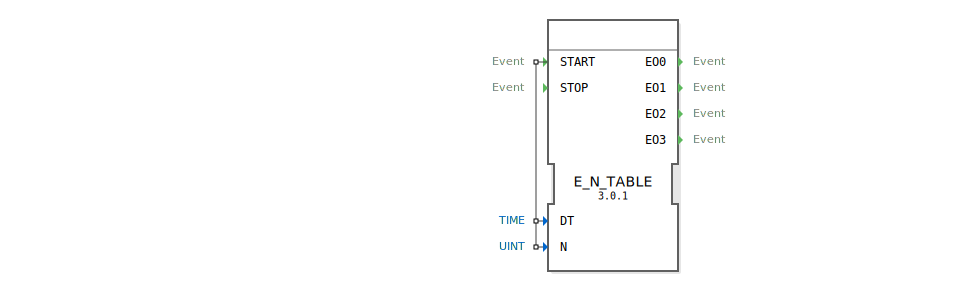

# E_N_TABLE

```{index} single: E_N_TABLE
```


* * * * * * * * * *

## Einleitung
Der `E_N_TABLE` (Event N-Table) ist ein Funktionsbaustein nach IEC 61499, der eine endliche Sequenz von zeitlich versetzten Ereignissen auf separaten Ausgängen generiert. Er kombiniert intern einen tabellengesteuerten Zeitgeber (`E_TABLE`) mit einem Demultiplexer (`E_DEMUX`), um eine Kette von Ereignissen zu erzeugen, bei der jedes Ereignis auf einem eigenen Kanal ausgegeben wird.



## Schnittstellenstruktur

### **Ereignis-Eingänge**
- **START**: Startet die Generierung der Ereignissequenz.
    - **Verbundene Daten**: `DT`, `N`
- **STOP**: Stoppt die Sequenz vorzeitig.

### **Ereignis-Ausgänge**
- **EO0**: Gibt das erste Ereignis der Sequenz aus (Index 0).
- **EO1**: Gibt das zweite Ereignis der Sequenz aus (Index 1).
- **EO2**: Gibt das dritte Ereignis der Sequenz aus (Index 2).
- **EO3**: Gibt das vierte Ereignis der Sequenz aus (Index 3).

### **Daten-Eingänge**
- **DT**: Ein Array von Zeitdauern (Datentyp: `TIME`, Größe: 4). `DT[i]` definiert die Verzögerungszeit, die *vor* dem `i`-ten Ereignis gewartet wird.
- **N**: Die Gesamtzahl der zu generierenden Ereignisse (Datentyp: `UINT`, max. 4 für diesen Baustein).

## Funktionsweise
1.  **Start der Sequenz**: Ein `START`-Ereignis löst den internen `E_TABLE`-Baustein aus. Die Anzahl der zu generierenden Ereignisse wird durch `N` festgelegt.
2.  **Erstes Ereignis**: Der Baustein wartet die in `DT[0]` definierte Zeitspanne ab. Danach wird das erste Ereignis am Ausgang `EO0` ausgelöst.
3.  **Folgeereignisse**: Der Baustein wartet die in `DT[1]` definierte Zeitspanne ab und löst dann das zweite Ereignis an `EO1` aus. Dieser Prozess wiederholt sich für die nächsten Ereignisse gemäß den Zeitdauern in `DT[2]`, `DT[3]` usw., bis `N` Ereignisse generiert wurden.
4.  **Ende der Sequenz**: Die Sequenz endet automatisch, nachdem `N` Ereignisse ausgelöst wurden.
5.  **Stopp**: Ein `STOP`-Ereignis bricht die Sequenz an jeder Stelle sofort ab.

**Beispiel:**
- `N` = 3
- `DT` = `[T#2s, T#5s, T#1s]`
- Nach einem `START`-Ereignis:
    1.  Nach 2 Sekunden wird `EO0` ausgelöst.
    2.  Weitere 5 Sekunden später wird `EO1` ausgelöst.
    3.  Weitere 1 Sekunde später wird `EO2` ausgelöst.
    4.  Die Sequenz ist beendet. `EO3` wird nicht ausgelöst.

## Technische Besonderheiten
- **Sequenzgenerator**: Erzeugt eine Kette von einzelnen, zeitlich versetzten Ereignissen.
- **Demultiplexing**: Jedes Ereignis in der Kette wird auf einen eigenen, dedizierten Ausgang geleitet.
- **Tabellengesteuert**: Die Zeitabstände zwischen den Ereignissen sind nicht fix, sondern werden aus dem `DT`-Array gelesen.

## Anwendungsszenarien
- **Steuerung von Schrittketten**: Jeder Ausgang (`EO0`, `EO1`, ...) kann einen nachfolgenden Schritt in einer Prozesskette anstoßen.
- **Komplexe Ansteuerung**: Ansteuern verschiedener Aktoren in einer genau definierten zeitlichen Abfolge (z.B. Ventile in einem Spülprozess).
- **Testautomatisierung**: Generieren einer komplexen, zeitlich definierten Stimulus-Sequenz für ein Testobjekt.


## 🛠️ Zugehörige Übungen

* [Uebung_093b](../../../training1/Ventilsteuerung/4diacIDE-workspace/test_B/Uebungen_doc/Uebung_093b.md)

## Fazit
Der `E_N_TABLE` ist ein mächtiger Baustein zur Erzeugung von komplexen, zeitlich definierten Ereignisketten. Im Gegensatz zu einem einfachen `E_CYCLE`, der nur einen periodischen Takt erzeugt, ermöglicht `E_N_TABLE` die Definition von variablen Zeitabständen und die Verteilung der einzelnen Sequenz-Ereignisse auf separate Kanäle. Dies macht ihn ideal für die Steuerung von sequenziellen Prozessen.