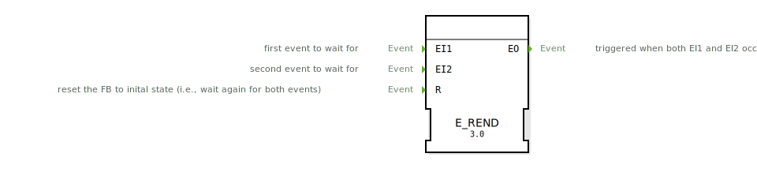

# E_REND

```{index} single: E_REND
```
## 🎧 Podcast

* [E_REND: Ereignissynchronisation in IEC 61499](https://podcasters.spotify.com/pod/show/iec-61499-grundkurs-de/episodes/E_REND-Ereignissynchronisation-in-IEC-61499-e368co9)
* [E_REND: Event Synchronization in IEC 61499](https://podcasters.spotify.com/pod/show/iec-61499-prime-course-en/episodes/E_REND-Event-Synchronization-in-IEC-61499-e368cv2)

## Einleitung
Der `E_REND` (Event Rendezvous) ist ein Funktionsbaustein nach IEC 61499, der als Synchronisationspunkt für zwei verschiedene Ereignisströme dient. Er feuert ein Ausgangsereignis erst dann, wenn er jeweils mindestens ein Ereignis von beiden seiner Eingänge empfangen hat. Dies entspricht einer logischen UND-Verknüpfung über die Zeit.



## Schnittstellenstruktur

### **Ereignis-Eingänge:**
- **EI1**: Der erste Ereigniseingang.
- **EI2**: Der zweite Ereigniseingang.
- **R (Reset)**: Setzt den Baustein in seinen Anfangszustand zurück.

### **Ereignis-Ausgänge:**
- **EO (Event Output)**: Wird ausgelöst, nachdem sowohl `EI1` als auch `EI2` mindestens einmal seit dem letzten Reset empfangen wurden.

## Funktionsweise
1.  **Warten auf Ereignisse**: Im Anfangszustand wartet der Baustein auf Ereignisse an `EI1` und `EI2`.
2.  **Speichern des ersten Ereignisses**: Trifft ein Ereignis am ersten Eingang ein (z.B. `EI1`), merkt sich der Baustein dies intern und wartet nun auf das Ereignis am zweiten Eingang (`EI2`).
3.  **Rendezvous und Auslösung**: Sobald das zweite Ereignis (`EI2`) eintrifft, ist die "Rendezvous"-Bedingung erfüllt. Der Baustein löst sofort das Ausgangsereignis `EO` aus.
4.  **Automatischer Reset**: Unmittelbar nach dem Auslösen von `EO` setzt sich der Baustein automatisch in seinen Anfangszustand zurück und wartet auf das nächste Paar von `EI1`- und `EI2`-Ereignissen.
5.  **Externer Reset**: Ein Ereignis am `R`-Eingang setzt den Baustein jederzeit in den Anfangszustand zurück, wodurch alle bisher gemerkten, aber noch nicht vollständigen Ereignispaare verworfen werden.

**Wichtig**: Die Eingangsereignisse `EI1` und `EI2` müssen **nicht gleichzeitig** eintreffen. Die Reihenfolge ihres Eintreffens ist ebenfalls unerheblich.

## Technische Besonderheiten
- **Zustandsbehaftet**: Im Gegensatz zu einem `E_MERGE` (OR) hat der `E_REND` einen internen Zustand, um sich das Eintreffen des ersten Ereignisses zu merken.
- **Synchronisation**: Dient der Synchronisation von zwei asynchronen Ereignisflüssen.

## Anwendungsszenarien
- **Prozess-Synchronisation**: Ein nächster Prozessschritt (`EO`) darf erst starten, wenn zwei voneinander unabhängige Vorbedingungen erfüllt sind (z.B. "Bauteil eingespannt" (`EI1`) und "Schutztür geschlossen" (`EI2`)).
- **Quittierung**: Eine Aktion wird erst ausgeführt, wenn sowohl ein Befehl (`EI1`) als auch eine manuelle Quittierung durch einen Bediener (`EI2`) vorliegen.
- **Materialfluss**: Ein Förderband stoppt (`EO`), wenn sowohl der vordere als auch der hintere Sensor ein langes Bauteil detektiert haben.

## Fazit
Der `E_REND`-Baustein ist ein kritisches Werkzeug für die Synchronisation von Prozessen in IEC 61499. Er bietet eine robuste Methode, um sicherzustellen, dass mehrere Bedingungen erfüllt sind, bevor eine nachfolgende Aktion ausgelöst wird. Seine Fähigkeit, sich das Eintreffen von Ereignissen zu "merken", macht ihn wesentlich leistungsfähiger als einfache logische Verknüpfungen und ist fundamental für die Steuerung von asynchronen und parallelen Abläufen.