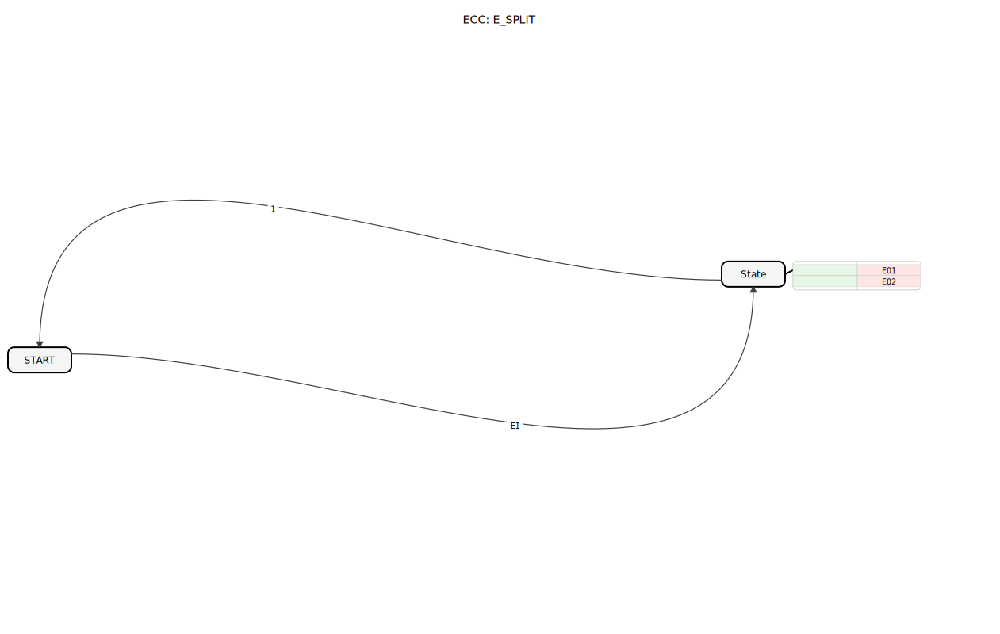
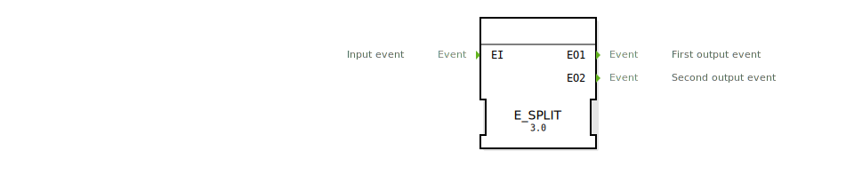

# E_SPLIT (Ereignis-Verteiler)

```{index} single: E_SPLIT (Ereignis-Verteiler)
```




* * * * * * * * * *

## Einleitung
Der **E_SPLIT** ist ein standardkonformer Funktionsbaustein (IEC 61499-1 Annex A) zur Ereignisverteilung, entwickelt unter EPL-2.0 Lizenz. Version 1.0 teilt ein eingehendes Ereignis sequenziell in zwei Ausgangsereignisse auf.



## Schnittstellenstruktur

### **Ereignis-Eingang**
- `EI`: Eingangsereignis (Trigger für die Verteilung)

### **Ereignis-Ausgänge**
- `EO1`: Erstes Ausgangsereignis
- `EO2`: Zweites Ausgangsereignis

## Funktionsweise

1. **Ereignisempfang**:
   - Bei Eingang von `EI` wird der Zustandsautomat aktiviert

2. **Sequenzielle Verarbeitung**:
   - **START-Zustand**: Wartet auf Eingangsereignis
   - **State-Zustand**:
     - Führt `EO1`-Aktion aus (sofort)
     - Führt `EO2`-Aktion aus (unmittelbar danach)
   - Automatische Rückkehr zu START

3. **Ausführungsreihenfolge**:
   - Garantierte Abfolge: EI → EO1 → EO2
   - Deterministisches Timing


## Technische Besonderheiten

✔ **Strikte Sequenzierung** (EO1 vor EO2)
✔ **Zustandsbasierte Implementierung** (BasicFB)
✔ **Echtzeitfähige** Ereignisverarbeitung
✔ **EPL-2.0 Open-Source** Implementierung

## Anwendungsszenarien

- **Ablaufsteuerung**: Getaktete Prozessschritte
- **Gerätesteuerung**: Aktivierungssequenzen
- **Sicherheitssysteme**: Verzögerte Notfallroutinen
- **Testautomation**: Trigger für Testsequenzen

## ⚖️ Vergleich mit ähnlichen Bausteinen

| Feature        | E_SPLIT | E_DEMUX | E_MERGE |
|---------------|---------|---------|---------|
| Funktionsprinzip | 1:2 Sequenz | 1:n Verteilung | n:1 Kombination |
| Ereignisreihenfolge | Fest | Adressabhängig | Beliebig |
| Zustandsmodell | BasicFB | Variabel | Keins |


## 🛠️ Zugehörige Übungen

* [Uebung_004a4](../../../training1/Ventilsteuerung/4diacIDE-workspace/test_B/Uebungen_doc/Uebung_004a4.md)
* [Uebung_004a4_AX](../../../training1/Ventilsteuerung/4diacIDE-workspace/test_AX/Uebungen_doc/Uebung_004a4_AX.md)
* [Uebung_080b](../../../training1/Ventilsteuerung/4diacIDE-workspace/test_B/Uebungen_doc/Uebung_080b.md)

## Fazit

Der E_SPLIT-Baustein bietet eine zuverlässige Lösung für sequenzielle Ereignisverteilung:

- Garantierte Ereignisabfolge
- Einfache aber wirkungsvolle Funktionalität
- Robustes Zustandsmaschinenmodell

 Durch seine deterministische Arbeitsweise eignet er sich besonders für zeitkritische Steuerungsaufgaben und sicherheitsrelevante Anwendungen. Die standardkonforme Implementierung ermöglicht problemlose Integration in IEC 61499-basierte Systeme.