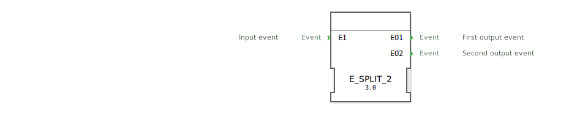

# E_SPLIT_2

```{index} single: E_SPLIT_2
```

<!-- Hier wäre Platz für ein Bild des Funktionsblocks, falls vorhanden. -->

* * * * * * * * * *

## Einleitung
Der `E_SPLIT_2` ist ein grundlegender Funktionsbaustein nach IEC 61499, der ein einzelnes Eingangereignis (`EI`) in eine Sequenz von zwei Ausgangsereignissen (`EO1` und `EO2`) aufteilt. Dieser Baustein ist funktional identisch mit `E_SPLIT`.



## Schnittstellenstruktur

### **Ereignis-Eingang**
- **EI**: Das Eingangereignis, das die Sequenz auslöst.

### **Ereignis-Ausgänge**
- **EO1**: Das erste Ausgangsereignis der Sequenz.
- **EO2**: Das zweite Ausgangsereignis der Sequenz.

## Funktionsweise
Wenn ein Ereignis am Eingang `EI` eintrifft, löst der Baustein sofort nacheinander die beiden Ausgangsereignisse aus. Die Reihenfolge ist dabei garantiert:
1.  Zuerst wird `EO1` ausgelöst.
2.  Unmittelbar danach wird `EO2` ausgelöst.

## Technische Besonderheiten
- **1-zu-2 Sequenz**: Teilt ein Ereignis in eine garantierte Sequenz von zwei Ereignissen auf.
- **Zustandslos**: Der Baustein hat keinen internen Speicher, der über eine einzelne Transaktion hinausgeht.
- **Generischer Baustein**: Die Funktionalität wird durch die generische Klasse `GEN_E_SPLIT` zur Verfügung gestellt, was eine optimierte Ausführung durch die 4diac-Laufzeitumgebung ermöglicht.

## Anwendungsszenarien
- **Reset und Start**: Ein einzelnes `RESET`-Ereignis kann verwendet werden, um zuerst einen Wert zurückzusetzen (`EO1`) und dann einen Prozess neu zu starten (`EO2`).
- **Lesen und Verarbeiten**: Ein `REQ`-Ereignis kann dazu führen, zuerst einen Sensorwert zu lesen (`EO1`) und dann die Berechnung mit dem neuen Wert anzustoßen (`EO2`).
- **Ablaufsteuerung**: Anstoßen von zwei aufeinanderfolgenden Aktionen mit einem einzigen Trigger-Ereignis.

## Fazit
Der `E_SPLIT_2`-Baustein ist ein nützliches Werkzeug, um aus einem einzelnen Trigger eine feste, kurze Ereignissequenz zu generieren. Seine Einfachheit und die garantierte Ausführungsreihenfolge machen ihn zu einer robusten Komponente für die Ablaufsteuerung in IEC 61499-Anwendungen.