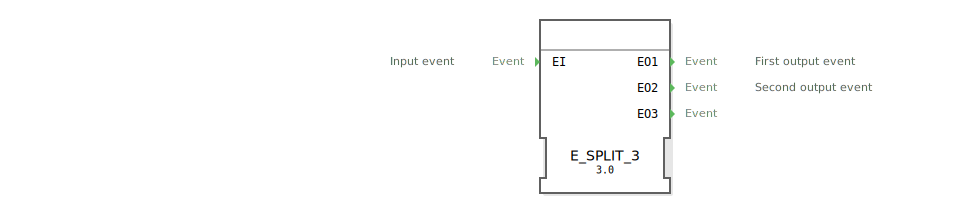

# E_SPLIT_3

```{index} single: E_SPLIT_3
```

<!-- Hier wäre Platz für ein Bild des Funktionsblocks, falls vorhanden. -->

* * * * * * * * * *

## Einleitung
Der `E_SPLIT_3` ist ein grundlegender Funktionsbaustein nach IEC 61499, der ein einzelnes Eingangereignis (`EI`) in eine Sequenz von drei Ausgangsereignissen (`EO1`, `EO2`, `EO3`) aufteilt.



## Schnittstellenstruktur

### **Ereignis-Eingang**
- **EI**: Das Eingangereignis, das die Sequenz auslöst.

### **Ereignis-Ausgänge**
- **EO1**: Das erste Ausgangsereignis der Sequenz.
- **EO2**: Das zweite Ausgangsereignis der Sequenz.
- **EO3**: Das dritte Ausgangsereignis der Sequenz.

## Funktionsweise
Wenn ein Ereignis am Eingang `EI` eintrifft, löst der Baustein sofort nacheinander die drei Ausgangsereignisse aus. Die Reihenfolge ist dabei garantiert:
1.  Zuerst wird `EO1` ausgelöst.
2.  Unmittelbar danach wird `EO2` ausgelöst.
3.  Unmittelbar danach wird `EO3` ausgelöst.

## Technische Besonderheiten
- **1-zu-3 Sequenz**: Teilt ein Ereignis in eine garantierte Sequenz von drei Ereignissen auf.
- **Zustandslos**: Der Baustein hat keinen internen Speicher, der über eine einzelne Transaktion hinausgeht.
- **Generischer Baustein**: Die Funktionalität wird durch die generische Klasse `GEN_E_SPLIT` zur Verfügung gestellt.

## Anwendungsszenarien
- **Initialisierungssequenz**: Ein `INIT`-Ereignis kann genutzt werden, um nacheinander drei verschiedene Systemkomponenten zu initialisieren (`EO1`, `EO2`, `EO3`).
- **Ablaufsteuerung**: Anstoßen von drei aufeinanderfolgenden Aktionen mit einem einzigen Trigger-Ereignis (z.B. "Greifer schließen", "Arm heben", "Arm drehen").


## 🛠️ Zugehörige Übungen

* [Uebung_004a9](../../../training1/Ventilsteuerung/4diacIDE-workspace/test_B/Uebungen_doc/Uebung_004a9.md)
* [Uebung_004a9_AX](../../../training1/Ventilsteuerung/4diacIDE-workspace/test_AX/Uebungen_doc/Uebung_004a9_AX.md)

## Fazit
Der `E_SPLIT_3`-Baustein ist ein nützliches Werkzeug, um aus einem einzelnen Trigger eine feste, kurze Ereignissequenz von drei Schritten zu generieren. Seine Einfachheit und die garantierte Ausführungsreihenfolge machen ihn zu einer robusten Komponente für die Ablaufsteuerung in IEC 61499-Anwendungen.