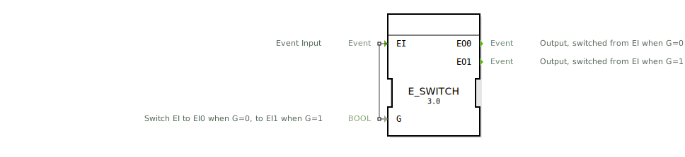

# E_SWITCH

```{index} single: E_SWITCH
```
## 🎧 Podcast

* [E_SWITCH: Die Weiche der Automatisierung – Warum Einfachheit IEC 61499 revolutioniert](https://podcasters.spotify.com/pod/show/iec-61499-grundkurs-de/episodes/E_SWITCH-Die-Weiche-der-Automatisierung--Warum-Einfachheit-IEC-61499-revolutioniert-e3681fl)
* [E_SWITCH: The Unsung Hero of Industrial Automation's Modular Design](https://podcasters.spotify.com/pod/show/iec-61499-prime-course-en/episodes/E_SWITCH-The-Unsung-Hero-of-Industrial-Automations-Modular-Design-e367npq)

## Einleitung
Der `E_SWITCH` (Event Switch) ist ein grundlegender Funktionsbaustein nach IEC 61499, der als bedingte Ereignisweiche oder 1-zu-2-Demultiplexer fungiert. Er leitet ein einzelnes Eingangereignis (`EI`) basierend auf dem Zustand einer booleschen Steuervariable (`G`) an einen von zwei Ausgängen weiter.



## Schnittstellenstruktur

### **Ereignis-Eingänge:**
- **EI (Event Input)**: Das Eingangereignis, das weitergeleitet werden soll.
    - **Verbundene Daten**: `G`

### **Ereignis-Ausgänge:**
- **EO0**: Der erste Ereignisausgang.
- **EO1**: Der zweite Ereignisausgang.

### **Daten-Eingänge:**
- **G (Guard)**: Die boolesche Bedingung, die die Weiche steuert (Datentyp: `BOOL`).

## Funktionsweise
1.  **Ereignisempfang**: Der Baustein wartet auf ein Ereignis am Eingang `EI`.
2.  **Prüfung der Bedingung**: Wenn das `EI`-Ereignis eintrifft, wird der Wert der Datenvariable `G` ausgewertet.
3.  **Bedingte Weiterleitung**:
    - **Wenn `G` = `FALSE` ist**: Das Ereignis wird an den Ausgang `EO0` weitergeleitet.
    - **Wenn `G` = `TRUE` ist**: Das Ereignis wird an den Ausgang `EO1` weitergeleitet.

Das Ereignis am Eingang `EI` wird also immer an genau einen der beiden Ausgänge geleitet, abhängig von der Steuerbedingung `G`.

## Technische Besonderheiten
- **Ereignisweiche**: Dient als grundlegendes "Switch" oder "If-Else"-Konstrukt für den Ereignisfluss.
- **Zustandslos**: Der Baustein selbst hat keinen internen Speicher; seine Entscheidung basiert ausschließlich auf dem Wert von `G` im Moment des `EI`-Ereignisses.

## Anwendungsszenarien
- **Bedingte Logik**: Ausführen von alternativen Aktionen basierend auf einer Bedingung. Wenn `G` wahr ist, führe Aktion A (`EO1`) aus, ansonsten führe Aktion B (`EO0`) aus.
- **Modusabhängige Verarbeitung**: Weiterleiten von Befehlen an unterschiedliche Verarbeitungspfade, je nachdem, ob sich das System in einem "Automatik"-Modus (`G=TRUE`) oder "Hand"-Modus (`G=FALSE`) befindet.
- **Fehlerbehandlung**: Weiterleiten eines Sensor-Ereignisses entweder an die normale Verarbeitungslogik (`G=FALSE` für "kein Fehler") oder an eine Fehlerbehandlungsroutine (`G=TRUE` für "Fehler erkannt").

## Vergleich mit ähnlichen Bausteinen

| Feature        | E_SWITCH | E_SELECT | E_DEMUX |
|---------------|----------|----------|---------|
| Auswahlkriterium | Boolesch (`G`) | Boolesch (`G`) | Index (`K`) |
| Richtung      | 1:2 (Demultiplexer) | 2:1 (Multiplexer) | 1:n (Demultiplexer) |
| Zustandsmodell | BasicFB | BasicFB | BasicFB/Generic |


## Zugehörige Übungen

* [Uebung_004b](../../../training1/Ventilsteuerung/4diacIDE-workspace/test_B/Uebungen_doc/Uebung_004b.md)
* [Uebung_004b2](../../../training1/Ventilsteuerung/4diacIDE-workspace/test_B/Uebungen_doc/Uebung_004b2.md)
* [Uebung_004b3](../../../training1/Ventilsteuerung/4diacIDE-workspace/test_B/Uebungen_doc/Uebung_004b3.md)
* [Uebung_005](../../../training1/Ventilsteuerung/4diacIDE-workspace/test_B/Uebungen_doc/Uebung_005.md)
* [Uebung_006a3_sub](../../../training1/Ventilsteuerung/4diacIDE-workspace/test_B/Uebungen_doc/Uebung_006a3_sub.md)
* [Uebung_007a3](../../../training1/Ventilsteuerung/4diacIDE-workspace/test_B/Uebungen_doc/Uebung_007a3.md)
* [Uebung_008](../../../training1/Ventilsteuerung/4diacIDE-workspace/test_B/Uebungen_doc/Uebung_008.md)
* [Uebung_009](../../../training1/Ventilsteuerung/4diacIDE-workspace/test_B/Uebungen_doc/Uebung_009.md)
* [Uebung_019c](../../../training1/Ventilsteuerung/4diacIDE-workspace/test_B/Uebungen_doc/Uebung_019c.md)
* [Uebung_020a](../../../training1/Ventilsteuerung/4diacIDE-workspace/test_B/Uebungen_doc/Uebung_020a.md)
* [Uebung_020b](../../../training1/Ventilsteuerung/4diacIDE-workspace/test_B/Uebungen_doc/Uebung_020b.md)
* [Uebung_020c3](../../../training1/Ventilsteuerung/4diacIDE-workspace/test_B/Uebungen_doc/Uebung_020c3.md)
* [Uebung_020d](../../../training1/Ventilsteuerung/4diacIDE-workspace/test_B/Uebungen_doc/Uebung_020d.md)
* [Uebung_020e2](../../../training1/Ventilsteuerung/4diacIDE-workspace/test_B/Uebungen_doc/Uebung_020e2.md)
* [Uebung_020f2](../../../training1/Ventilsteuerung/4diacIDE-workspace/test_B/Uebungen_doc/Uebung_020f2.md)
* [Uebung_020i](../../../training1/Ventilsteuerung/4diacIDE-workspace/test_B/Uebungen_doc/Uebung_020i.md)
* [Uebung_025](../../../training1/Ventilsteuerung/4diacIDE-workspace/test_B/Uebungen_doc/Uebung_025.md)
* [Uebung_026_sub](../../../training1/Ventilsteuerung/4diacIDE-workspace/test_B/Uebungen_doc/Uebung_026_sub.md)
* [Uebung_039a_sub_Outputs](../../../training1/Ventilsteuerung/4diacIDE-workspace/test_B/Uebungen_doc/Uebung_039a_sub_Outputs.md)
* [Uebung_086](../../../training1/Ventilsteuerung/4diacIDE-workspace/test_B/Uebungen_doc/Uebung_086.md)
* [Uebung_088](../../../training1/Ventilsteuerung/4diacIDE-workspace/test_B/Uebungen_doc/Uebung_088.md)
* [Uebung_089](../../../training1/Ventilsteuerung/4diacIDE-workspace/test_B/Uebungen_doc/Uebung_089.md)

## Fazit
Der `E_SWITCH`-Baustein ist ein fundamentaler und weit verbreiteter Baustein zur Implementierung von bedingten Verzweigungen in der ereignisgesteuerten Logik von IEC 61499. Seine Einfachheit und klare Funktion als "If-Else"-Weiche für Ereignisse machen ihn zu einem unverzichtbaren Werkzeug für die Erstellung von flexibler und robuster Steuerungssoftware.