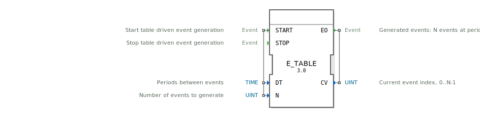

# E_TABLE

```{index} single: E_TABLE
```


* * * * * * * * * *

## Einleitung
Der `E_TABLE` (Event Table) ist ein Funktionsbaustein nach IEC 61499, der eine endliche Sequenz von Ereignissen mit individuell definierbaren Zeitabständen generiert. Er liest die Zeitabstände aus einer Tabelle (einem Array) und feuert eine bestimmte Anzahl von Ereignissen nacheinander.



## Schnittstellenstruktur

### **Ereignis-Eingänge**
- **START**: Startet die Generierung der Ereignissequenz.
    - **Verbundene Daten**: `DT`, `N`
- **STOP**: Stoppt die Sequenz vorzeitig.

### **Ereignis-Ausgänge**
- **EO (Event Output)**: Das Ausgangsereignis, das `N`-mal ausgelöst wird.
    - **Verbundene Daten**: `CV`

### **Daten-Eingänge**
- **DT**: Ein Array von Zeitdauern (Datentyp: `TIME`, Größe: 4). `DT[i]` definiert die Verzögerungszeit, die *vor* dem `i`-ten Ereignis gewartet wird.
- **N**: Die Gesamtzahl der zu generierenden Ereignisse (Datentyp: `UINT`, max. 4 für diesen Baustein).

### **Daten-Ausgänge**
- **CV (Current Value)**: Der Index des gerade ausgelösten Ereignisses (0 bis N-1) (Datentyp: `UINT`).

## Funktionsweise
1.  **Start der Sequenz**: Ein `START`-Ereignis löst den Baustein aus. Die Anzahl der zu generierenden Ereignisse wird durch `N` festgelegt.
2.  **Ereignis-Generierung**: Der Baustein arbeitet die Tabelle ab:
    - Er wartet die in `DT[0]` definierte Zeitspanne ab. Danach wird das erste `EO`-Ereignis ausgelöst, und `CV` wird auf `0` gesetzt.
    - Er wartet die in `DT[1]` definierte Zeitspanne ab. Danach wird das zweite `EO`-Ereignis ausgelöst, und `CV` wird auf `1` gesetzt.
    - Dieser Prozess wiederholt sich, bis `N` Ereignisse generiert wurden.
3.  **Ende der Sequenz**: Die Sequenz endet automatisch, nachdem `N` Ereignisse ausgelöst wurden.
4.  **Stopp**: Ein `STOP`-Ereignis bricht die Sequenz an jeder Stelle sofort ab.

**Beispiel:**
- `N` = 3
- `DT` = `[T#2s, T#5s, T#1s]`
- Nach einem `START`-Ereignis:
    1.  Nach 2 Sekunden wird `EO` mit `CV=0` ausgelöst.
    2.  Weitere 5 Sekunden später wird `EO` mit `CV=1` ausgelöst.
    3.  Weitere 1 Sekunde später wird `EO` mit `CV=2` ausgelöst.
    4.  Die Sequenz ist beendet.

## Technische Besonderheiten
- **Tabellengesteuerte Zeitabstände**: Die Stärke des Bausteins liegt in der Fähigkeit, variable Zeitabstände zwischen den Ereignissen zu definieren, anstatt eines festen Intervalls.
- **Sequenz-Zähler**: Der `CV`-Ausgang liefert wertvolle Information darüber, an welcher Stelle der Sequenz man sich gerade befindet.

## Anwendungsszenarien
- **Steuerung von Schrittketten**: Anstoßen von Schritten mit jeweils unterschiedlichen Warte- oder Bearbeitungszeiten.
- **Komplexe Ansteuerung**: Ansteuern eines Aktors mit einer Serie von Impulsen mit variabler Pause.
- **Testautomatisierung**: Generieren einer komplexen, zeitlich definierten Stimulus-Sequenz für ein Testobjekt, bei der der `CV`-Ausgang zur Synchronisation mit der Auswertung genutzt werden kann.

## ⚖️ Vergleich mit ähnlichen Bausteinen

| Merkmal       | E_TABLE | E_CYCLE | E_N_TABLE |
|--------------|-----------|---------|-----------|
| Ereignisabstand | Variabel (Array `DT`) | Fix (`DT`) | Variabel (Array `DT`) |
| Ausgänge | Ein `EO`-Kanal | Ein `EO`-Kanal | Mehrere (`EO0`..`EO3`) |
| Zähler-Ausgang (`CV`) | Ja | Nein | Nein (intern) |


## 🛠️ Zugehörige Übungen

* [Uebung_093](../../../training1/Ventilsteuerung/4diacIDE-workspace/test_B/Uebungen_doc/Uebung_093.md)

## Fazit
Der `E_TABLE`-Baustein ist ein sehr flexibler Zeitgeber zur Erzeugung von komplexen, endlichen Ereignisketten. Seine Fähigkeit, variable Zeitabstände aus einer Tabelle zu lesen, macht ihn ideal für nicht-periodische, sequenzielle Steuerungsaufgaben. Er ist die Basis für andere Bausteine wie `E_N_TABLE`, liefert aber im Gegensatz zu diesem den aktuellen Zählerstand als nützliche Ausgangsinformation.