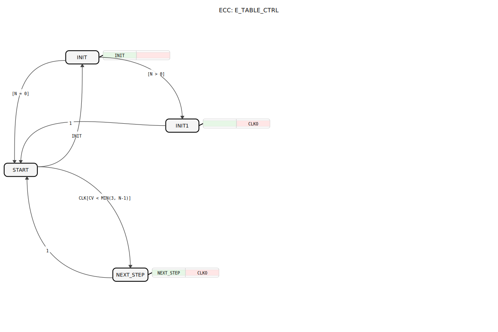

# E_TABLE_CTRL

```{index} single: E_TABLE_CTRL
```




* * * * * * * * * *

## Einleitung
Der **E_TABLE_CTRL** ist ein Unterstützungsbaustein für E_TABLE nach IEC 61499-1 (Annex A), unter EPL-2.0 Lizenz. Version 1.0 ermöglicht die präzise Steuerung von Ereignissequenzen basierend auf einer konfigurierbaren Zeit-Tabelle.


## Schnittstellenstruktur

### **Ereignis-Eingänge**
- `INIT`: Initialisiert die Ereignistabelle (mit DT- und N-Parametern)
- `CLK`: Taktsignal für den Tabellenfortschritt

### **Ereignis-Ausgang**
- `CLKO`: Generiertes Taktereignis (mit DTO- und CV-Daten)

### **Daten-Eingänge**
- `DT` (TIME-Array): Zeitintervalle für die Ereignisgenerierung
- `N` (UINT): Anzahl der aktiven Zeitschritte

### **Daten-Ausgänge**
- `DTO` (TIME): Aktuelles Zeitintervall
- `CV` (UINT): Aktueller Ereignisindex (0..N-1)

## Funktionsweise

1. **Initialisierung**:
   - Bei `INIT`-Ereignis wird der Index (CV) auf 0 gesetzt
   - Erstes Zeitintervall (DTO) aus DT-Array übernommen

2. **Tabellensteuerung**:
   - Jedes `CLK`-Ereignis erhöht CV um 1
   - Nächstes Zeitintervall aus DT-Array wird geladen
   - `CLKO` wird bei jedem Schritt generiert

3. **Zustandsautomat** (ECC):
   - **START**: Wartezustand
   - **INIT**: Initialisierungsphase
   - **INIT1**: Erste Ereignisgenerierung
   - **NEXT_STEP**: Tabellenfortschritt

## Technische Besonderheiten

✔ **Tabellengesteuerte** Zeitplanung
✔ **Array-basierte** Konfiguration (bis zu 4 Zeitschritte)
✔ **Zustandsbasierte** Implementierung (BasicFB)
✔ **Echtzeitfähige** Ereignisgenerierung

## Anwendungsszenarien

- **Prozesssteuerung**: Komplexe Zeitabläufe
- **Testautomation**: Programmierbare Testsequenzen
- **Maschinensteuerung**: Bewegungsabläufe
- **Produktionslinien**: Taktgesteuerte Prozesse

## Beziehung zu E_TABLE

Der `E_TABLE_CTRL`-Baustein ist nicht als eigenständiger Baustein für die direkte Anwendung gedacht, sondern als die **interne Steuerungslogik** des Composite-Funktionsbausteins `E_TABLE`.

Innerhalb von `E_TABLE` arbeitet `E_TABLE_CTRL` mit einem `E_DELAY`-Baustein zusammen:
1.  `E_TABLE_CTRL` empfängt den `START`-Befehl und berechnet die erste Verzögerungszeit `DTO`.
2.  Er sendet `DTO` über `CLKO` an den `E_DELAY`-Baustein.
3.  Nachdem `E_DELAY` abgelaufen ist, meldet er dies über seinen `EO`-Ausgang zurück an den `CLK`-Eingang von `E_TABLE_CTRL`.
4.  `E_TABLE_CTRL` berechnet daraufhin die nächste Verzögerungszeit und der Zyklus wiederholt sich.

Dieser Baustein kapselt also die reine Zustandslogik (welcher Schritt ist der nächste, wie lange dauert er), während der `E_DELAY` die eigentliche Zeitverzögerung ausführt.


## 🛠️ Zugehörige Übungen

* [Uebung_175](../../../training1/Ventilsteuerung/4diacIDE-workspace/test_B/Uebungen_doc/Uebung_175.md)

## Fazit

Der E_TABLE_CTRL-Baustein erweitert die Möglichkeiten der tabellengesteuerten Ereignisgenerierung:

- Flexible Konfiguration mehrerer Zeitintervalle
- Präzise Steuerung komplexer Abläufe
- Robuste Zustandsmaschinen-Implementierung

Durch seine Array-basierte Zeitsteuerung eignet er sich ideal für Anwendungen mit variablen Prozessschritten. Die Integration als BasicFB gewährleistet zuverlässige Operation in IEC 61499-basierten Steuerungssystemen.