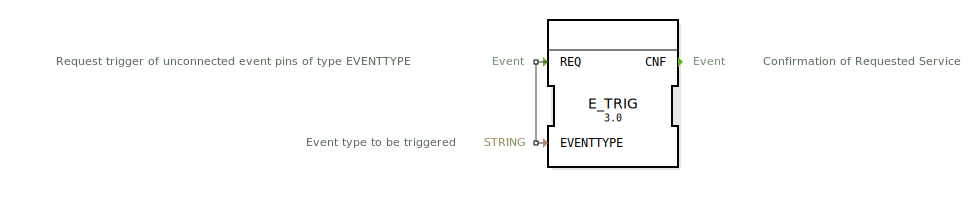

# E_TRIG

```{index} single: E_TRIG
```

<!-- Hier wäre Platz für ein Bild des Funktionsblocks, falls vorhanden. -->

* * * * * * * * * *

## Einleitung
Der `E_TRIG` ist ein spezieller Service-Funktionsbaustein nach IEC 61499. Seine Aufgabe ist es, *unverbundene* Ereignis-Eingänge eines bestimmten Typs (Namens) innerhalb einer Ressource programmatisch auszulösen. Dies ermöglicht fortgeschrittene Steuerungs- und Initialisierungs-Szenarien.



## Schnittstellenstruktur

### **Ereignis-Eingänge:**
- **REQ (Request)**: Löst den Trigger-Mechanismus aus.
    - **Verbundene Daten**: `EVENTTYPE`

### **Ereignis-Ausgänge:**
- **CNF (Confirmation)**: Bestätigt, dass der Trigger-Befehl abgesetzt wurde.

### **Daten-Eingänge:**
- **EVENTTYPE**: Der Name der Ereignis-Eingänge, die ausgelöst werden sollen (Datentyp: `STRING`).
    - **Standardwert**: 'EInit'

## Funktionsweise
1.  **Trigger-Anforderung**: Bei einem `REQ`-Ereignis liest der Baustein den am `EVENTTYPE`-Eingang anliegenden String.
2.  **Interne Auslösung**: Der Baustein weist die 4diac-Laufzeitumgebung (die Ressource) an, alle *unverbundenen* Ereignis-Eingänge von Funktionsbausteinen innerhalb derselben Ressource zu finden, deren Name mit dem `EVENTTYPE`-String übereinstimmt.
3.  **Ereignis-Generierung**: Die Laufzeitumgebung löst diese gefundenen Ereignis-Eingänge aus.
4.  **Bestätigung**: Unmittelbar nachdem der Befehl abgesetzt wurde, löst der `E_TRIG`-Baustein sein `CNF`-Ereignis aus.

**Beispiel:**
Angenommen, mehrere Funktionsbausteine in einer Ressource haben einen unverbundenen Eingang namens `INIT`. Ein `E_TRIG`-Baustein mit `EVENTTYPE = 'INIT'` würde bei einem `REQ` all diese `INIT`-Eingänge gleichzeitig auslösen, um eine erneute Initialisierung dieser Bausteine zu erzwingen.

## Technische Besonderheiten
- **Service-Baustein**: Dies ist kein einfacher Logik-Baustein, sondern eine Schnittstelle zu einem speziellen Dienst der 4diac-Laufzeitumgebung.
- **Wirkt auf unverbundene Eingänge**: Die Funktionalität zielt explizit auf Eingänge, die nicht grafisch im Netzwerk verdrahtet sind. Dies ist ein mächtiges, aber mit Vorsicht zu verwendendes Feature.
- **Standard-Anwendungsfall `EInit`**: Der Standardwert 'EInit' deutet auf den primären Anwendungsfall hin: das manuelle Auslösen von Initialisierungs-Ereignissen, die normalerweise nur beim Start einer Ressource einmalig ausgeführt werden.

## Anwendungsszenarien
- **Manuelle Re-Initialisierung**: Zurücksetzen von Teilen einer Anwendung in einen definierten Anfangszustand, ohne die gesamte Ressource neu starten zu müssen.
- **Dynamische Konfiguration**: Nach dem Laden einer neuen Konfiguration können relevante Bausteine über einen gezielten `E_TRIG`-Aufruf dazu gebracht werden, die neuen Parameter zu übernehmen.
- **Test und Debugging**: Manuelles Auslösen von bestimmten Ereignissen in einer laufenden Anwendung zu Testzwecken.


## 🛠️ Zugehörige Übungen

* [Uebung_176](../../../training1/Ventilsteuerung/4diacIDE-workspace/test_B/Uebungen_doc/Uebung_176.md)

## Fazit
Der `E_TRIG`-Baustein ist ein Werkzeug für fortgeschrittene Anwendungsfälle und für Entwickler, die tiefere Kenntnisse der 4diac-Ausführungsumgebung haben. Er bietet eine leistungsstarke Methode, um die normale, grafisch definierte Ereignisfluss-Logik zu umgehen und direkt mit der Laufzeitumgebung zu interagieren. Er sollte mit Bedacht eingesetzt werden, da seine Wirkung nicht unmittelbar aus dem grafischen Netzwerk ersichtlich ist.