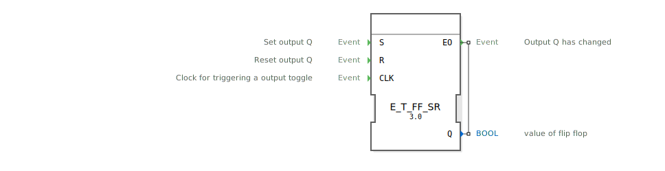

# E_T_FF_SR

```{index} single: E_T_FF_SR
```
## 🎧 Podcast

* [Der E_T_FF_SR-Baustein: Herzstück der IEC 61499 – Speichern, Umschalten, Reagieren](https://podcasters.spotify.com/pod/show/iec-61499-grundkurs-de/episodes/Der-E_T_FF_SR-Baustein-Herzstck-der-IEC-61499--Speichern--Umschalten--Reagieren-e3682dm)
* [Unpacking E_T_FF_SR: The Secret Toggle Switch of Industrial Control Systems](https://podcasters.spotify.com/pod/show/iec-61499-prime-course-en/episodes/Unpacking-E_T_FF_SR-The-Secret-Toggle-Switch-of-Industrial-Control-Systems-e367ntv)

## Einleitung
Der `E_T_FF_SR` (Event-driven Toggle Flip-Flop mit Set/Reset) ist ein erweiterter bistabiler Funktionsbaustein nach IEC 61499. Er kombiniert die Funktionalität eines `E_T_FF` (Toggeln) mit zusätzlichen `S`- (Setzen) und `R`- (Rücksetzen) Eingängen.



## Schnittstellenstruktur

### **Ereignis-Eingänge:**
- **S (Set)**: Setzt den Ausgang `Q` auf `TRUE`.
- **R (Reset)**: Setzt den Ausgang `Q` auf `FALSE`.
- **CLK (Clock)**: Löst eine Umschaltung (Toggeln) des Ausgangs `Q` aus.

### **Ereignis-Ausgänge:**
- **EO (Event Output)**: Wird ausgelöst, wenn sich der Zustand von `Q` ändert.
    - **Verbundene Daten**: `Q`

### **Daten-Ausgänge:**
- **Q**: Der aktuelle Zustand des Flip-Flops (Datentyp: `BOOL`).

## Funktionsweise
Der `E_T_FF_SR` ist ein zustandsbehafteter Baustein, dessen Ausgang `Q` durch drei Ereigniseingänge beeinflusst wird:

1.  **Setzen (S)**: Wenn ein `S`-Ereignis eintrifft, wird `Q` auf `TRUE` gesetzt. Falls `Q` zuvor `FALSE` war, wird `EO` ausgelöst.
2.  **Zurücksetzen (R)**: Wenn ein `R`-Ereignis eintrifft, wird `Q` auf `FALSE` gesetzt. Falls `Q` zuvor `TRUE` war, wird `EO` ausgelöst.
3.  **Toggeln (CLK)**: Wenn ein `CLK`-Ereignis eintrifft, wird `Q` umgeschaltet (getoggelt). Falls `Q` seinen Zustand ändert, wird `EO` ausgelöst.

### Besonderheiten des Verhaltens aus dem `START`-Zustand
Der Baustein startet im `START`-Zustand (impliziert `Q` ist undefiniert/`FALSE`).
- Wenn das erste Ereignis ein `S` ist, wird `Q` auf `TRUE` gesetzt.
- Wenn das erste Ereignis ein `R` ist, wird `Q` auf `FALSE` gesetzt.
- **Wenn das erste Ereignis ein `CLK` ist, wird `Q` auf `TRUE` gesetzt** (nicht getoggelt von `FALSE` nach `TRUE`). Subsequent `CLK` events werden dann normal toggeln.

## Technische Besonderheiten
- **Asynchrone Set/Reset**: Die `S`- und `R`-Eingänge können den Zustand von `Q` jederzeit überschreiben.
- **Toggel-Funktion**: Der `CLK`-Eingang ermöglicht einen einfachen Zustandswechsel.
- **Keine Priorisierung (Dominanz)**: Wie bei `E_RS` und `E_SR` gibt es keine fest definierte Priorität, wenn `S`, `R` oder `CLK` gleichzeitig eintreffen. Die Verarbeitungsreihenfolge der 4diac-Laufzeitumgebung bestimmt den Endzustand.
- **Initiales Verhalten mit `CLK`**: Bei einem `CLK`-Ereignis aus dem `START`-Zustand wird der Baustein initial gesetzt (`Q=TRUE`), anstatt zu toggeln. Dies sollte bei der Initialisierung des Systems beachtet werden.

## Anwendungsszenarien
- **Steuerung mit manueller Korrektur**: Ein Toggler (`CLK`) für eine Lampe, die aber bei Bedarf (z.B. Sicherheitsgründen) direkt Ein (`S`) oder Aus (`R`) geschaltet werden kann.
- **Modus-Umschaltung**: Zwischen verschiedenen Modi hin- und herwechseln (`CLK`), mit der Möglichkeit, einen Grundmodus (`R`) oder einen Sondermodus (`S`) direkt anzusteuern.
- **Fehler-Reset und Toggle**: Ein Fehlerzustand kann durch `S` gesetzt werden, durch `R` quittiert, und der Zustand des Fehler-Handlings kann durch `CLK` getoggelt werden.


## Zugehörige Übungen

* [Uebung_004a7](../../../training1/Ventilsteuerung/4diacIDE-workspace/test_B/Uebungen_doc/Uebung_004a7.md)
* [Uebung_006a](../../../training1/Ventilsteuerung/4diacIDE-workspace/test_B/Uebungen_doc/Uebung_006a.md)
* [Uebung_006a2](../../../training1/Ventilsteuerung/4diacIDE-workspace/test_B/Uebungen_doc/Uebung_006a2.md)
* [Uebung_006a3](../../../training1/Ventilsteuerung/4diacIDE-workspace/test_B/Uebungen_doc/Uebung_006a3.md)
* [Uebung_006a4](../../../training1/Ventilsteuerung/4diacIDE-workspace/test_B/Uebungen_doc/Uebung_006a4.md)
* [Uebung_179](../../../training1/Ventilsteuerung/4diacIDE-workspace/test_B/Uebungen_doc/Uebung_179.md)
* [Uebung_180](../../../training1/Ventilsteuerung/4diacIDE-workspace/test_B/Uebungen_doc/Uebung_180.md)

## Fazit
Der `E_T_FF_SR`-Baustein bietet maximale Flexibilität für Speicher- und Steuerungsaufgaben, indem er die Toggel-Funktion mit direkten Set- und Reset-Möglichkeiten kombiniert. Die spezifischen Verhaltensweisen aus dem `START`-Zustand und die fehlende Priorisierungsgarantie bei simultanen Ereignissen müssen bei der Implementierung sorgfältig berücksichtigt werden.