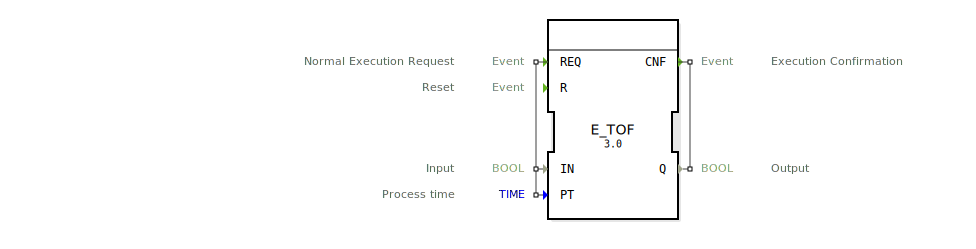

# E_TOF

```{index} single: E_TOF
```
## 🎧 Podcast

* [E_TOF vs. FB_TOF: Der Event-Timer, der nicht zyklisch tickt – Revolution für Automatisierungssysteme?](https://podcasters.spotify.com/pod/show/iec-61499-grundkurs-de/episodes/E_TOF-vs--FB_TOF-Der-Event-Timer--der-nicht-zyklisch-tickt--Revolution-fr-Automatisierungssysteme-e3673qk)
* [FB_TOF und E_TOF: Verzögerungstimer in IEC 61131-3 und 61499](https://podcasters.spotify.com/pod/show/iec-61499-grundkurs-de/episodes/FB_TOF-und-E_TOF-Verzgerungstimer-in-IEC-61131-3-und-61499-e368e2d)

## Beschreibung:

### Der Baustein E_TOF in der IEC 61499: Ein Überblick

#### Einleitung

Die IEC 61499 ist ein internationaler Standard, der die Modellierung von verteilten industriellen Steuerungssystemen ermöglicht. Ein zentrales Konzept in diesem Standard ist der Funktionsbaustein (FB), der als grundlegende Komponente für die Steuerungslogik dient. Der Baustein **E_TOF** (Event-driven Off-Delay Timer) ist ein Beispiel für einen solchen Funktionsbaustein, der in der IEC 61499 verwendet wird, um eine verzögerte Abschaltfunktion zu modellieren. Dieser Aufsatz beschreibt die Struktur, das Verhalten und die Anwendung des E_TOF-Bausteins anhand des bereitgestellten Quelltextes. Ein besonderer Aspekt, der hervorgehoben werden soll, ist, dass dieser Baustein **auch dann funktioniert, wenn er nicht zyklisch aufgerufen wird**, da er intern auf dem **E_DELAY**-Baustein aus der IEC 61499 basiert.

#### Struktur des E_TOF-Bausteins

Der E_TOF-Baustein ist ein **Composite Function Block (CFB)**, der gemäß der IEC 61499 spezifiziert ist. Ein CFB besteht aus einer Schnittstelle (Interface) und einem internen Netzwerk von Funktionsbausteinen, die zusammenarbeiten, um das gewünschte Verhalten zu realisieren.

##### Schnittstelle (Interface)

Die Schnittstelle des E_TOF-Bausteins besteht aus:

- **Eingangsereignisse (Event Inputs)**:
  - **REQ (Request)**: Dieses Ereignis löst die Ausführung des Bausteins aus. Es ist mit den Eingangsvariablen **IN** und **PT** verknüpft.
  - **R (Reset)**: Dieses Ereignis setzt den Timer zurück.

- **Ausgangsereignis (Event Output)**:
  - **CNF (Confirmation)**: Dieses Ereignis wird ausgelöst, wenn die Ausführung des Bausteins abgeschlossen ist. Es ist mit der Ausgangsvariable **Q** verknüpft.

- **Eingangsvariablen (Input Variables)**:
  - **IN (Input)**: Dies ist eine boolesche Variable, die den Zustand des Timers steuert. Wenn **IN** auf **TRUE** gesetzt ist, startet der Timer. Wenn **IN** auf **FALSE** gesetzt wird, beginnt die Verzögerungszeit.
  - **PT (Process Time)**: Dies ist eine Zeitvariable (TIME), die die Verzögerungszeit definiert, nach der der Ausgang **Q** auf **FALSE** gesetzt wird.

- **Ausgangsvariable (Output Variable)**:
  - **Q (Output)**: Dies ist eine boolesche Variable, die den Zustand des Timers anzeigt. Sie bleibt solange **TRUE**, bis die Verzögerungszeit **PT** abgelaufen ist.

##### Internes Netzwerk (FBNetwork)

Der E_TOF-Baustein verwendet intern drei Funktionsbausteine, um das gewünschte Verhalten zu realisieren:

1. **E_SWITCH**: Dieser Baustein steuert den Fluss der Ereignisse basierend auf dem Eingang **IN**. Wenn **IN** auf **TRUE** gesetzt ist, wird das Ereignis an **E_RS.S** weitergeleitet. Wenn **IN** auf **FALSE** gesetzt ist, wird das Ereignis an **E_DELAY.START** weitergeleitet.
2. **E_DELAY**: Dieser Baustein realisiert die Verzögerungszeit **PT**. Wenn das **START**-Ereignis eintritt, beginnt der Timer zu laufen. Wenn die Verzögerungszeit abgelaufen ist, wird das **EO**-Ereignis ausgelöst.
3. **E_RS**: Dieser Baustein ist ein bistabiles Element, das den Zustand des Timers speichert. Wenn das **S**-Ereignis eintritt, wird der Ausgang **Q** auf **TRUE** gesetzt. Wenn das **R**-Ereignis eintritt, wird der Ausgang **Q** auf **FALSE** gesetzt.

#### Verhalten des E_TOF-Bausteins

Der E_TOF-Baustein verhält sich wie ein Off-Delay-Timer, der eine verzögerte Abschaltfunktion realisiert. Das Verhalten des Bausteins kann wie folgt beschrieben werden:

1. **Start des Timers**: Wenn das **REQ**-Ereignis eintritt und die Eingangsvariable **IN** auf **TRUE** gesetzt ist, wird der Timer gestartet. Der Ausgang **Q** wird auf **TRUE** gesetzt.
2. **Verzögerungszeit**: Wenn die Eingangsvariable **IN** auf **FALSE** gesetzt wird, beginnt die Verzögerungszeit **PT**. Der Ausgang **Q** bleibt solange **TRUE**, bis die Verzögerungszeit abgelaufen ist.
3. **Ablauf der Verzögerungszeit**: Sobald die Verzögerungszeit **PT** abgelaufen ist, wird der Ausgang **Q** auf **FALSE** gesetzt, und das **CNF**-Ereignis wird ausgelöst, um den Abschluss der Verzögerung zu signalisieren.
4. **Reset**: Wenn das **R**-Ereignis eintritt, wird der Timer zurückgesetzt, und der Ausgang **Q** wird auf **FALSE** gesetzt.

#### Unabhängigkeit vom zyklischen Aufruf

Ein entscheidender Vorteil des E_TOF-Bausteins ist, dass er **nicht zyklisch aufgerufen werden muss**, um korrekt zu funktionieren. Dies liegt daran, dass der Baustein intern auf dem **E_DELAY**-Baustein basiert, der in der IEC 61499 spezifiziert ist. Der **E_DELAY**-Baustein ist ein ereignisgesteuerter Timer, der unabhängig vom zyklischen Aufruf des übergeordneten Bausteins arbeitet. Das bedeutet, dass der E_TOF-Baustein auch in Systemen eingesetzt werden kann, die nicht zyklisch arbeiten, z.B. in ereignisgesteuerten oder verteilten Steuerungssystemen.

#### Anwendungsbeispiele

Der E_TOF-Baustein kann in verschiedenen industriellen Steuerungsanwendungen eingesetzt werden, insbesondere in Szenarien, in denen eine verzögerte Abschaltfunktion erforderlich ist. Einige Beispiele sind:

- **Maschinensteuerung**: Der Baustein kann verwendet werden, um sicherzustellen, dass eine Maschine nach dem Ausschalten noch für eine bestimmte Zeit weiterläuft, z.B. um Prozesse abzuschließen oder Sicherheitsvorkehrungen zu treffen.
- **Beleuchtungssteuerung**: Der Baustein kann in Beleuchtungssystemen eingesetzt werden, um das Licht nach dem Ausschalten des Schalters noch für eine bestimmte Zeit brennen zu lassen.
- **Ventilsteuerung**: Der Baustein kann verwendet werden, um ein Ventil nach dem Schließen noch für eine bestimmte Zeit offen zu halten, um z.B. Druck abzulassen.

##
## Zugehörige Übungen

* [Uebung_020e](../../../../training1/Ventilsteuerung/4diacIDE-workspace/test_B/Uebungen_doc/Uebung_020e.md)

## Fazit

Der E_TOF-Baustein ist ein vielseitiger Funktionsbaustein in der IEC 61499, der eine verzögerte Abschaltfunktion realisiert. Durch seine interne Verwendung des **E_DELAY**-Bausteins kann er **auch dann korrekt funktionieren, wenn er nicht zyklisch aufgerufen wird**. Dies macht ihn besonders geeignet für ereignisgesteuerte und verteilte Steuerungssysteme, in denen zyklische Aufrufe nicht immer gewährleistet sind.

Der bereitgestellte Quelltext zeigt, wie der E_TOF-Baustein in der Praxis implementiert werden kann, und bietet eine solide Grundlage für die Entwicklung ähnlicher Bausteine in industriellen Steuerungssystemen. Die Unabhängigkeit vom zyklischen Aufruf ist dabei ein entscheidender Vorteil, der den Baustein für eine Vielzahl von Anwendungen geeignet macht.

## Vergleich E_TOF zu FB_TOF

### Kapitel 1: Der FB_TOF-Baustein

Der **FB_TOF** (Off-Delay Timer) ist ein standardisierter Funktionsbaustein gemäß der IEC 61131-3, der eine verzögerte Abschaltfunktion realisiert. Ein wesentliches Merkmal dieses Bausteins ist der Ausgang **ET** (Elapsed Time), der die verstrichene Zeit seit dem Start der Verzögerung anzeigt. Dieser Ausgang ist besonders nützlich, um den Fortschritt der Verzögerungszeit zu überwachen und in Steuerungslogiken zu verwenden.

Ein kritischer Aspekt des FB_TOF-Bausteins ist jedoch, dass er **zyklisch aufgerufen werden muss**, um korrekt zu funktionieren. Das bedeutet, dass der Baustein in jedem Zyklus des SPS-Programms ausgeführt werden muss, um die verstrichene Zeit **ET** korrekt zu berechnen und die Verzögerungszeit **PT** einzuhalten. Wenn der Baustein nicht regelmäßig aufgerufen wird, kann der Timer nicht korrekt arbeiten, und die Verzögerungszeit wird möglicherweise nicht eingehalten. Diese Abhängigkeit vom zyklischen Aufruf macht den FB_TOF-Baustein ideal für traditionelle SPS-Systeme, die in festen Zyklen arbeiten.

### Kapitel 2: Der E_TOF-Baustein

Der **E_TOF** (Event-driven Off-Delay Timer) ist ein Funktionsbaustein gemäß der IEC 61499, der ebenfalls eine verzögerte Abschaltfunktion realisiert. Im Gegensatz zum FB_TOF besitzt der E_TOF **keinen Ausgang ET**, der die verstrichene Zeit anzeigt. Stattdessen basiert der E_TOF intern auf dem **E_DELAY**-Baustein, der in der IEC 61499 spezifiziert ist und eine ereignisgesteuerte Verzögerungsfunktion bietet.

Ein entscheidender Vorteil des E_TOF-Bausteins ist, dass er **nicht zyklisch aufgerufen werden muss**, um korrekt zu funktionieren. Da der interne **E_DELAY**-Baustein unabhängig vom zyklischen Aufruf des übergeordneten Bausteins arbeitet, kann der E_TOF auch in Systemen eingesetzt werden, die nicht zyklisch arbeiten, z.B. in ereignisgesteuerten oder verteilten Steuerungssystemen. Dies macht den E_TOF-Baustein besonders flexibel und geeignet für moderne, verteilte Steuerungsarchitekturen, bei denen zyklische Aufrufe nicht immer gewährleistet sind.

Zusammenfassend lässt sich sagen, dass der FB_TOF durch seinen Ausgang **ET** eine detaillierte Überwachung der verstrichenen Zeit ermöglicht, jedoch einen zyklischen Aufruf erfordert. Der E_TOF hingegen verzichtet auf den Ausgang **ET**, bietet dafür aber die Flexibilität, unabhängig von zyklischen Aufrufen zu arbeiten, was ihn ideal für ereignisgesteuerte Systeme macht.