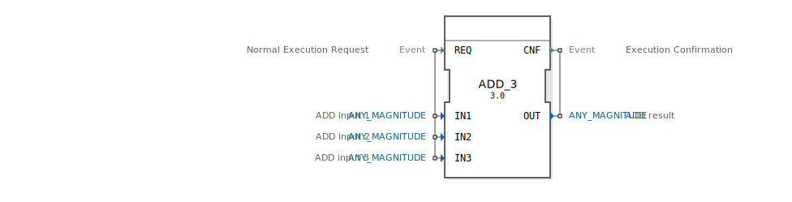

# ADD_3

```{index} single: ADD_3
```


* * * * * * * * * *

## Einleitung
Der **ADD_3** ist eine erweiterte Version des Addierers zur Berechnung der Summe dreier Werte, entwickelt unter EPL-2.0 Lizenz. Version 1.0 bietet typsichere Addition für verschiedene numerische Datentypen gemäß IEC 61131-3 Standard.



## Schnittstellenstruktur

### **Ereignis-Eingänge**
- `REQ`: Berechnungsanforderung (mit drei Eingabewerten)

### **Ereignis-Ausgänge**
- `CNF`: Berechnungsbestätigung (mit Summenergebnis)

### **Daten-Eingänge**
- `IN1` (ANY_MAGNITUDE): Erster Summand
- `IN2` (ANY_MAGNITUDE): Zweiter Summand
- `IN3` (ANY_MAGNITUDE): Dritter Summand

### **Daten-Ausgänge**
- `OUT` (ANY_MAGNITUDE): Ergebnis der Addition (IN1 + IN2 + IN3)

## Funktionsprinzip

1. **Anforderung**:
   - `REQ`-Ereignis triggert die Berechnung
   - Alle drei Eingangswerte werden gleichzeitig ausgewertet

2. **Berechnung**:
   - Typenerhaltende Summenbildung
   - Unterstützt alle ANY_MAGNITUDE-Typen:
     - Ganzzahlen (INT, DINT)
     - Fließkommazahlen (REAL, LREAL)
     - Zeitwerte (TIME, LTIME)

3. **Ergebnisausgabe**:
   - `CNF`-Ereignis mit berechnetem OUT-Wert
   - Automatische Typkonvertierung bei gemischten Eingängen

## Technische Besonderheiten

✔ **Drei-Eingang-Addition** in einer Operation
✔ **Generische Implementierung** (GEN_ADD-Klasse)
✔ **Breite Typunterstützung** (ANY_MAGNITUDE)
✔ **Deterministische Ausführung**

## Typische Anwendungsfälle

- **Messwertaggregation**: Summierung mehrerer Sensoren
- **Energiebilanzierung**: Gesamtverbrauchsberechnung
- **Positionstechnik**: Mehrdimensionale Koordinaten
- **Produktionsstatistik**: Mengenerfassung

## Vergleich mit ADD_2

| Feature        | ADD_3  | ADD_2  |
|---------------|--------|--------|
| Eingänge      | 3      | 2      |
| Berechnung    | IN1+IN2+IN3 | IN1+IN2 |
| Performance   | Höhere Effizienz bei 3 Werten | Leichtgewichtiger |

## Fehlerbehandlung

- Bei Typinkompatibilität:
  - OUT = 0 (numerische Typen)
  - Leerer Wert (nicht-numerische Typen)
  - Kein Abbruch der Ausführung


## Zugehörige Übungen

* [Uebung_087](../../../../training1/Ventilsteuerung/4diacIDE-workspace/test_B/Uebungen_doc/Uebung_087.md)
* [Uebung_087a1](../../../../training1/Ventilsteuerung/4diacIDE-workspace/test_B/Uebungen_doc/Uebung_087a1.md)

## Fazit

Der ADD_3-Baustein erweitert die Möglichkeiten der typsicheren Addition:

- Effiziente Dreifach-Summation
- Konsistente Typbehandlung
- Optimierte Performance gegenüber serieller ADD_2-Nutzung

Besonders vorteilhaft für Anwendungen mit mehreren zu aggregierenden Werten. Die generische Implementierung ermöglicht maximale Flexibilität in heterogenen Steuerungsumgebungen.