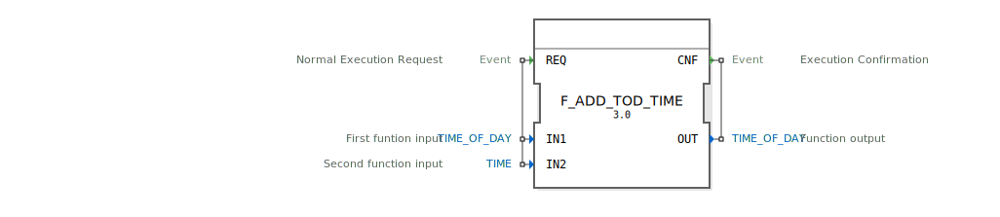

# F_ADD_TOD_TIME

```{index} single: F_ADD_TOD_TIME
```


* * * * * * * * * *




## Einführung
Der **F_ADD_TOD_TIME** ist ein spezialisierter Funktionsbaustein zur Addition von Zeitwerten zu Tageszeiten, entwickelt unter EPL-2.0 Lizenz. Version 1.0 ermöglicht präzise Zeitberechnungen mit TIME_OF_DAY und TIME-Datentypen.

## Schnittstellenstruktur

### **Ereignis-Eingänge**
- `REQ`: Berechnungsanforderung (mit Eingabewerten)

### **Ereignis-Ausgänge**
- `CNF`: Berechnungsbestätigung (mit Ergebnis)

### **Daten-Eingänge**
- `IN1` (TIME_OF_DAY): Ausgangszeit (Tageszeit)
- `IN2` (TIME): Zeitdauer für Addition

### **Daten-Ausgänge**
- `OUT` (TIME_OF_DAY): Ergebnis der Addition

## Funktionsweise

1. **Aktivierung**:
   - Durch `REQ`-Ereignis ausgelöst
   - Verarbeitet TIME_OF_DAY und TIME-Werte

2. **Berechnung**:
   - Addiert Zeitdauer (IN2) zur Tageszeit (IN1)
   - Berücksichtigt automatisch:
     - Tagesübergänge (24h-Format)
     - Millisekundengenauigkeit

3. **Ergebnisausgabe**:
   - `CNF`-Ereignis mit neuer TIME_OF_DAY
   - Format: TOD#23:59:59.999

## Technische Spezifikationen

✔ **Präzise Tageszeitberechnung**
✔ **Automatischer Tagesübergang**
✔ **IEC 61131-3 konform**
✔ **Millisekundengenaue Berechnung**

## Anwendungsbeispiele

- **Schichtplanung**: Arbeitszeitberechnungen
- **Lichtsteuerung**: Tageslichtsimulation
- **Produktionsprozesse**: Zeitgesteuerte Abläufe
- **Fahrplansysteme**: Ankunftszeitberechnungen

## Besondere Hinweise

- **Gültigkeitsbereich**:
  - 00:00:00.000 bis 23:59:59.999
  - Bei Überschreitung: Wrap-around (z.B. 25:00:00 → 01:00:00)

- **Fehlerfälle**:
  - Bei Überlauf: Zyklische Weiterzählung
  - Bei ungültigen Eingaben: OUT = IN1

## Vergleich mit ähnlichen Bausteinen

| Merkmal        | F_ADD_TOD_TIME | F_ADD_DT_TIME |
|----------------|----------------|---------------|
| Eingangstyp 1  | TIME_OF_DAY    | DATE_AND_TIME |
| Ausgangstyp    | TIME_OF_DAY    | DATE_AND_TIME |
| Bereich        | Tageszyklus    | Absolutes Datum |

## Fazit

Der F_ADD_TOD_TIME-Baustein bietet essentielle Funktionen für Tageszeitberechnungen:

- Präzise Handhabung von Tageszeit-Operationen
- Automatische Behandlung von Tagesübergängen
- Optimierte Performance für Echtzeitanwendungen

Ideal für Steuerungsanwendungen, die wiederkehrende tageszeitbasierte Operationen erfordern. Die spezialisierte Implementierung garantiert korrekte Ergebnisse im 24-Stunden-Format.