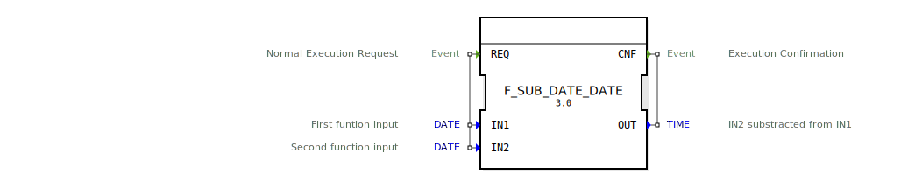

# F_SUB_DATE_DATE

```{index} single: F_SUB_DATE_DATE
```


* * * * * * * * * *




## Einführung
Der **F_SUB_DATE_DATE** ist ein standardkonformer Funktionsbaustein zur Berechnung von Zeitdifferenzen zwischen zwei Datumswerten, entwickelt unter EPL-2.0 Lizenz. Version 1.0 ermöglicht die präzise Berechnung von Zeitintervallen gemäß IEC 61131-3 Standard.

## Schnittstellenstruktur

### **Ereignis-Eingänge**
- `REQ`: Berechnungsanforderung (mit Start- und Enddatum)

### **Ereignis-Ausgänge**
- `CNF`: Berechnungsbestätigung (mit Zeitdifferenz)

### **Daten-Eingänge**
- `IN1` (DATE): Startdatum (Minuend)
- `IN2` (DATE): Enddatum (Subtrahend)

### **Daten-Ausgänge**
- `OUT` (TIME): Berechnetes Zeitintervall (IN1 - IN2)

## Funktionsprinzip

1. **Berechnungsauslösung**:
   - `REQ`-Ereignis mit zwei DATE-Werten
   - Beide Eingänge müssen vom Typ DATE sein

2. **Differenzberechnung**:
   - Konvertierung beider Datumswerte in Sekunden seit 1970-01-01
   - Subtraktion der Zeitstempel (IN1 - IN2)
   - Umwandlung in TIME-Datentyp

3. **Ergebnisausgabe**:
   - `CNF`-Ereignis mit berechnetem Zeitintervall
   - Positive Werte wenn IN1 > IN2, negative bei IN1 < IN2

## Technische Besonderheiten

✔ **Präzise Zeitdifferenz** (Tagesgenau)
✔ **Berücksichtigung von Schaltjahren**
✔ **Negative Zeitintervalle** für rückwirkende Berechnungen
✔ **Plattformunabhängige Zeitberechnung**

## Anwendungsszenarien

- **Prozessdauerberechnung**: Produktionszeit zwischen zwei Daten
- **Wartungsintervalle**: Restlaufzeit bis nächste Wartung
- **Projektplanung**: Verbleibende Zeit bis Deadline
- **Lagerverwaltung**: Haltbarkeitsdauer-Berechnung

## Fehlerbehandlung

- **Datumsgrenzen**:
  - Unterstützt den Bereich 1970-01-01 bis 2106-02-07
  - Bei Überschreitung: OUT = T#0s

- **Typinkompatibilität**:
  - OUT = T#0s
  - Keine Exception-Generierung

## ⚖️ Vergleich mit ähnlichen Bausteinen

| Feature        | F_SUB_DATE_DATE | F_SUB_TIME | F_SUB_DT_DT |
|---------------|-----------------|------------|-------------|
| Eingangstypen | DATE - DATE     | TIME - TIME | DT - DT     |
| Ausgangstyp   | TIME            | TIME       | TIME        |
| Genauigkeit   | Tagesgenau      | Nanosekunde | Mikrosekunde |

## Fazit

Der F_SUB_DATE_DATE-Baustein bietet eine optimierte Lösung für Datumsdifferenzen:

- Kalendergenaue Berechnungen
- Einfache Handhabung von Zeitintervallen
- Standardkonforme Implementierung

Besonders wertvoll für Anwendungen mit terminbezogenen Berechnungen und langfristigen Zeitplanungen.