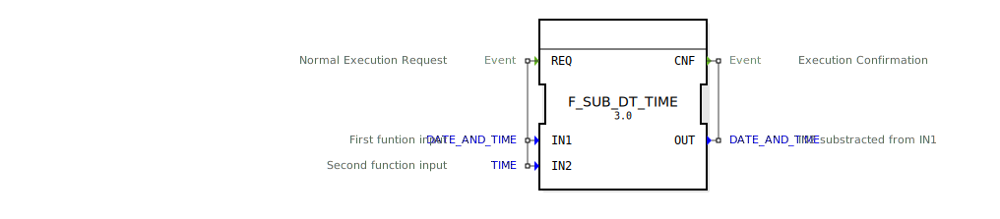

# F_SUB_DT_TIME

```{index} single: F_SUB_DT_TIME
```


* * * * * * * * * *




## Einführung
Der **F_SUB_DT_TIME** ist ein standardkonformer Funktionsbaustein zur Subtraktion von Zeitintervallen von Zeitstempeln, entwickelt unter EPL-2.0 Lizenz. Version 1.0 ermöglicht präzise Zeitpunktberechnungen gemäß IEC 61131-3 Standard.

## Schnittstellenstruktur

### **Ereignis-Eingänge**
- `REQ`: Berechnungsanforderung (mit Zeitstempel und Zeitintervall)

### **Ereignis-Ausgänge**
- `CNF`: Berechnungsbestätigung (mit korrigiertem Zeitstempel)

### **Daten-Eingänge**
- `IN1` (DATE_AND_TIME): Basiszeitpunkt
- `IN2` (TIME): Abzuziehendes Zeitintervall

### **Daten-Ausgänge**
- `OUT` (DATE_AND_TIME): Berechneter Zeitpunkt (IN1 - IN2)

## Funktionsprinzip

1. **Berechnungsauslösung**:
   - `REQ`-Ereignis mit DATE_AND_TIME und TIME-Wert
   - Zeitbereich: DT#1970-01-01-00:00:00 bis DT#2106-02-07-06:28:15

2. **Zeitpunktberechnung**:
   - Konvertierung in Epochen-Mikrosekunden
   - Subtraktion des Zeitintervalls
   - Kalendergenaue Rückrechnung

3. **Ergebnisausgabe**:
   - `CNF`-Ereignis mit neuem Zeitstempel
   - Automatische Kalenderkorrektur (Schaltjahre, Monatsenden)

## Technische Besonderheiten

✔ **Mikrosekundengenauigkeit**
✔ **Vollständige Kalenderarithmetik**
✔ **Negative Zeitintervalle** (Zeitpunktverschiebung in die Zukunft)
✔ **Plattformübergreifende Konsistenz**

## Anwendungsszenarien

- **Terminplanung**: Fristenberechnung
- **Prozesssteuerung**: Vorherige Startzeitpunktbestimmung
- **Wartungssysteme**: Planung vorbeugender Wartungen
- **Datenanalyse**: Historische Zeitpunktkorrektur

## Fehlerbehandlung

- **Zeitbereichsüberschreitung**:
  - Bei Unterlauf: OUT = DT#1970-01-01-00:00:00
  - Bei Überlauf: OUT = DT#2106-02-07-06:28:15

- **Sonderfälle**:
  - IN2 = T#0s → OUT = IN1
  - IN2 negativ → Addition zum Zeitpunkt

## Vergleich mit ähnlichen Bausteinen

| Feature        | F_SUB_DT_TIME | F_ADD_DT_TIME | F_SUB_DT_DT |
|---------------|---------------|---------------|-------------|
| Operation     | Zeitpunkt - Intervall | Zeitpunkt + Intervall | Zeitpunkt - Zeitpunkt |
| Ergebnis      | DATE_AND_TIME | DATE_AND_TIME | TIME        |
| Genauigkeit   | Mikrosekunden | Mikrosekunden | Mikrosekunden |

## Fazit

Der F_SUB_DT_TIME-Baustein bietet eine zuverlässige Lösung für Zeitpunktberechnungen:

- Industrietaugliche Präzision
- Volle Kalenderunterstützung
- Intuitive Handhabung von Zeitintervallen

Unverzichtbar für alle Anwendungen mit terminbezogenen Berechnungen und historischen Zeitanalysen.