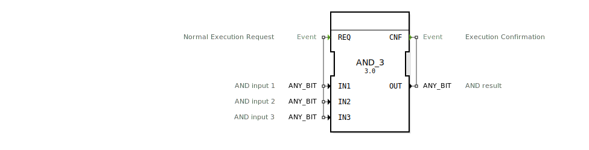

# AND_3

```{index} single: AND_3
```


* * * * * * * * * *

## Einleitung
Der AND_3-Funktionsblock ist ein generischer Baustein zur Berechnung der bitweisen logischen UND-Verknüpfung mit drei Eingängen. Er führt eine bitweise UND-Operation auf drei Eingabewerten durch und gibt das Ergebnis aus. Der Baustein unterstützt alle ANY_BIT-Datentypen und ist damit flexibel für verschiedene Bitbreiten einsetzbar.



## Schnittstellenstruktur

### **Ereignis-Eingänge**
- **REQ**: Normaler Ausführungsanforderung - löst die Berechnung der UND-Verknüpfung aus

### **Ereignis-Ausgänge**
- **CNF**: Ausführungsbestätigung - signalisiert die Beendigung der Berechnung

### **Daten-Eingänge**
- **IN1**: UND-Eingang 1 (ANY_BIT)
- **IN2**: UND-Eingang 2 (ANY_BIT)
- **IN3**: UND-Eingang 3 (ANY_BIT)

### **Daten-Ausgänge**
- **OUT**: UND-Ergebnis (ANY_BIT)

### **Adapter**
Keine Adapter vorhanden.

## Funktionsweise
Bei Eintreffen des REQ-Ereignisses führt der AND_3-Baustein eine bitweise UND-Verknüpfung der drei Eingangswerte IN1, IN2 und IN3 durch. Das Ergebnis wird am Datenausgang OUT ausgegeben und gleichzeitig wird das CNF-Ereignis generiert, um die erfolgreiche Berechnung zu signalisieren.

Die Operation erfolgt nach der Formel: OUT = IN1 ∧ IN2 ∧ IN3

## Technische Besonderheiten
- Generischer Baustein, der mit allen ANY_BIT-Datentypen (BOOL, BYTE, WORD, DWORD, LWORD) funktioniert
- Unterstützt drei Eingänge für erweiterte UND-Verknüpfungen
- Typensicherheit durch konsistente Verwendung des gleichen Datentyps für alle Ein- und Ausgänge

## Zustandsübergang
1. **Wartezustand**: Baustein wartet auf REQ-Ereignis
2. **Berechnungszustand**: Bei REQ werden die Eingänge verarbeitet
3. **Ausgabezustand**: Ergebnis wird an OUT ausgegeben und CNF-Ereignis wird generiert
4. Rückkehr in Wartezustand

## Anwendungsszenarien
- Bitmasken-Operationen in Steuerungsanwendungen
- Mehrfache Bedingungsprüfungen in logischen Schaltungen
- Signalverarbeitung mit mehreren Eingangssignalen
- Filteroperationen in Datenverarbeitungssystemen

## ⚖️ Vergleich mit ähnlichen Bausteinen
Im Vergleich zu Standard-UND-Bausteinen mit nur zwei Eingängen bietet AND_3 die Möglichkeit, drei Eingänge gleichzeitig zu verarbeiten, was die Anzahl benötigter Bausteine in komplexeren Schaltungen reduziert. Gegenüber Bausteinen mit fester Bitbreite bietet AND_3 durch die generische ANY_BIT-Typisierung größere Flexibilität.


## 🛠️ Zugehörige Übungen

* [Uebung_002a6_AX](../../../../training1/Ventilsteuerung/4diacIDE-workspace/test_AX/Uebungen_doc/Uebung_002a6_AX.md)

## Fazit
Der AND_3-Funktionsblock ist ein vielseitiger und effizienter Baustein für bitweise UND-Operationen mit drei Eingängen. Seine generische Natur macht ihn für verschiedene Anwendungsfälle und Datentypen geeignet, während die klare Ereignissteuerung eine zuverlässige Integration in Steuerungssysteme ermöglicht.