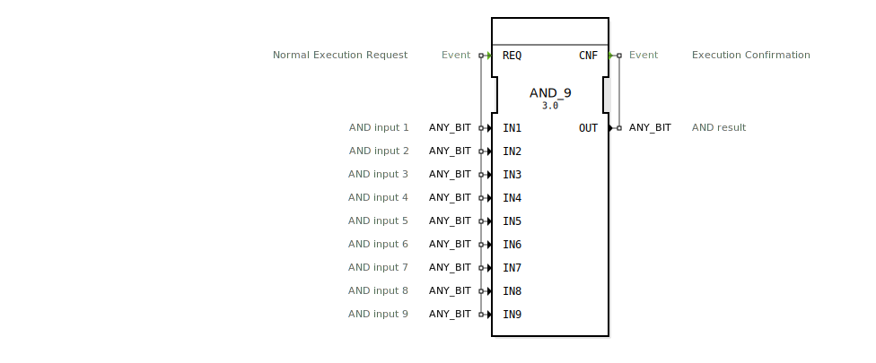

# AND_9

```{index} single: AND_9
```


* * * * * * * * * *
## Einleitung
Der Funktionsblock `AND_9` führt eine bitweise logische UND-Operation (AND) auf bis zu neun Eingangsvariablen durch. Es handelt sich um einen generischen Funktionsblock, der mit verschiedenen Bit-Datentypen arbeiten kann. Der Block ist gemäß dem Standard IEC 61131-3 klassifiziert und eignet sich für Anwendungen in der Automatisierungstechnik.



## Schnittstellenstruktur

### **Ereignis-Eingänge**
- `REQ` (Normal Execution Request): Startet die Ausführung des Funktionsblocks. Die Operation wird ausgeführt, wenn dieses Ereignis eintritt.

### **Ereignis-Ausgänge**
- `CNF` (Execution Confirmation): Signalisiert die erfolgreiche Beendigung der Operation.

### **Daten-Eingänge**
- `IN1` bis `IN9` (ANY_BIT): Bis zu neun Eingangsvariablen, auf denen die bitweise UND-Operation durchgeführt wird. Jeder Eingang kann einen beliebigen Bit-Datentyp (z.B. BOOL, BYTE, WORD, DWORD, LWORD) haben.

### **Daten-Ausgänge**
- `OUT` (ANY_BIT): Das Ergebnis der bitweisen UND-Operation aller Eingangsvariablen. Der Datentyp entspricht dem der Eingangsvariablen.

### **Adapter**
Es sind keine Adapter vorhanden.

## Funktionsweise
Der Funktionsblock `AND_9` führt eine bitweise UND-Operation auf den Werten der Eingangsvariablen `IN1` bis `IN9` durch. Das Ergebnis wird an den Ausgang `OUT` ausgegeben. Die Operation wird durch das Ereignis `REQ` gestartet und nach Abschluss durch das Ereignis `CNF` bestätigt.

## Technische Besonderheiten
- **Generische Implementierung**: Der Funktionsblock kann mit verschiedenen Bit-Datentypen arbeiten, was eine hohe Flexibilität ermöglicht.
- **Skalierbarkeit**: Unterstützt bis zu neun Eingangsvariablen, was komplexere logische Operationen ermöglicht.

## Zustandsübersicht
1. **Idle-Zustand**: Wartet auf das Ereignis `REQ`.
2. **Ausführungszustand**: Führt die bitweise UND-Operation durch.
3. **Bestätigungszustand**: Sendet das Ereignis `CNF` und gibt das Ergebnis an `OUT` aus.

## Anwendungsszenarien
- Logische Verknüpfung mehrerer digitaler Signale in der Automatisierungstechnik.
- Filterung von Signalen durch logische Masken.
- Implementierung von Sicherheitsfunktionen, bei denen mehrere Bedingungen gleichzeitig erfüllt sein müssen.

## ⚖️ Vergleich mit ähnlichen Bausteinen
- **AND (Standard)**: Standardmäßig unterstützen viele PLC-Systeme nur UND-Operationen mit zwei Eingängen. `AND_9` erweitert diese Funktionalität auf bis zu neun Eingänge.
- **GEN_AND**: Der generische AND-Block, auf dem `AND_9` basiert, kann für verschiedene Datentypen und eine variable Anzahl von Eingängen konfiguriert werden.

## Fazit
Der `AND_9`-Funktionsblock ist ein leistungsfähiges Werkzeug für bitweise logische Operationen in der Automatisierungstechnik. Seine generische Natur und die Unterstützung für bis zu neun Eingänge machen ihn besonders flexibel und vielseitig einsetzbar. Ideal für Anwendungen, bei denen komplexe logische Verknüpfungen erforderlich sind.